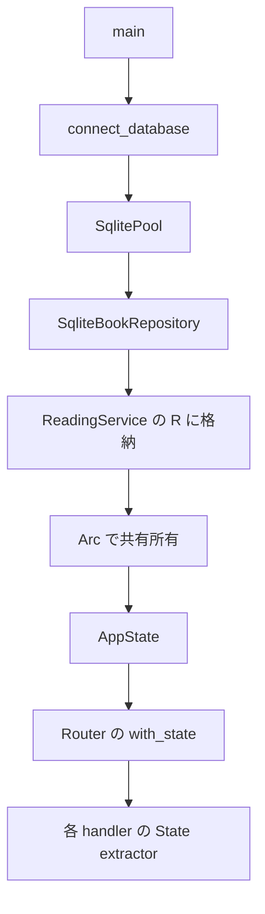

# 依存関係を組み立てる

## 問い

HTTP のリクエストが届く前に、誰が SQLite と service を接続しているのでしょうか。`ReadingService<R>` の `R` と、`AppState` の `Clone` に注目して読みます。

第1部の目安は、確認問題とソースへの往復を含めて60〜90分です。この章では起動時の組み立て、次の2章ではリクエスト時の処理を追います。

## 読む場所と順序

1. `src/main.rs` の `main`：接続、Router 構築、待受けの順序。
2. `src/lib.rs` の `pub use app::{build_app, connect_database}`：バイナリに公開する入口。
3. `src/app.rs` の `connect_database`、続いて以下の `AppState` と `build_app`。
4. `src/service.rs` の `ReadingService<R>` と `impl<R: BookRepository>`、`src/repository.rs` の `BookRepository`。

```rust,ignore
{{#include ../../../src/app.rs:composition}}
```

## 解説

### 起動処理と依存関係

`main` は Tokio の実行環境で非同期処理を進めます。`connect_database(...).await?` が接続と migration を終えてから、pool を `build_app` に渡します。その後に TCP listener を作り、`axum::serve` で Router を使います。`lib.rs` は呼び出しの中継関数ではなく、`app` 内の関数を再公開するモジュール境界です。したがって「main → lib → app」は公開経路であり、3つの関数が順に実行される意味ではありません。



矢印は起動時の生成・受け渡しと、その後の状態取得を表します。リクエストのたびに DB 接続や service を作り直す図ではありません。`connect_database` は最大1接続の pool を作りますが、pool は接続を貸し出す仕組みであり、service 自体の共有とは役割が違います。

### ジェネリクスは「未決定のまま動く」ことではない

`ReadingService<R>` は repository の型を引数に取る構造体です。`impl<R: BookRepository>` は「この契約を実装した `R` に対して、これらのメソッドを使える」という制約です。`build_app` で `SqliteBookRepository::new(pool)` を渡すため、ここで `R = SqliteBookRepository` と推論されます。さらに `AppState.service` の型にも、その具体型が書かれています。

service は `insert_book` などの契約を呼び、SQLite の SQL 文を知る必要がありません。実装の選択箇所を `build_app` にまとめることで、service の処理と具体的な保存先の組み立てを別々に読めます。ここでは実行時に `dyn` を使って実装を選んでいるわけではありません。

### Clone で増えるもの

`Arc<T>` は同じ `T` を複数の所有者で保持する参照カウント付きのポインタです。`AppState` の derive された `Clone` はフィールドの `Arc` を clone します。増えるのは同じ service を指す共有所有者であり、service や repository の中身の複製ではありません。`State(state)` は Router に設定した状態を handler に取り出す extractor です。

`Arc` は共有所有のための道具です。任意の値を自由に同時変更できるようにしたり、SQL の競合を解決したりはしません。状態更新の保存条件は第2部で別に確認します。

## 確認

1. `R` の具体型はどこで決まりますか。service の各メソッドで選び直しますか。
2. `AppState` を clone すると新しい service と DB ができますか。
3. `main → lib → app` と読むとき、`lib` はどんな役割ですか。

## 解答

1. `build_app` が SQLite repository を `ReadingService::new` に渡す箇所で決まります。各メソッドでの選び直しはありません。
2. できません。`Arc` が clone され、同じ service を共有します。repository の pool による接続管理は別の仕組みです。
3. モジュールの公開境界です。`pub use` により、`main` と統合テストが同じ `build_app` を使えます。

次は[本の登録](create-book.md)を追い、この組み立ての上をどの型の値が流れるかを確かめます。
