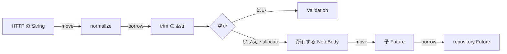

# 借用して検査し、所有して渡す

## 問い

検査だけなら参照で足りるのに、HTTP の `String` を `NoteBody` が所有し、子 Future へ値として渡すのはなぜでしょうか。

## 前提

[要求から検証済みの入力へ](reading-completion-input.md)を読み、要求全体の検証が保存より先に完了することを確認しているものとします。

## 読む場所と順序

1. `src/handler.rs` の `ReadingCompletionsRequest` と `record_reading_completions`。
2. `src/domain/text.rs` の `NoteBody`、`normalize`、`TryFrom<String>`。
3. `src/service.rs` の `reading_completions_validation` と `reading_completions_concurrency`。
4. `src/repository.rs` の `record_reading_completion`。

```rust,ignore
{{#include ../../../src/service.rs:reading_completions_validation}}
```

## 解説

handler の `into_iter()` は要求の `Vec` を消費し、各 `String` を service へ移します。service は件数と `book_id` の重複を借用で調べますが、本文は `NoteBody::try_from(item.body)` へ移します。

`normalize` の `trim()` が返す `&str` は元の `String` の一部を借ります。空かどうかを調べるだけならこの参照で十分です。しかし `NoteBody` は HTTP DTO が破棄された後も子 Future の中で使われます。そこで検査に成功した範囲から新しい `String` を一度だけ作り、`NoteBody` が所有します。



子 Future は `position`、`book_id`、`NoteBody` を所有します。repository には `&NoteBody` を渡し、その保存 Future を同じ子 Future の中で待ちます。本文を clone せず、所有者を一つに保ったまま必要な範囲だけ貸しています。

部分的な移動も同じ入口で現れます。handler は各 `ReadingCompletionItemRequest` から `book_id` と `body` を取り出せますが、`body` を移した後の項目全体は使えません。すべてのフィールドを使い切る現在の変換では、DTO を clone する理由がありません。

## 別案との比較

### `TryFrom<&str>` にする

変換の呼び出し時には成立しますが、検証済みの本文を子 Future が所有するには結局 `String` の割り当てが必要です。元の DTO を後で使う要件がないため、現在は所有権を直接引き渡します。

### HTTP DTO を clone する

コンパイルは通りますが、使い終わる元データを残すだけです。同じ本文の割り当てとコピーが増え、どちらが検証済みかも型から区別できません。

### `&str` を切り離した task へ渡す

呼び出し元より task が長く生存できるため成立しません。現在は task を切り離さず、親 Future が所有する `NoteBody` を子 Future が所有する形にします。

## 確認

1. `trim()` に本文の所有権を渡さなくてよいのはなぜですか。
2. `NoteBody` が検証後の文字列を所有するために、どこで割り当てが必要ですか。
3. 子 Future が `NoteBody` を所有し、repository には参照を渡す理由は何ですか。
4. HTTP DTO の clone が不要なのはなぜですか。

## 解答

1. 内容を一時的に読んで空か調べるだけなので、元の `String` を指す `&str` で足ります。
2. `trim()` の参照から、HTTP DTO と独立して生存する `String` を作る箇所です。
3. 子 Future の停止中も本文を保持しつつ、repository には保存に必要な期間だけ読ませるためです。
4. 各値は検証済みの型へ移され、元の DTO を後で使わないためです。clone は観測可能な能力を増やしません。

次は[保存状態を型状態へ接続する](../02-types/stored-state-to-typestate.md)で、DB から復元した状態を `Book<Reading>` へ絞る過程を読みます。
