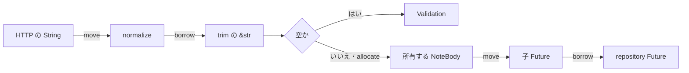

# 借用して検査し、所有して渡す

## 問い

検査だけなら参照で足りるのに、HTTP の `String` を `NoteBody` が所有し、子 Future へ値として渡すのはなぜでしょうか。

## 前提

[要求から検証済みの入力へ](reading-completion-input.md)を読み、要求全体の検証が保存より先に完了し、`NoteBody::try_from` が `String` を所有値へ変えることを確認しているものとします。

## 読む場所と順序

1. 借用して空を調べ、所有値を作る正規化: `src/domain/text.rs` の `normalize`（[借用で検査し所有値を作る](#借用で検査し所有値を作る)）。
2. 子 Future が所有し、repository が借用する: `src/service.rs` の `record_reading_completions`（[子 Future の所有と repository への借用](#子-future-の所有と-repository-への借用)）。
3. 移動と借用を `.await` をまたいで保持する理由: [Future が値を保持する範囲](../04-async/future-values.md)。

## 借用で検査し所有値を作る

対象: `src/domain/text.rs` / `normalize`

```rust,ignore
{{#include ../../../src/domain/text.rs:normalize_text}}
```

- `normalize(value: String, ...)` は本文を値で受け取ります。この時点で HTTP DTO が持っていた `String` の所有権が normalize へ移ります。
- `value.trim()` は前後の空白を除いた部分を指す `&str` を返します。所有権は移さず、trim の間だけ元の `String` を借ります。
- 空かどうかの検査はこの借用だけで足ります。`is_empty()` は文字を読むだけなので、新しい文字列を確保する必要はありません。
- 成功時は `value.to_owned()` で trim 後の範囲から新しい `String` を一度だけ作り、所有値として返します。検査に使った借用をそのまま返すと元の `String` の寿命に縛られるため、独立して生存できる値へ切り替えます。
- 失敗時は `&'static str` のメッセージを持つ `InvalidText` を返し、確保は行いません。

検査は借用で済ませ、HTTP DTO から切り離して長く使う本文だけを所有値へ写します。この所有値が `NoteBody` です。


```mermaid
flowchart LR
    Http[HTTP の String] -->|move| Normalize[normalize]
    Normalize -->|borrow| Trimmed[trim の &str]
    Trimmed --> Check{空か}
    Check -->|はい| Error[Validation]
    Check -->|いいえ・allocate| Body[所有する NoteBody]
    Body -->|move| Child[子 Future]
    Child -->|borrow| Repo[repository Future]
```

## 子 Future の所有と repository への借用

対象: `src/service.rs` / `ReadingService::record_reading_completions`（子 Future の生成と repository への借用）

```rust,ignore
{{#include ../../../src/service.rs:reading_completions_pipeline}}
```

- `validated.into_iter()` は検証済みの `Vec<(BookId, NoteBody)>` を消費し、各項目を値で取り出します。`.enumerate()` が入力順の位置を付け、`.map(...)` が項目ごとの子 Future を作ります。
- `|(position, (book_id, body))| async move { ... }` の `async move` は、位置と `book_id`（どちらも `Copy`）をコピーし、`body: NoteBody` の所有権を子 Future へ移します。`body` を clone せず、所有者を一つに保ちます。
- 子 Future の内側の `self.record_reading_completion(book_id, &body).await` は `body` を借用して repository の保存 Future を作り、その Future を子 Future の中で完了まで待ちます。repository 側は `&NoteBody` から `as_str()` で `&str` を取り、SQL へ bind します。
- `.collect::<FuturesUnordered<_>>()` は、同じ型を持つ子 Future を一つのコレクションへ集めます。各子 Future が自分の `NoteBody` を所有するため、位置や本文を親の `Vec` に残しておく必要がありません。
- 子 Future は `.await` をまたいで `body` を所有し続けます。そのため、親の検証ループを抜けて `validated` の `Vec` が消費された後も本文が生きています。子 Future が `validated` 内の `&str` を借りる形では、親の `Vec` を消費できません。子 Future の寿命も、その `Vec` に縛られます。

収集した結果を入力順へ戻す仕組みは[完了順と入力順を分ける](../04-async/completion-order.md)で読みます。

handler 側でも同じ判断をしています。各 `ReadingCompletionItemRequest` から `book_id` と `body` を移した後は、元の項目を使いません。二つのフィールドを使い切る変換なので clone は不要です（[handler の入力変換](reading-completion-input.md#handler-の入力変換)）。

## 別案との比較

### `TryFrom<&str>` にする

変換の呼び出し時には成立しますが、検証済みの本文を子 Future が所有するには結局 `String` の割り当てが必要です。元の DTO を後で使う要件がないため、現在は所有権を直接引き渡します。

### HTTP DTO を clone する

コンパイルは通りますが、使い終わる元データを残すだけです。同じ本文の割り当てとコピーが増え、どちらが検証済みかも型から区別できません。

### `&str` を切り離した task へ渡す

呼び出し元より task が長く生存できるため、借用では成立しません。現在は task を切り離さず、親 Future が持つ `NoteBody` の所有権を子 Future へ移します。

## 確認

1. `trim()` に本文の所有権を渡さなくてよいのはなぜですか。
2. `NoteBody` が検証後の文字列を所有するために、どこで割り当てが必要ですか。
3. 子 Future が `NoteBody` を所有し、repository には参照を渡す理由は何ですか。
4. 子 Future が `validated` の要素を借りる実装が成り立たないのはなぜですか。
5. HTTP DTO の clone が不要なのはなぜですか。

## 解答

1. 内容を一時的に読んで空か調べるだけなので、元の `String` を指す `&str` で足ります。
2. `trim()` の参照から、HTTP DTO と独立して生存する新しい `String` を作る `to_owned()` の箇所です。
3. 子 Future の停止中も本文を保持しつつ、repository には保存に必要な期間だけ `&NoteBody` を読ませるためです。
4. 子 Future を作る時点で `validated` を消費するため、借用が参照先より長く生きられません。所有値へ移せば参照先への依存が消えます。
5. 各値は検証済みの型へ移され、元の DTO を後で使わないためです。clone は観測可能な能力を増やしません。

次は[保存状態を型状態へ接続する](../02-types/stored-state-to-typestate.md)で、DB から復元した状態を `Book<Reading>` へ絞る過程を読みます。
