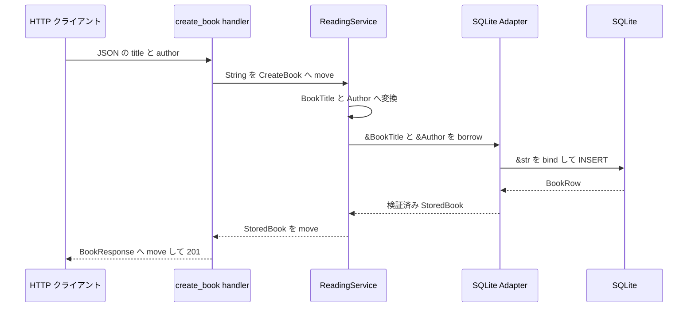

# 本の登録で所有権を追う

## 問い

`POST /books` の JSON に入った書名と著者は、HTTP の入口から SQLite、応答まで、どこで所有権が移り、どの呼び出しの間だけ借用されるのでしょうか。`Clone` を使わずに同じ値を保存と応答へつなげられる理由も考えます。

## 読む場所と順序

1. `src/app.rs` の `/books` route。
2. `src/handler.rs` の `CreateBookRequest` と `create_book`。
3. `src/service.rs` の `CreateBook` と `ReadingService::create_book`。
4. `src/repository.rs` の `BookRepository::insert_book`。
5. `src/repository/sqlite.rs` の `insert_book` と `TryFrom<BookRow> for StoredBook`。
6. `src/handler.rs` の `From<StoredBook> for BookResponse`。

### HTTP の入口

```rust,ignore
{{#include ../../../src/handler.rs:create_book_handler}}
```

### 検証と保存の呼び出し

```rust,ignore
{{#include ../../../src/service.rs:create_book_service}}
```

### SQLite への保存

```rust,ignore
{{#include ../../../src/repository/sqlite.rs:insert_book_sqlite}}
```

## 全体の流れ



矢印の `move` は所有者が変わる受け渡し、`borrow` は元の所有者を変えずに一時的に読む受け渡しです。

## 解説

### JSON から service まで移す

Axum の `Json<CreateBookRequest>` が成功すると、handler は `request` を所有します。`CreateBook` の構築では `request.title` と `request.author` を順に取り出し、それぞれの `String` を新しい入力値へ移します。

一つ目のフィールドを移した時点で `request` は部分的に移動された状態です。まだ移していない `request.author` は使えますが、構造体全体を一つの値として使うことはできません。2 つのフィールドをどちらも `CreateBook` へ渡した後、元の `request` に値は残りません。

`state.service.create_book(...)` は `CreateBook` を値で受け取ります。handler は入力の所有権を service へ渡し、`.await` の後に入力を使い直しません。入力を保持する必要がないため、ここで `Clone` は不要です。

### service で値型へ移し、repository には貸す

service は `input.title` を `BookTitle::try_from`、`input.author` を `Author::try_from` へ移します。成功すると、`title` と `author` が正規化済みの文字列を所有します。

repository の引数は `&BookTitle` と `&Author` です。service は値型を手放さず、保存処理の間だけ貸します。SQLite Adapter はさらに `as_str()` で内部の文字列を借り、SQLx の `.bind(...)` へ渡します。この参照は `.await` を含む `insert_book` の Future が完了するまで有効です。

借用した値をそのまま DB が所有するわけではありません。SQL の `INSERT` が文字列を SQLite の行へ保存し、`RETURNING` が新しい `BookRow` を返します。service が所有していた `title` と `author` は repository 呼び出しの完了後に役目を終えます。

### DB の行から応答用の値へ移す

`BookRow` は SQLx が DB の列から作る保存表現です。`row.try_into()` は書名、著者、状態を再検証し、`StoredBook` を返します。新規登録の SQL は状態を `want_to_read` に固定し、採番された ID とともに行を返します。

handler へ戻った `StoredBook` は `book.into()` で `BookResponse` へ移ります。変換では `into_parts` で本を分解し、`BookTitle::into_inner` と `Author::into_inner` が内部の `String` を出力 DTO へ移します。保存に使った入力文字列を clone して応答へ残すのではなく、DB から返された検証済みの値を応答の所有値へ変えています。

| 境界 | 渡す型 | 所有権の扱い |
| --- | --- | --- |
| JSON → handler | `CreateBookRequest` | extractor が値を作り、handler が所有する |
| handler → service | `CreateBook` | 2 つの `String` を移す |
| service → 値型 | `BookTitle`、`Author` | `String` を変換へ移す |
| service → repository | `&BookTitle`、`&Author` | 保存処理の間だけ借りる |
| SQLite → repository | `BookRow` | SQLx が行の値を所有する |
| repository → handler | `StoredBook` | 検証済みの本を戻り値として移す |
| handler → JSON | `BookResponse` | 内部の文字列を出力 DTO へ移す |

### `Result` と `?` が失敗を戻す

登録経路には、入力の検証、SQL の実行、保存値の復元という失敗点があります。各関数は `Result` を返し、`?` は失敗なら現在の関数から呼び出し元へ戻します。

- `BookTitle::try_from` と `Author::try_from` の `InvalidText` は `AppError::Validation` へ変換されます。
- SQLx のエラーは `AppError::Database` へ変換されます。
- DB から戻った値が不正なら `AppError::InvalidStoredValue` になります。
- handler の `?` が `AppError` を Axum へ返し、`IntoResponse` が HTTP 応答へ変換します。

`?` が成功値を複製することはありません。`Ok` の中身を取り出して次の変数へ移し、`Err` なら早期に戻ります。

## 確認

1. `request.title` を移した後でも `request.author` を使えるのはなぜですか。元の `request` 全体は使えますか。
2. service が repository へ `&title` を渡すのは、所有権をどこへ残すためですか。
3. 応答の書名は、入力 DTO を clone して保持したものですか。
4. 空白だけの書名と SQL の失敗は、同じ `AppError` の variant になりますか。

## 解答

1. フィールドは個別に移せるため、まだ移していない `author` は使えます。一部を移した後の構造体全体は、完全な値ではないため使えません。
2. `title` の所有者を service のローカル変数に残し、repository の保存処理に必要な期間だけ読ませるためです。
3. 違います。SQLite の `RETURNING` から復元した `StoredBook` を分解し、値型が所有する文字列を `BookResponse` へ移します。
4. なりません。入力の検証失敗は `Validation`、SQL の失敗は `Database` です。どちらも `Result` と `?` で戻りますが、原因は区別されます。

次は[成立する実装と別案を比べる](compare-alternatives.md)で、部分的な移動、借用、`Clone`、`?` の選択を短いコードで比較します。
