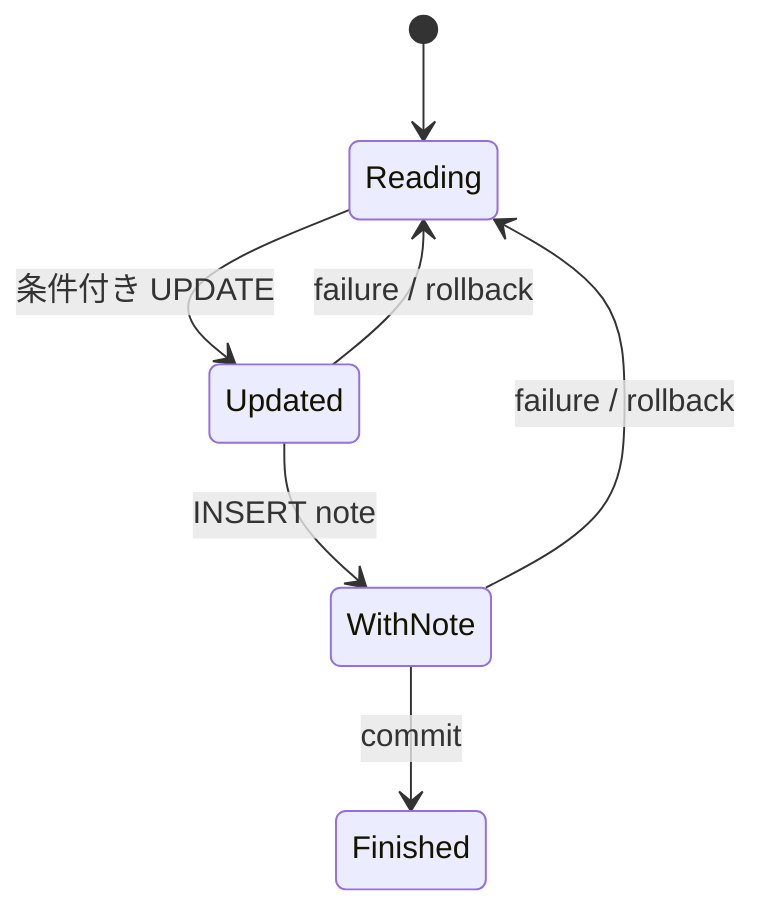

# 状態変更とメモを一緒に保存する

## 問い

合法な `Book<Finished>` を作れたあと、なぜ SQLite でも現在状態を調べ、状態変更とメモ追加を一つの transaction に入れるのでしょうか。

## 前提

[保存状態を型状態へ接続する](stored-state-to-typestate.md)を読み、型状態が手元の値だけを保証することを確認しているものとします。

## 読む場所と順序

1. `src/repository.rs` の `record_reading_completion` の契約。
2. `src/service.rs` の一冊を処理する `record_reading_completion`。
3. `src/repository/sqlite.rs` の `reading_completion_transaction`。
4. `tests/api.rs` の `rolls_back_a_completion_when_adding_its_note_fails`。
5. `migrations/0001_create_books_and_notes.sql`。

```rust,ignore
{{#include ../../../src/repository/sqlite.rs:reading_completion_transaction}}
```

## 解説

一冊の読了記録は次の順で進みます。

1. transaction を開始する。
2. `id` が一致し、現在状態が `reading` の本だけを `finished` へ更新する。
3. 同じ transaction でメモを追加する。
4. DB 行を検証済みの型へ復元する。
5. transaction を commit する。

条件付き `UPDATE` が行を返さなければ `Conflict` です。取得後に別の要求が状態を変えた場合も、削除した場合も、読書中という保存の前提が崩れています。

メモ追加や行変換、commit が失敗して `?` で戻ると、未確定の transaction は rollback されます。そのため「読了状態だけ」「メモだけ」という半端な読了記録を残しません。



冊子間は同じ transaction に入れません。ある本の競合や DB エラーは、その一冊を失敗にしますが、別の本ですでに commit した読了記録を取り消しません。

既存の `books` と `notes` の表、列、制約をそのまま使います。一括読了記録は新しい永続エンティティではなく、既存の状態変更とメモ追加を一緒に成立させる操作です。この完成形では migration を追加せず、既存データを削除しません。

## 別案との比較

### 状態更新とメモ追加を別々に commit する

後半の失敗で読了状態だけが残るため、一冊の読了記録の契約を破ります。

### 全冊を一つの transaction にする

全体成功・全体失敗が必要なら成立します。しかし独立した一冊の競合で別の本の成功まで失うため、部分成功の契約には合いません。

### 型状態だけを信頼して無条件に UPDATE する

取得時点の値が合法でも、DB はその後に変わり得ます。保存先の現在状態を再検査しないため競合を上書きします。

## 確認

1. `Book<Finished>` があっても `WHERE status = 'reading'` が必要なのはなぜですか。
2. メモ追加が失敗したとき、状態変更だけが残らない根拠は何ですか。
3. 一冊の原子性と冊子間の部分成功は、どの境界で分かれますか。
4. 今回 migration を追加しない理由は何ですか。

## 解答

1. 型状態は取得後の DB の変化を知らず、同じ ID の別スナップショットも存在できるためです。
2. 状態更新とメモ追加を同じ transaction で行い、commit 前の失敗では transaction 全体を rollback するためです。
3. 一冊は repository の一つの transaction、冊子間は service が持つ独立した子 Future と個別 commit で分かれます。
4. 読了記録は既存の本の状態と既存のメモで表現でき、新しい保存概念や列を必要としないためです。

次は[失敗後に何が残るか](completion-failures.md)で、入力不正、未検出、競合、依存先の失敗を結果と保存状態へ対応付けます。
