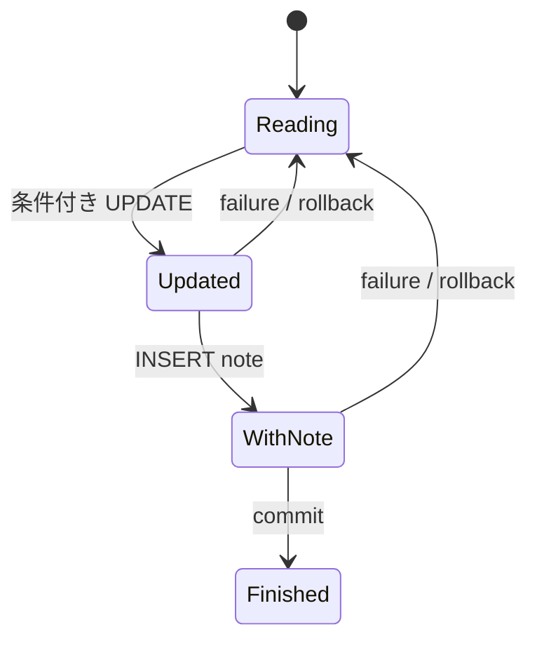

# 状態変更とメモを一緒に保存する

## 問い

合法な `Book<Finished>` を作れたあと、なぜ SQLite でも現在状態を調べ、状態変更とメモ追加を一つの transaction に入れるのでしょうか。

## 前提

[保存状態を型状態へ接続する](stored-state-to-typestate.md)を読み、型状態が手元の値だけを保証することを確認しているものとします。

## 読む場所と順序

次の順で読みます。各節の直前に、対応する実コードの抜粋があります。

1. [repository が約束する一冊の保存単位](#repository-が約束する一冊の保存単位): 呼び出し側が知る契約。
2. [条件付き UPDATE と transaction](#条件付き-update-と-transaction): SQLx の呼び出しと確定手順。
3. [失敗すると transaction 全体が rollback される](#失敗すると-transaction-全体が-rollback-される): `?` で抜けたときの保存状態。
4. [複数の本は独立した保存単位](#複数の本は独立した保存単位): 一冊の原子性と部分成功の境界。
5. [migration を追加しない理由](#migration-を追加しない理由): 既存の表で足りる根拠。

## repository が約束する一冊の保存単位

対象: `src/repository.rs` の `BookRepository::record_reading_completion`

```rust,ignore
{{#include ../../../src/repository.rs:record_completion_contract}}
```

doc コメントの 3 行が、このメソッドの契約そのものです。

1. 「現在状態が読書中でなければ `Conflict`」: 保存先が読書中かを確認できない保存は拒否します。
2. 「状態とメモのどちらも変更しない」: 片方だけが残る結果を許しません。
3. 「依存先の失敗時も transaction を rollback し、片方だけを残しません」: DB 操作の途中失敗も同じ扱いです。

シグネチャは `book: Book<Finished>` と `body: &NoteBody` を受け、`Result<(StoredBook, Note), AppError>` を返します。呼び出し側はこの契約だけを知ればよく、transaction や SQL は Adapter の中に隠れます。

## 条件付き UPDATE と transaction

対象: `src/repository/sqlite.rs` の `SqliteBookRepository::record_reading_completion`

```rust,ignore
{{#include ../../../src/repository/sqlite.rs:reading_completion_transaction}}
```

処理を順に追います。

1. `self.pool.begin().await?` で transaction を開始します。以後の SQL は `&mut *transaction` 上で実行し、確定するまで他の接続からは見えません。
2. `StoredBook::Finished(book)` は、受け取った `Book<Finished>` を enum に包みます。`id()` や `status()` を使うためです。
3. 1 つ目の `sqlx::query_as::<_, BookRow>("UPDATE ...")` は SQL 文と、`RETURNING` で返る行の型 `BookRow` を指定します。
4. `.bind(finished.id().0)` は SQL の `?` へ値を順に対応付けます。SQL は `SET status = 'finished' WHERE id = ? AND status = 'reading'` で、現在状態が読書中の行だけを更新します。
5. `.fetch_optional(&mut *transaction)` は 0 行または 1 行を `Option<BookRow>` で返します。`.ok_or(AppError::Conflict)?` は行が無ければ競合として関数を抜けます。取得後に別の要求が状態を変えた場合も、削除した場合も同じです。
6. 2 つ目の `query_as` はメモを同じ transaction 上で `INSERT` します。`.bind(finished.id().0)` と `.bind(body.as_str())` を渡し、`.fetch_one` は 1 行を必須とします。
7. `book_row.try_into()?` と `note_row.try_into()?` は、前章の変換で検証済みの `StoredBook` と `Note` へ復元します。
8. `transaction.commit().await?` で両方を確定し、`Ok((saved_book, note))` を返します。

条件付き UPDATE が行を返さなければ `Conflict` です。条件付き `UPDATE` は、型状態では知りえない保存先の現在状態を再検査する役割を持ちます。

## 失敗すると transaction 全体が rollback される

メモ追加、行の変換、commit のどれかが `Err` になると、`?` が関数を途中で抜けます。`commit()` 前に transaction が破棄されるため、SQLite の未確定の変更は rollback されます。そのため「読了状態だけ」「メモだけ」という半端な読了記録を残しません。


```mermaid
stateDiagram-v2
    [*] --> Reading
    Reading --> Updated: 条件付き UPDATE
    Updated --> WithNote: INSERT note
    WithNote --> Finished: commit
    Updated --> Reading: failure / rollback
    WithNote --> Reading: failure / rollback
```

テストの `rolls_back_a_completion_when_adding_its_note_fails` は、`notes` への `INSERT` を必ず拒否する trigger を作ります。状態更新のあとのメモ保存だけを決定的に失敗させ、rollback 後の保存状態を観測します。待ち時間や実行順には依存しません。

## 複数の本は独立した保存単位

一冊の原子性は、repository の一つの transaction が担います。service は一冊ごとに独立した子 Future を進め、それぞれの transaction を commit します。

ある本の競合や DB エラーは、その一冊だけを失敗にします。別の本ですでに commit した読了記録は取り消しません。この分け方は次章の[失敗後に何が残るか](completion-failures.md)で結果へ対応付けます。

## migration を追加しない理由

既存の `books` と `notes` の表、列、制約をそのまま使います。一括読了記録は新しい永続エンティティではなく、既存の状態変更とメモ追加を一緒に成立させる操作です。この完成形では migration を追加せず、既存データを削除しません。

## 別案との比較

### 状態更新とメモ追加を別々に commit する

後半の失敗で読了状態だけが残るため、一冊の読了記録の契約を破ります。

### 全冊を一つの transaction にする

全体成功・全体失敗が必要なら成立します。しかし独立した一冊の競合で別の本の成功まで失うため、部分成功の契約には合いません。

### 型状態だけを信頼して無条件に UPDATE する

取得時点の値が合法でも、DB はその後に変わり得ます。保存先の現在状態を再検査しないため競合を上書きします。

## 確認

1. `Book<Finished>` があっても `WHERE status = 'reading'` が必要なのはなぜですか。
2. メモ追加が失敗したとき、状態変更だけが残らない根拠は何ですか。
3. 一冊の原子性と、複数の本の間での部分成功は、どの境界で分かれますか。
4. 今回 migration を追加しない理由は何ですか。

## 解答

1. 型状態は取得後の DB の変化を知らず、同じ ID の別スナップショットも存在できるためです。
2. 状態更新とメモ追加を同じ transaction で行い、commit 前の失敗では transaction 全体を rollback するためです。
3. 一冊は repository の一つの transaction、複数の本は service が持つ独立した子 Future と個別 commit で分かれます。
4. 読了記録は既存の本の状態と既存のメモで表現でき、新しい保存概念や列を必要としないためです。

次は[失敗後に何が残るか](completion-failures.md)で、入力不正、未検出、競合、依存先の失敗を結果と保存状態へ対応付けます。
