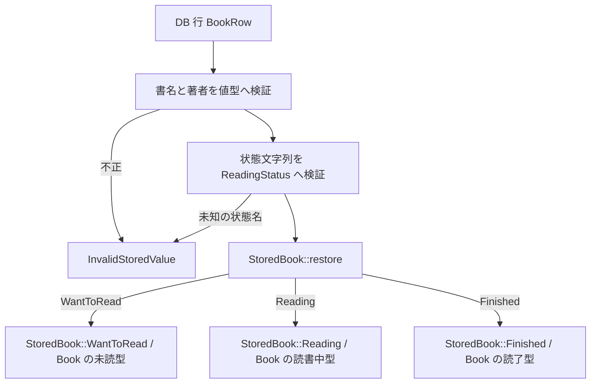

# 実行時の状態を型へ接続する

## 問い

DB を読むまで状態が分からない本を、どうやって `Book<S>` として扱うのでしょうか。型で遷移を制限しても残る、実行時の判定を探します。

## 読む場所と順序

1. `src/repository/sqlite.rs` の `BookRow` と `TryFrom<BookRow> for StoredBook`（[登録章](../01-values/create-book.md#db-の行から応答用の値へ移す)の抜粋）。
2. `src/domain.rs` の `ReadingStatus::try_from` と `parse_input`。
3. `src/domain/book.rs` の `StoredBook`、`restore`、`into_parts`。
4. `src/service.rs` の `UpdateStatus` と `update_status`。
5. `src/repository.rs` の更新契約、`src/repository/sqlite.rs` の `update_book_status`。
6. HTTP 側は `src/handler.rs` の `UpdateStatusRequest`・`update_status`・`BookResponse`、ID は `src/domain.rs` の `BookId`。



```rust,ignore
{{#include ../../../src/domain/book.rs:stored_book}}
```

```rust,ignore
{{#include ../../../src/service.rs:update_status_service}}
```

以下は SQLite repository の条件付き保存です。

```rust,ignore
{{#include ../../../src/repository/sqlite.rs:conditional_status_sqlite}}
```

## 解説

### 実行時に分かる状態を enum で包む

型引数はコンパイル時の情報なので、DB の文字列をそのまま `S` として代入することはできません。`StoredBook` は「3種類のどれか一つ」を保持する enum です。各 variant の中には、それぞれ異なる型の本が入っています。返り値の型はひとつの `StoredBook` にでき、`match` で取り出すと、その枝の中では `Book<Reading>` などの具体的な型として扱えます。

DB 境界はまず書名・著者を検証し、状態文字列を `ReadingStatus` に変換します。未知の保存状態は `InvalidStoredValue` です。一方、HTTP から来た状態名は `parse_input` が読み、未知なら `Validation` になります。入力元による分類は値型の章と同じ考え方です。

### restore は新規作成ではない

既に読了した本を DB から読むたびに、未読から操作を再実行する必要はありません。`restore` は検証済みの保存値から、その状態の本を復元します。`pub(crate)` なので crate 内で使う操作であり、外部の公開 API として自由に読了の本を新規作成する入口ではありません。

ただし可視性は「repository だけが呼べる」という制限でもありません。crate 内のどこで使うかは設計上の約束です。実際の呼び出し元である `TryFrom<BookRow>` が値を検証していることまで確認すると、復元境界の説明がつながります。

`into_parts` は逆方向の操作です。variant の違いを `match` で吸収し、共通の ID・値型・`ReadingStatus` へ所有権ごと分解します。handler はこの結果を出力 DTO に変えられるため、HTTP の利用者が `Book<S>` の型引数を扱う必要はありません。

### match で許可する組み合わせを絞る

service は要求された状態名を読み、現在の本を取得し、`expected` に取得時の状態を控えます。`match (current, requested)` の2つの枝だけが成功です。未読から読書中、読書中から読了の枝でそれぞれ型に合ったメソッドを呼びます。それ以外の、飛び越し・逆戻り・同じ状態への更新は `Conflict` です。

型状態が保証するのは、枝に入って取り出した本に対して合法な操作しか書けないことです。外から送られてくる状態名や DB の現在状態は、実行時に判定する必要があります。型を使うことで境界の判定が不要になるのではなく、判定後の操作を制約できます。

### 保存時にもう一度、現在状態を確認する

本を取得してから保存するまでに、別のリクエストが更新するかもしれません。SQL の `WHERE id = ? AND status = ?` は、取得時の `expected` と現在の保存状態が一致するときだけ更新します。該当行が返らなければ409です。取得後に削除された場合も、この条件付き保存が成立しなかったので409に分類します。最初の `find_book` で存在しなかった場合の404とは異なります。

これは状態を比較する保存条件であり、行の全フィールドや全履歴を比較する仕組みではありません。型状態はメモリ上の合法な操作、条件付き保存は取得時の状態を前提に保存できるか、という別々の保証です。

## 確認

1. DB の状態が実行時まで不明なのに、各枝で `start_reading` や `finish` を呼べるのはなぜですか。
2. `restore` が読了を直接作ることは、新規作成で読書中を飛び越せるという意味ですか。
3. 未知の状態名、同じ状態への更新、最初から未検出、取得後の削除はそれぞれ何になりますか。
4. `self` を消費する遷移に加えて、なぜ SQL の状態条件が必要ですか。

## 解答

1. `StoredBook` の variant を `match` すると、中の本の具体型が枝ごとに分かるためです。要求された状態との組み合わせの選択は実行時に残ります。
2. いいえ。検証済みの永続化データを復元する crate 内操作です。新規登録は SQL で未読に固定し、公開された `Book::new` も未読だけを作ります。
3. 未知の入力状態名は400、同じ状態への更新は409、最初の取得で未検出なら404、取得後に削除され条件付き更新が成立しなければ409です。未知の DB 状態名は保存値不正なので500です。
4. clone や別取得で同じ ID の値が複数存在し得るためです。値の移動だけでは DB の競合を防げません。

確認の根拠は `src/repository/sqlite.rs` の `conditional_update_rejects_a_stale_state` と `conditional_update_rejects_deletion_after_fetch` にあります。型による禁止は `src/domain/book.rs` の正例と `compile_fail` を `cargo test --doc` で確認します。両方を読むと、コンパイル時の保証と保存時の保証を混同せず説明できます。
