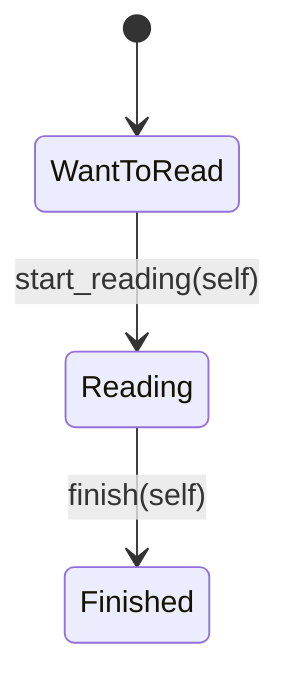

# 型状態で遷移を制限する

## 問い

未読の本に `finish()` を呼ぶ誤りを、実行する前に検出できるのはなぜでしょうか。その保証は、DB の同時更新にも及ぶのでしょうか。

## 読む場所と順序

1. `src/domain/book.rs` のマーカー型 `WantToRead`・`Reading`・`Finished`。
2. `Book<S>` と `impl Book<WantToRead>`、`impl Book<Reading>`、`impl<S> Book<S>`。
3. 同じ場所の rustdoc の正例・`compile_fail`、`transitions_preserve_book_data` テスト。
4. 補助として `src/domain.rs` の公開する型と `BookId`、`src/domain/text.rs` の `BookTitle`・`Author`。



```rust,ignore
{{#include ../../../src/domain/book.rs:book_typestate}}
```

## 解説

### 状態を型引数にする

`Book<S>` の `S` は状態を表す型引数です。`Book<WantToRead>` と `Book<Reading>` は別の型なので、コンパイラはどちらに何のメソッドがあるかを判定できます。マーカー型はフィールドを持たない単位構造体で、`state: S` にその値を格納しています。文字列を毎回比較する代わりに、現在の状態が型シグネチャに現れます。

`impl Book<WantToRead>` は未読の本だけに `new` と `start_reading` を提供します。`impl Book<Reading>` の `finish` は読書中の本だけにあります。これは特定の型引数に対象を絞った通常の `impl` であり、特殊な言語機能を有効にしているわけではありません。`impl<S> Book<S>` の `id`・`title`・`author` は、すべての状態で使える読み取り操作です。

### self を消費して別の型へ移る

`start_reading(self) -> Book<Reading>` は本を所有権ごと受け取り、ID・書名・著者を新しい型の本へ移します。`&mut self` で同じ変数の型を書き換える処理ではありません。返された本が次の操作の対象です。`finish` も同様に `Book<Finished>` を返します。

所有権が移った元の値を、同じままもう一度使うことはできません。そのため、ひとつの値を操作する経路では、遷移後の型を受け取って次へ進む必要があります。未読の型には `finish` が存在しないので、飛び越しは `Err` になる以前にコンパイルで拒否されます。

### 保証はその値に対するもの

この `Book<S>` は `Clone` を実装しています。遷移前に clone した値や、同じ DB 行を別々に取得した値まで消えるわけではありません。`self` の消費は「その所有値が移動した」という保証であり、同じ ID のスナップショットが世界に一つだけという保証ではありません。

また、`start_reading` も `finish` も SQL を実行していません。メモリ上の型が変わっても、保存できたとは限りません。DB で古い状態に基づく更新を拒否する仕組みは、[実行時の境界](runtime-boundaries.md)で読む条件付き UPDATE が担います。

### コンパイルできる例とできない例を確認する

`Book` の rustdoc には `Book::new(...).start_reading().finish()` という正例と、未読の本へ直接 `finish()` を呼ぶ `compile_fail,E0599` の例があります。リポジトリのルートで実行します。

```sh
cargo test --doc
```

正例はコンパイルして実行され、`compile_fail` はコンパイルが失敗することを検査します。通常のテストが不正な操作の `Err` を調べるのに対し、こちらは操作を記述したプログラム自体が受け入れられないことを確かめます。この章の抜粋はソースの表示用で、テストの正本は rustdoc です。

ただし、`compile_fail,E0599` と書いても、現在の rustdoc は診断コードが `E0599` と一致するところまでは検査しません。`cargo test --doc` の成功だけを、意図した理由で拒否された証拠にはできません。掲載時には同じ最小例を一時 crate で `cargo check` し、公開されている型の import と構築は成功したあと、未読の `Book<WantToRead>` に `finish` がないという診断になることを確認しました。代表部分は次の形です。

```text
error[E0599]: no method named `finish` found for struct `Book<WantToRead>` in the current scope
  = note: the method was found for
          - `Book<Reading>`
```

これにより、非公開項目へのアクセスや誤った import ではなく、意図した型状態の規則で拒否されたと切り分けられます。

## 確認

1. `Book<WantToRead>` に `finish` を呼べない理由は何ですか。
2. `start_reading(self)` のあと、同じ元の値を使えますか。先に clone した別の値はどうですか。
3. `Book<Finished>` が手元にあれば、DB への保存も成功していますか。
4. `cargo test --doc` では何を確認でき、意図した拒否理由はどのように確かめますか。

## 解答

1. `finish` は `impl Book<Reading>` にだけ定義されているためです。未読の本に対する実行時の判定ではありません。
2. 元の値は移動済みで使えません。ただし clone した別の値は残ります。全スナップショットの一意性や DB の排他は保証しません。
3. いいえ。遷移メソッドはメモリ上の値を返すだけで、保存処理は別です。
4. `src/domain/book.rs` の `Book` の rustdoc を `cargo test --doc` で実行し、正例の成功と失敗例のコンパイル拒否を確認します。診断コードまでは照合されないため、同じ最小例を `cargo check` し、`Book<WantToRead>` に `finish` がない `E0599` であることを別に確認します。
