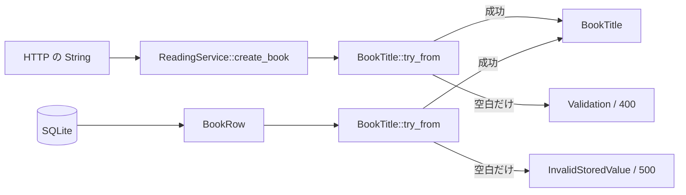

# 検証済みの文字列を値型にする

## 問い

関数の引数が `String` ではなく `BookTitle` であると、呼び出される側は何を検証し直さずに済むのでしょうか。

## 読む場所と順序

1. `src/handler.rs` の `CreateBookRequest` と `create_book`。
2. `src/service.rs` の `CreateBook` と `create_book`、`src/error.rs` の `From<InvalidText>`。
3. `src/domain/text.rs` の `BookTitle`、`normalize`、`TryFrom<String>`、参照と所有権を返すメソッド。
4. `src/repository/sqlite.rs` の `TryFrom<BookRow>`、`src/handler.rs` の `From<StoredBook> for BookResponse`。
5. 同じ値型ファイルの `Author`・`NoteBody` と各テスト。ID は `src/domain.rs` の `BookId`。

以下の抜粋には、書名の検証で使う共通関数とエラー型、隣接する値型の定義も含まれます。

```rust,ignore
{{#include ../../../src/domain/text.rs:validated_title}}
```

同じ構築規則を、HTTP 入力と DB の保存値という 2 つの境界から使います。



```rust,ignore
{{#include ../../../src/service.rs:create_book_service}}
```

```rust,ignore
{{#include ../../../src/repository/sqlite.rs:book_row_conversion}}
```

## 解説

### 非公開フィールドが構築経路を絞る

`pub struct BookTitle(String)` は、型自体は公開し、内部フィールドは非公開にしたタプル構造体です。呼び出し側が `BookTitle(String::new())` と直接作ることや、内部を空文字列へ書き換えることはできません。公開した変換経路で規則を満たしたときだけ値を渡せます。

この型の不変条件は「前後の空白が除かれ、空ではない」です。`trim` は前後の空白を除きますが、内部の空白や改行は保持します。文字数の上限や実在する書名であることまでは保証しません。型の名前から規則を想像するだけでなく、構築処理を読んで保証の範囲を確定させることが大切です。

`BookId(pub i64)` も別の型に包んでいますが、こちらは数値を公開しており、正数であるという検証はしていません。別の ID と取り違えないための区別と、内容を検証する値型とは目的を分けて読みましょう。

### TryFrom と関連型 Error

`From` は失敗しない変換、`TryFrom` は失敗し得る変換を表す標準 trait です。`impl TryFrom<String> for BookTitle` は、所有した文字列を受け取って `Result<BookTitle, InvalidText>` を返す約束です。

`type Error = InvalidText` は、この trait 実装が使うエラーの型を指定する「関連型」です。実行時に入るエラー値ではありません。`Self` はこの実装では `BookTitle`、`Self::Error` は `InvalidText` を指します。`normalize(...).map(Self)` は `Ok(String)` のときだけ構造体のコンストラクタで包み、`Err` はそのまま残します。

### 読み出し方にも所有権が表れる

| メソッド | 受け取り方 | 戻り値と用途 |
| --- | --- | --- |
| `as_str(&self)` | 借用 | `&str`。元の値を残して SQL の bind などで読む |
| `into_inner(self)` | 消費 | `String`。値型を使い終え、HTTP DTO へ所有権を渡す |

`as_str` の参照は元の値より長く生存できず、内部文字列を書き換える権限も与えません。`into_inner` で取り出した文字列は自由に変更できますが、既に `BookTitle` ではありません。再び値型として使うには検証を通す必要があります。この出口の設計が、不変条件を保ったままデータを使うことにつながります。

### 検証規則とエラー分類は別の責務

service の `BookTitle::try_from(input.title)?` は `From<InvalidText> for AppError` を利用して `Validation` に変換します。DB 行の復元では同じ変換に `map_err` を付け、`InvalidStoredValue` に明示的に分類し直しています。

値型の `InvalidText` 自体は HTTP の 400 や 500 を知りません。規則を共通化しても、失敗を誰の責任として扱うかは値の入ってきた境界に依存します。「同じ検証だから同じステータス」という結論にはなりません。

## 確認

1. `BookTitle` の構築成功後、呼び出し側が期待できる条件を2つ挙げてください。
2. `type Error` と `Self::Error` は何ですか。
3. SQL に渡す場面と出力 DTO に移す場面では、どちらの読み出し方が合いますか。
4. DB 復元でも単に `?` を使って入力と同じ分類にしたら、何が説明できなくなりますか。

## 解答

1. 前後の空白が除去済みであることと、空でないことです。内部の空白は残ります。
2. この `TryFrom` 実装の失敗型の指定と、その型への参照です。ここでは両者が `InvalidText` を表します。
3. SQL には `as_str` で借用し、出力 DTO には `into_inner` で所有権を移します。
4. 利用者が送った値の不正と、保存済みデータの不正を区別できなくなります。実装は DB 境界の `map_err` で後者を 500 の原因として扱います。

`src/domain/text.rs` の `title_is_trimmed_and_cannot_be_blank` などは、入力例と保証を対応させて読めます。次の[型状態](typestate.md)では、内容だけでなく呼べる操作を型で絞ります。
