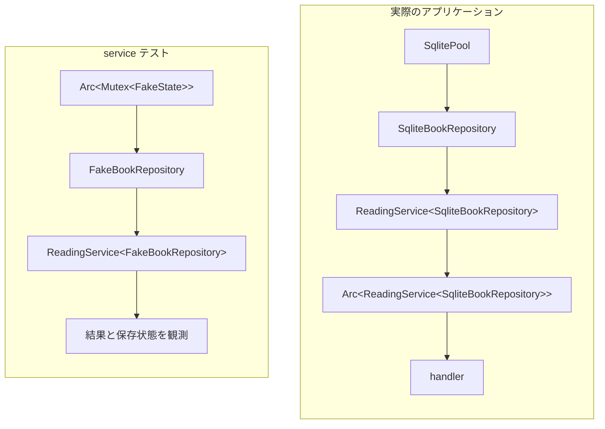

# ジェネリックな service を具体化する

## 問い

`ReadingService<R>` の `R` はいつ、どこで `SqliteBookRepository` や `FakeBookRepository` に決まるのでしょうか。型引数と所有する値を区別し、同じ service の呼び出しが各 Adapter へ届くまでを追います。

## 読む場所と順序

1. `src/service.rs` の `ReadingService<R>`、`new`、`create_book`、`update_status`。
2. `src/app.rs` の `AppState<R>`、`build_app`、`build_app_with_repository`。
3. `src/handler.rs` の `State<AppState<R>>` を受け取る handler。
4. `src/service/tests.rs` の `reports_a_save_conflict_without_changing_the_book`。
5. `src/test_support.rs` の `FakeBookRepository`。



図の 2 つの service は異なる具体型です。ただし、入力検証、状態遷移、エラー伝播を実装するメソッド本体は、どちらも同じ `impl<R: BookRepository>` から使われます。

```rust,ignore
{{#include ../../../src/service.rs:generic_service}}
```

この抜粋は `impl` の先頭までです。続くすべてのユースケースも同じ `impl<R: BookRepository>` の中にあります。

## 解説

### R と repository は別のもの

`R` は repository の型を表す型引数、`repository: R` は service が所有する値です。`ReadingService<R>` という型を宣言した時点では、`R` は特定の Adapter に決まっていません。

`new(repository: R)` は参照ではなく値を受け取り、その所有権をフィールドへ移します。service の各メソッドは `&self` を受け取り、フィールドの repository を共有借用して呼びます。呼び出すたびに repository を移動したり複製したりする必要はありません。

struct の宣言自体には `R: BookRepository` がありません。`new` とユースケースを定義する `impl` に境界があるため、これらのメソッドを利用できるのは `BookRepository` の Interface を満たす `R` の場合です。境界は「repository らしい名前の型」という印ではなく、メソッド本体でどの操作と結果へ依存できるかを決めています。

### 組み立て時の式から Adapter を具体化する

```rust,ignore
{{#include ../../../src/app.rs:composition}}
```

production の `build_app` では、値と型が次の順でつながります。

1. `SqliteBookRepository::new(pool)` が `SqliteBookRepository` の値を返す。
2. その値を `build_app_with_repository(repository)` へ渡す式から、`R = SqliteBookRepository` と推論される。
3. `ReadingService::new(repository)` の結果は `ReadingService<SqliteBookRepository>` になる。
4. `Arc::new` が service を所有し、型は `Arc<ReadingService<SqliteBookRepository>>` になる。
5. `AppState<R>` と `State<AppState<R>>` の同じ `R` を通じて、handler も SQLite Adapter を持つ service を利用する。

これは実行時の型切り替えではありません。Router を組み立てる呼び出しごとに具体型がコンパイル時に決まります。production では `SqliteBookRepository`、制御可能な検証では `FakeBookRepository` を渡します。どちらでも handler から `state.service.create_book(...)` を呼ぶと、`self.repository.insert_book(...)` はその Router に渡した Adapter の実装へ届きます。

`AppState<R>` と handler まで同じ型引数を伝えるのは、既存の `BookRepository` Seam の Adapter を Router の組み立て時に選べるようにするためです。新しい Interface や動的ディスパッチは増やしていません。

### service テストではフェイクに具体化する

```rust,ignore
{{#include ../../../src/service/tests.rs:service_conflict_test}}
```

このテストでは値と型が次のようにつながります。

1. `FakeBookRepository::default()` がフェイクの値を作る。
2. `ReadingService::new(fake.clone())` から `R = FakeBookRepository` と推論される。
3. 結果の型は `ReadingService<FakeBookRepository>` になる。
4. `service.update_status(...)` 内の `find_book` と `update_book_status` はフェイク Adapter へ届く。
5. テスト側に残した `fake` から、同じ保存状態を観測する。

`ReadingService<SqliteBookRepository>` と `ReadingService<FakeBookRepository>` は別の具体型ですが、service の判断を別実装へ差し替えてはいません。`ReadingService<R>` の同じメソッド本体を使い、永続化だけを異なる Adapter にしています。

フェイクの clone は、この検査に必要な所有権を分けるためにあります。

```rust,ignore
{{#include ../../../src/test_support.rs:fake_state}}
```

service へフェイクを値として渡したあとも、テスト側には失敗注入と保存結果の確認に使うハンドルが必要です。`FakeBookRepository` の clone は内部の `Arc` を clone し、同じ `FakeState` の共有所有者を増やします。`BTreeMap` や本を丸ごと複製して別の保存状態を作るわけではありません。

`AppState<R>` も `Arc<ReadingService<R>>` を持つため、`AppState<R>` の clone に service や `R` 自身の `Clone` は必要ありません。手書きの `Clone` 実装は `Arc` の共有所有者だけを増やし、service や保存状態を複製しません。repository の Interface にも `ReadingService<R>` にも、理由のない `Clone` 境界は付いていません。

### 静的ディスパッチで呼び出し先が決まる

`R: BookRepository` は、実行時に登録済み Adapter の一覧から呼び出し先を探す仕組みではありません。各利用箇所で `R` が具体化されると、その具体型の `BookRepository` 実装へ静的に結び付きます。

| 利用経路 | `R` | repository 呼び出しの到達先 | 観測する保証 |
| --- | --- | --- | --- |
| production の Router | `SqliteBookRepository` | SQLx と SQLite | HTTP から実 DB までの保存結果 |
| 制御可能な Router テスト | `FakeBookRepository` | `BTreeMap` と注入エラー | HTTP から制御可能な保存先までの振る舞い |
| service テスト | `FakeBookRepository` | `BTreeMap` と注入エラー | service の検証、遷移、エラー伝播 |

この形では、`Box<dyn BookRepository>` のためのヒープ割り当てや vtable を介した動的ディスパッチは必要ありません。Adapter ごとに結果型を変える関連型も必要ありません。`BookRepository` が固定したドメイン型とエラーを両方の Adapter が返すため、service は Adapter 固有の分岐を持たずに済みます。

差し替え可能性のために service を薄い転送層にしているわけでもありません。入力の値型への変換、状態の組み合わせの判定、複数の repository 操作の順序は service にあります。repository は SQL やメモリ操作と保存契約を担当します。この責任の分け方により、同じ service の判断をフェイクで制御して確かめ、SQLite Adapter の保存契約を実 DB で別に確かめられます。

## 確認

1. `ReadingService<R>` は repository の型だけを記録しますか、それとも repository の値を所有しますか。
2. production の Router で `R = SqliteBookRepository` と判断できる式はどこですか。
3. フェイクを使うテストは、service の判断も別実装へ差し替えていますか。
4. `fake.clone()` は何を複製し、なぜ必要ですか。
5. `ReadingService` や `R` に `Clone` がなくても `AppState<R>` を clone できるのはなぜですか。
6. repository trait があるうえで、`AppState` と handler もジェネリックにする理由は何ですか。

## 解答

1. `repository: R` として値を所有します。メソッドの実行時は `&self` からその値を共有借用します。
2. `SqliteBookRepository::new(pool)` の結果を `build_app_with_repository` へ渡す式から、`R = SqliteBookRepository` と推論されます。
3. いいえ。repository の値と実装だけを変え、入力検証や状態遷移には同じ `ReadingService<R>` のメソッドを使います。
4. 内部の `Arc` を clone して、同じ `FakeState` へのハンドルを増やします。service に所有権を渡したあとも、テストから失敗を設定し保存状態を観測するためです。
5. `AppState<R>` が clone するのは `Arc` だけだからです。service 本体や `R` を複製する必要はありません。
6. 既存の `BookRepository` Seam の Adapter を Router の組み立て時に選び、HTTP からの処理を制御可能な保存先まで通すためです。型引数はその既存 Seam を組み立て場所まで届ける役割だけを持ちます。

第 3 部では、`BookRepository` の契約を SQLite とフェイクが別々に実現し、`ReadingService<R>` の `R` が組み立て場所ごとに具体化されることを読みました。次は[非同期処理の借用と共有](../04-async/async-bounds.md)で、同じ呼び出しが返す Future に `Send`、`Sync`、`'static` がどう要求されるかを分けて読みます。
