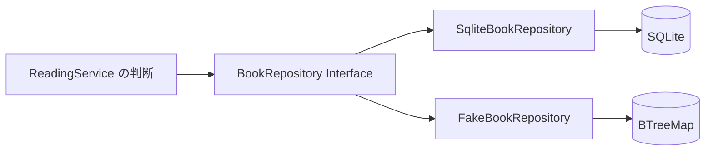

# 永続化の契約を trait で読む

## 問い

service は SQL を書かずに、保存の成功・未検出・競合をどう区別できるのでしょうか。`BookRepository` をメソッド一覧としてではなく、SQLite とフェイクがともに満たす Interface として読みます。

## 読む場所と順序

1. `src/repository.rs` の `BookRepository` 全体。
2. `src/service.rs` の `create_book`、`update_status`、`record_reading_completion`。
3. `src/repository/sqlite.rs` の `impl BookRepository for SqliteBookRepository`、`insert_book`、`find_book`、`update_book_status`、`record_reading_completion`。
4. `src/test_support.rs` の `impl BookRepository for FakeBookRepository`、`update_book_status`、`record_reading_completion`。
5. `src/repository/sqlite.rs` と `src/service/tests.rs` にある、古い状態からの更新を拒否するテスト。
6. `tests/api.rs` の `rolls_back_a_completion_when_adding_its_note_fails`。



`BookRepository` は別プロセスやデータの通り道ではありません。service が永続化を利用する Seam に置かれた Interface です。SQLite Adapter とフェイク Adapter は、同じ Interface を異なる方法で実装します。

```rust,ignore
{{#include ../../../src/repository.rs:repository_contract}}
```

## 解説

### Interface は型シグネチャだけではない

trait の宣言からは、呼び出せる操作、引数、完了時の値、返り得るエラー型を読めます。しかし、次のような意味は型だけでは表し切れません。

| 操作 | 入力と成功時の値 | 呼び出し側が頼る規則 |
| --- | --- | --- |
| `insert_book` | 検証済みの書名・著者を借り、採番済みの本を返す | 新しい本は未読として保存する |
| `list_books` | 状態は任意、結果は ID 順の一覧 | 指定なしは全件、該当なしは空の一覧 |
| `find_book` | ID から本を返す | 未検出は `NotFound` |
| `list_notes` | 本の ID からメモ一覧を返す | 本やメモがなくても空の一覧 |
| `insert_note` | 検証済みの本文を借り、採番済みのメモを返す | 本がなければ `NotFound` |
| `update_book_status` | 取得時の状態と遷移済みの本を受け取る | 状態不一致と取得後の削除は `Conflict` とし、その場合は変更しない |
| `record_reading_completion` | 読了へ遷移済みの本と検証済みのメモ本文を受け取る | 現在状態が読書中の場合だけ、状態とメモを一つの保存単位で確定する。競合や依存先の失敗では片方だけを残さない |
| `delete_book` | ID で本を削除する | 関連メモも削除し、本がなければ `NotFound` |

たとえば `insert_book` の引数が値型なので、空白だけの書名をこの Seam へ持ち込むことは防げます。一方、実装が未読で保存することや、`list_books` が ID 順であることは型からは証明できません。rustdoc、Adapter の実装、観測可能な結果を確かめるテストまでが Interface の根拠です。

`update_book_status` では、service が実行時の状態を見て合法な遷移を作り、repository が取得時の状態を前提に保存できるか調べます。型状態がメモリ上の操作を制限し、repository の条件付き更新が永続化の競合を検出します。どちらか一方で両方を保証しているわけではありません。

`record_reading_completion` では、service が `Book<Reading>` を `Book<Finished>` へ進め、repository が DB の現在状態をもう一度検査します。成功時は読了状態とメモの両方を返し、失敗時はどちらも残しません。この原子性はタプルの返り値だけからは証明できないため、rustdoc、SQLite の transaction、フェイクの更新順、失敗後の保存状態を確認するテストを一緒に読みます。

### impl Future は実装ごとの具体型を隠す

返り値の `impl Future<Output = Result<StoredBook, AppError>> + Send` を分解します。

| 記述 | 読み方 |
| --- | --- |
| `impl Future` | Adapter が決める、`Future` を実装した一つの具体型を返す。呼び出し側には型名を公開しない |
| `Output = Result<StoredBook, AppError>` | 完了時に得られる値は、保存された本かアプリケーションのエラー |
| `+ Send` | 返す Future はスレッド間で移動可能でなければならない |

`impl Trait` は「型が未定」という意味ではありません。SQLite Adapter とフェイク Adapter の各メソッドには、それぞれコンパイラが決める具体的な Future の型があります。Interface はその名前を隠し、呼び出し側が利用できる能力だけを示します。

Adapter 側は `async fn insert_book(...) -> Result<...>` と書けます。`async fn` の呼び出しが返す Future が、この `impl Future` の契約を満たすためです。service は具体的な Future の名前を知らなくても `.await` して `Result` を受け取れます。Future が借用する値や `Send` の要求元は、次の部で詳しく読みます。

### SQLite Adapter は実際の保存を担う

```rust,ignore
{{#include ../../../src/repository/sqlite.rs:conditional_update}}
```

SQLite Adapter は SQL、接続、DB 行とドメイン型の変換を内部に隠します。状態更新では `WHERE` に ID と期待する状態を入れ、比較と書き込みを一つの SQL にしています。`fetch_optional` の `None` は `Conflict` へ変換し、SQL の失敗は `AppError::Database`、不正な保存値は `InvalidStoredValue` として返します。

service は `WHERE` 句や `BookRow` を知りません。`find_book` の `NotFound`、条件付き保存の `Conflict`、成功時の `StoredBook` という Interface を使って処理を組み立てます。そのため SQL の実装知識が service の各メソッドへ散らばりません。

一括読了記録では、状態を `finished` へ変える条件付き更新とメモ追加を同じ transaction で実行します。メモ追加が失敗すると transaction を rollback し、状態更新だけを残しません。service は SQL の順序を知らず、「両方が保存された成功値か、どちらも残らない失敗」という Interface に依存します。

### フェイク Adapter は同じ契約を制御可能にする

```rust,ignore
{{#include ../../../src/test_support.rs:fake_update}}
```

フェイクも `BookRepository` を実装し、`BTreeMap` の現在状態が `expected` と一致するときだけ更新します。状態不一致と取得後の削除を `Conflict` にし、注入した保存エラーを変更前に返します。常に成功するだけの代用品ではありません。

フェイクの `record_reading_completion` も、注入した失敗と現在状態の検査を保存前に終え、成功するときだけ本とメモの両方を更新します。SQLite と同じ transaction 機構をまねるのではなく、呼び出し側が観測する原子性を同じにします。

2 つの Adapter から確認できることは異なります。

| Adapter | 確認できること | これだけでは確認できないこと |
| --- | --- | --- |
| SQLite | 実 SQL の条件、行変換、migration と制約、DB エラー | service の分岐を狙った場所で失敗させたときの判断 |
| フェイク | 入力検証、状態遷移、保存失敗の伝播を決まった順序で観測できる | SQL、SQLite の制約、DB 行からの復元 |

両方に古い取得結果と取得後の削除を拒否するテストがあります。これは実装を同じにするためではなく、service が頼る条件付き更新の契約をどちらの Adapter も満たすと確かめるためです。SQLite とフェイクという実在する 2 つの差し替え先があるので、この Seam は将来の可能性だけを想定した抽象化ではありません。

### 関連型や dyn Trait を採用しない理由

関連型は、Adapter ごとに結果の型を変える必要がある場合に候補になります。たとえば本の型を `type Book` にすると、service 側には `R: BookRepository<Book = StoredBook>` のような等値制約が必要です。このアプリではどの Adapter も同じ `StoredBook`、`Note`、`AppError` を受け渡すこと自体が Interface なので、関連型にしても差し替えの自由は増えず、読むべき型だけが増えます。

`dyn BookRepository` は実行時に Adapter を選び、trait object を通して動的ディスパッチしたい場合の候補です。しかし現在の `BookRepository` はメソッドの返り値に `impl Future` を使うため、そのままでは dyn 互換ではありません。Future を box 化するなど、dyn 互換の別の Interface が必要になります。

このアプリは起動時に SQLite、service テストのコンパイル時にフェイクと、利用する具体型をそれぞれ決められます。実行中に Adapter を入れ替えないため、Future の box 化、追加の割り当て、動的ディスパッチを導入する理由がありません。関連型や `dyn Trait` が使えないから避けているのではなく、現在の差異を表すにはジェネリックな `R: BookRepository` が最も小さい Interface だから採用しています。

## 確認

1. `BookRepository` の型シグネチャだけでは分からず、rustdoc やテストまで読む必要がある規則を 2 つ挙げてください。
2. `impl Future` は、呼び出すたびに任意の型を返したり、実行時に Adapter を選んだりする指定ですか。
3. SQLite Adapter とフェイク Adapter は、それぞれ何を確かめるために必要ですか。
4. 2 つの Adapter で条件付き更新のテストを持つのは、内部実装を同じにするためですか。
5. この Interface で関連型を追加しても利点が小さいのはなぜですか。
6. 現在の `BookRepository` をそのまま `dyn BookRepository` として使わない理由は何ですか。

## 解答

1. 例として、新しい本を未読で保存すること、一覧を ID 順に返すこと、状態不一致では保存内容を変えず `Conflict` を返すことがあります。型は入出力を制約しますが、これらの意味までは実装しません。
2. いいえ。各 Adapter の各メソッドで具体型は決まっています。`impl Future` はその型名を隠し、`Future`、`Output`、`Send` という利用可能な契約だけを公開します。
3. SQLite は実 SQL、DB 制約、行変換を確かめます。フェイクは service の判断とエラー伝播を、任意の待ち時間や DB の状態操作に頼らず確かめます。
4. いいえ。内部は SQL と `BTreeMap` で異なります。service が頼る、古い状態や削除後の更新を拒否する契約を両方が満たすことを確かめています。
5. どの Adapter も同じドメイン型を返すことが契約であり、service 側に関連型の等値制約を追加するだけになるためです。
6. 返り値の `impl Future` を持つ現在の trait は dyn 互換ではありません。また Adapter は実行時に切り替えないため、box 化や動的ディスパッチを伴う別 Interface を導入する必要もありません。

次は[ジェネリックな service](generic-service.md)で、SQLite とフェイクの具体型がどこで決まり、同じ service の呼び出しがどちらへ届くかを追います。
