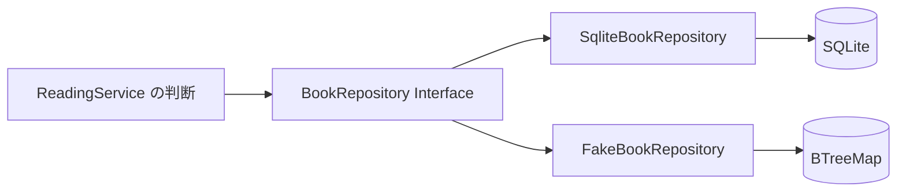

# `BookRepository` の契約

## 問い

service は SQL を書かずに、保存の成功・未検出・競合をどう区別できるのでしょうか。`BookRepository` をメソッド一覧としてではなく、SQLite とフェイクがともに満たす Interface として読みます。

## 前提

[失敗後に何が残るか](../02-types/completion-failures.md)まで読み、一冊では状態とメモを原子的に保存し、複数の本の間では部分成功を許す契約を確認しているものとします。

## 読む場所と順序

1. [trait の宣言と `Send + Sync`](#trait-declaration)（`src/repository.rs`）。
2. [シグネチャから読めること、読めないこと](#interface-semantics)（同じ trait のメソッドと戻り型）。
3. [impl Future は実装ごとの具体型を隠す](#impl-future)（`update_book_status`、`record_reading_completion` の宣言）。
4. [借用と寿命は誰が決めるか](#borrow-lifetime)（`insert_book` の宣言）。
5. [SQLite Adapter は実際の保存を担う](#sqlite-adapter)（`src/repository/sqlite.rs` の `update_book_status`）。
6. [関連型や dyn Trait を採用しない理由](#associated-dyn)。


```mermaid
flowchart LR
    Service[ReadingService の判断] --> Interface[BookRepository Interface]
    Interface --> Sqlite[SqliteBookRepository]
    Interface --> Fake[FakeBookRepository]
    Sqlite --> DB[(SQLite)]
    Fake --> Memory[(BTreeMap)]
```

`BookRepository` は別プロセスやデータの通り道ではありません。service が永続化を利用する Seam に置かれた Interface です。SQLite Adapter とフェイク Adapter は、この Interface を異なる方法で実装します。

具体型がどこで選ばれるかは[フェイクと SQLite Adapter](adapters.md#generic-r)で追います。

## 解説

<a id="trait-declaration"></a>
### trait の宣言と `Send + Sync`

対象: `src/repository.rs` / `BookRepository`

```rust,ignore
{{#include ../../../src/repository.rs:trait_header}}
```

- `pub(crate) trait BookRepository` は crate の内側だけが実装し利用する Interface です。外部へ公開しません。
- 型引数も関連型も持たず、メソッドが扱う型は `StoredBook`、`Note`、`AppError` に固定されています。実装ごとに答えの型が変わる余地を作りません。
- `Send + Sync` は supertrait の要求です。`BookRepository` を実装する型は、所有したままスレッドへ移せて（`Send`）、複数の子 Future から `&R` を共有借用できなければなりません（`Sync`）。

この 2 つが必要な理由は、service が repository を所有し、複数の子 Future が `&R` を同時に持つ設計の帰結です。要求元は[Future が値を保持する範囲](../04-async/future-values.md)で、実際に `R` が何になるかは[フェイクと SQLite Adapter](adapters.md#generic-r)で読みます。

<a id="interface-semantics"></a>
### シグネチャから読めること、読めないこと

trait の宣言からは、呼び出せる操作、引数、完了時の値、返り得るエラー型を読めます。しかし、次のような意味は型だけでは表し切れません。

| 操作 | 入力と成功時の値 | 呼び出し側が頼る規則 |
| --- | --- | --- |
| `insert_book` | 検証済みの書名・著者を借り、採番済みの本を返す | 新しい本は未読として保存する |
| `list_books` | 状態は任意、結果は ID 順の一覧 | 指定なしは全件、該当なしは空の一覧 |
| `find_book` | ID から本を返す | 未検出は `NotFound` |
| `list_notes` | 本の ID からメモ一覧を返す | 本やメモがなくても空の一覧 |
| `insert_note` | 検証済みの本文を借り、採番済みのメモを返す | 本がなければ `NotFound` |
| `update_book_status` | 取得時の状態と遷移済みの本を受け取る | 状態不一致と取得後の削除は `Conflict` とし、その場合は変更しない |
| `record_reading_completion` | 読了へ遷移済みの本と検証済みのメモ本文を受け取る | 現在状態が読書中の場合だけ、状態とメモを一つの保存単位で確定する。競合や依存先の失敗では片方だけを残さない |
| `delete_book` | ID で本を削除する | 関連メモも削除し、本がなければ `NotFound` |

`insert_book` の引数は検証済みの型なので、空白だけの書名をこの Seam へ持ち込めません。一方、実装が本を未読で保存することや、`list_books` が ID 順であることは型から証明できません。

rustdoc、Adapter の実装、観測可能な結果を確かめるテストも Interface の根拠になります。

`update_book_status` では、service が実行時の状態を見て合法な遷移を作り、repository が取得時の状態を前提に保存できるか調べます。型状態がメモリ上の操作を制限し、repository の条件付き更新が永続化の競合を検出します。どちらか一方で両方を保証しているわけではありません。

`record_reading_completion` では、service が `Book<Reading>` を `Book<Finished>` へ進め、repository が DB の現在状態をもう一度検査します。成功時は読了状態とメモの両方を返し、失敗時はどちらも残しません。

タプルの返り値だけでは、この原子性を証明できません。rustdoc、SQLite の transaction、フェイクの更新順、失敗後の保存状態を確認するテストも一緒に読みます。

<a id="impl-future"></a>
### impl Future は実装ごとの具体型を隠す

まず、条件付き保存の宣言です。

対象: `src/repository.rs` / `BookRepository::update_book_status`

```rust,ignore
{{#include ../../../src/repository.rs:update_status_signature}}
```

もう一つ、読了記録の宣言です。

対象: `src/repository.rs` / `BookRepository::record_reading_completion`

```rust,ignore
{{#include ../../../src/repository.rs:record_completion_contract}}
```

共通して現れる返り値の `impl Future<Output = Result<...>> + Send` を分解します。

| 記述 | 読み方 |
| --- | --- |
| `fn update_book_status(...)` | `&self` を借りる同期のメソッドです。`async fn` ではなく、Future を値として返します |
| `impl Future` | Adapter が決める、`Future` を実装した一つの具体型を返す。呼び出し側には型名を公開しない |
| `Output = Result<StoredBook, AppError>` | 完了時に得られる値は、保存された本かアプリケーションのエラー |
| `+ Send` | 返す Future はスレッド間で移動可能でなければならない |

`impl Trait` は「型が未定」という意味ではありません。SQLite Adapter とフェイク Adapter の各メソッドには、コンパイラが決める具体的な Future の型があります。Interface はその名前を隠し、呼び出し側が利用できる能力だけを示します。

`record_reading_completion` の `Output` は、`(StoredBook, Note)` というタプルです。状態とメモが一つの完了値として返ることが型に現れます。

Adapter 側は `async fn update_book_status(...) -> Result<...>` と書けます。`async fn` の呼び出しが返す Future が、この `impl Future` の契約を満たすためです。service は具体的な Future の名前を知らなくても `.await` して `Result` を受け取れます。

<a id="borrow-lifetime"></a>
### 借用と寿命は誰が決めるか

対象: `src/repository.rs` / `BookRepository::insert_book`

```rust,ignore
{{#include ../../../src/repository.rs:insert_signature}}
```

- `&self` は repository を所有せず借ります。service は repository の所有者であり続けます。
- `&BookTitle` と `&Author` は、検証済みの値を保存の間だけ貸します。所有権を repository へ渡さず、呼び出し側が検証済みの値を保持し続けられます。
- 返る `impl Future` は、これらの借用を完了まで捕まえます。`+ 'static` を要求しないので、借用を保持したまま service の子 Future の中で待てます。所有権を渡すか借りるかの判断は[借用して検査し、所有して渡す](../01-values/borrow-and-own.md)と同じ基準です。

Future が借用をまたいで何を保持するか、`Send` と `Sync` の要求元は[Future が値を保持する範囲](../04-async/future-values.md)で詳しく読みます。

<a id="sqlite-adapter"></a>
### SQLite Adapter は実際の保存を担う

条件付き更新の実装です。

対象: `src/repository/sqlite.rs` / `SqliteBookRepository::update_book_status`

```rust,ignore
{{#include ../../../src/repository/sqlite.rs:conditional_update}}
```

1. `UPDATE books SET status = ? WHERE id = ? AND status = ?` で、ID と期待する状態を一つの文にまとめます。比較と書き込みの間に別の要求が割り込む余地を SQL の中で閉じます。
2. `WHERE` に一致する行がなければ `fetch_optional` の `None` が返り、`.ok_or(AppError::Conflict)?` で `Conflict` になります。取得後の状態変更も削除も同じ経路です。
3. 行が返れば、`BookRow` から `StoredBook` へ復元して成功値にします。

SQLite Adapter は SQL、接続、DB 行とドメイン型の変換を内部に隠します。service は `WHERE` 句や `BookRow` を知りません。`find_book` の `NotFound`、条件付き保存の `Conflict`、成功時の `StoredBook` という Interface だけを使って処理を組み立てます。

一括読了記録では、状態を `finished` へ変える条件付き更新とメモ追加を同じ transaction で実行します。メモ追加が失敗すると transaction を rollback し、状態更新だけを残しません。この手順は[状態変更とメモを一緒に保存する](../02-types/atomic-completion.md)と[失敗後に何が残るか](../02-types/completion-failures.md)で確認済みです。

service は SQL の順序を知りません。「両方が保存された成功値か、どちらも残らない失敗」という Interface に依存します。

<a id="fake-adapter"></a>
### フェイク Adapter も同じ契約を満たす

SQLite と差し替え可能なフェイクも `BookRepository` を実装します。フェイクの内部構造、失敗注入、並行進行の制御は[フェイクと SQLite Adapter](adapters.md#fake-contract)で読みます。

ここでは、二つの Adapter が同じ Interface を満たしながら、異なる範囲を検証することを押さえます。

| Adapter | 確認できること | これだけでは確認できないこと |
| --- | --- | --- |
| SQLite | 実 SQL の条件、行変換、migration と制約、DB エラー | service の分岐を狙った場所で失敗させたときの判断 |
| フェイク | 入力検証、状態遷移、保存失敗の伝播を決まった順序で観測できる | SQL、SQLite の制約、DB 行からの復元 |

両方の Adapter に、古い取得結果と取得後の削除を拒否するテストがあります。実装を同じにするためではありません。service が頼る条件付き更新の契約を、どちらの Adapter も満たすと確かめるためです。

SQLite とフェイクという二つの実在する差し替え先があります。そのため、この Seam は将来の可能性だけを想定した抽象化ではありません。

<a id="associated-dyn"></a>
### 関連型や dyn Trait を採用しない理由

関連型は、Adapter ごとに結果の型を変える必要がある場合に候補になります。たとえば本の型を `type Book` にすると、service 側には `R: BookRepository<Book = StoredBook>` のような等値制約が必要です。

このアプリでは、どの Adapter も同じ `StoredBook`、`Note`、`AppError` を受け渡します。それ自体が Interface なので、関連型にしても差し替えの自由は増えず、読むべき型だけが増えます。

`dyn BookRepository` は、実行時に Adapter を選び、trait object を通して動的ディスパッチする場合の候補です。しかし現在の `BookRepository` は、メソッドの返り値に `impl Future` を使うため、そのままでは dyn 互換ではありません。

利用するには Future を box 化するなど、dyn 互換の別の Interface が必要です。

このアプリでは、起動時に SQLite、service テストのコンパイル時にフェイクという具体型を決められます。実行中に Adapter を入れ替えないため、Future の box 化、追加の割り当て、動的ディスパッチを導入する理由がありません。

関連型や `dyn Trait` が使えないから避けているのではありません。現在の差異を表す最小の Interface が、ジェネリックな `R: BookRepository` だから採用しています。

## 確認

1. `BookRepository` の型シグネチャだけでは分からず、rustdoc やテストまで読む必要がある規則を 2 つ挙げてください。
2. `impl Future` は、呼び出すたびに任意の型を返したり、実行時に Adapter を選んだりする指定ですか。
3. `impl Future` に `+ 'static` が付いていないことが、借用した値にとって何を意味しますか。
4. SQLite Adapter とフェイク Adapter は、それぞれ何を確かめるために必要ですか。
5. 2 つの Adapter で条件付き更新のテストを持つのは、内部実装を同じにするためですか。
6. この Interface で関連型を追加しても利点が小さいのはなぜですか。
7. 現在の `BookRepository` をそのまま `dyn BookRepository` として使わない理由は何ですか。

## 解答

1. 例として、新しい本を未読で保存すること、一覧を ID 順に返すこと、状態不一致では保存内容を変えず `Conflict` を返すことがあります。型は入出力を制約しますが、これらの意味までは実装しません。
2. いいえ。各 Adapter の各メソッドで具体型は決まっています。`impl Future` はその型名を隠し、`Future`、`Output`、`Send` という利用可能な契約だけを公開します。
3. 返る Future が借用をその有効期間の間だけ保持できる、という意味です。参照先を所有する子 Future の内側で完了まで待つため、無条件に `'static` を要求せずに済みます。
4. SQLite は実 SQL、DB 制約、行変換を確かめます。フェイクは service の判断とエラー伝播を、任意の待ち時間や DB の状態操作に頼らず確かめます。
5. いいえ。内部は SQL と `BTreeMap` で異なります。service が頼る、古い状態や削除後の更新を拒否する契約を両方が満たすことを確かめています。
6. どの Adapter も同じドメイン型を返すことが契約であり、service 側に関連型の等値制約を追加するだけになるためです。
7. 返り値の `impl Future` を持つ現在の trait は dyn 互換ではありません。また Adapter は実行時に切り替えないため、box 化や動的ディスパッチを伴う別 Interface を導入する必要もありません。

次は[フェイクと SQLite Adapter](adapters.md)で、`R` がどこで決まり、二つの Adapter が同じ契約をどう観測可能にするかを追います。
