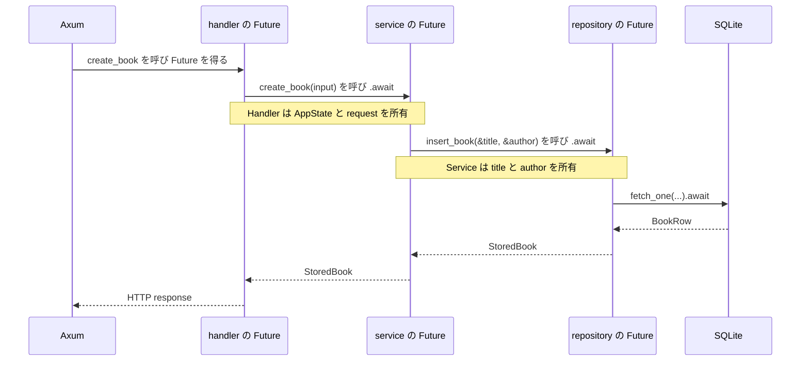

# 非同期処理の借用と共有を読む

## 問い

`create_book` を呼ぶと、いつ処理が始まり、どの Future が何を保持するのでしょうか。service 内のローカル値を repository に貸したまま `.await` できる理由を追い、`Send`、`Sync`、`'static`、`Arc` の対象と要求元を区別します。

## 読む場所と順序

1. `src/handler.rs` の `create_book`。
2. `src/service.rs` の `ReadingService::create_book`。
3. `src/repository.rs` の `BookRepository: Send + Sync` と `insert_book` の返り値。
4. `src/repository/sqlite.rs` の `insert_book`。
5. `src/app.rs` の `AppState<R>` と `build_app_with_repository`。
6. Axum 0.8.9 の `Handler` と `Router<S>`、Tokio 1.53.1 の `spawn` の公開 Interface。



3 つの `async fn` の呼び出しは、入れ子になった Future を作ります。外側の Future が内側を `.await` するため、内側が借りている値も完了まで外側に保持されます。

## 解説

### 呼び出し、Future の生成、進行を分ける

```rust,ignore
{{#include ../../../src/handler.rs:create_book_handler}}
```

`async fn` の呼び出しは、その関数を完了まで実行して結果を直接返すのではなく、処理を表す Future を返します。実行器が Future を poll すると本文が進み、内側の `.await` では対象の Future を poll します。対象が `Ready` ならそのまま進み、`Pending` なら再開に必要な状態を保持して呼び出し元へ制御を返します。

したがって、`.await` は「新しいスレッドを作る命令」でも「必ず停止する命令」でもありません。呼び出し、Future の生成、poll による進行、`Pending` の場合の停止は別の出来事です。

この handler の Future は、extractor から受け取った `AppState<R>` と `CreateBookRequest` を所有します。`request.title` と `request.author` は `CreateBook` へ移動し、`state.service.create_book(...)` の呼び出しで service の Future を作ります。`.await` している間も、handler の Future は `AppState<R>`、つまり service を共有所有する `Arc` を保持します。

### service の Future がローカル値を保持する

```rust,ignore
{{#include ../../../src/service.rs:create_book_service}}
```

service の Future は `input` を値で受け取り、`BookTitle` と `Author` へ変換します。変換後の `title` と `author` もこの Future が所有するローカル値です。一方、`&self` は `Arc` が指す `ReadingService` の共有借用です。

`insert_book(&title, &author)` が返す repository の Future は、次の 3 つを借用できます。

- `&self.repository`
- `&title`
- `&author`

service は repository の Future をその場で `.await` します。内側の Future が未完了なら、外側の service の Future が `title` と `author`、および service への借用を保持するため、参照先は再開時にも有効です。参照先より内側の Future だけを長く生存させる形は、借用検査が拒否します。

```rust,ignore
{{#include ../../../src/repository/sqlite.rs:insert_book_sqlite}}
```

SQLite Adapter でも、`title.as_str()` と `author.as_str()` を query に bind し、`fetch_one(...).await` の完了まで使います。ここで新しい `String` を割り当てたり、タイトルと著者を clone したりする必要はありません。呼び出し元が所有する値を、入れ子の Future が有効な範囲だけ借りています。

### repository の Future に無条件の static は要らない

```rust,ignore
{{#include ../../../src/repository.rs:repository_contract}}
```

`insert_book` の返り値は `impl Future<Output = Result<StoredBook, AppError>> + Send` です。無条件の `+ 'static` はありません。返す具体的な Future の型は隠していますが、呼び出し側は `Output` と `Send` を利用でき、Future は引数の参照に結び付いた有効期間を取り込めます。

借用した Future を同じ処理の内側で待つ最小例は成立します。

```rust
async fn length_after_yield(value: &str) -> usize {
    tokio::task::yield_now().await;
    value.len()
}

#[tokio::main(flavor = "current_thread")]
async fn main() {
    let owned = String::from("Rust");
    assert_eq!(length_after_yield(&owned).await, 4);
}
```

この例は Tokio 1.53.1 で `cargo check` が成功します。`owned` を所有する `main` の Future の内側で借用し、その場で完了を待つためです。

同じ借用を独立した task へ渡す次の別案は成立しません。

```rust,compile_fail
fn spawn_borrowed(value: &str) {
    tokio::spawn(async move {
        println!("{value}");
    });
}
```

Tokio 1.53.1 の `spawn` は、渡す Future と出力へ `Send + 'static` を要求します。この例は E0521 となり、関数本体でだけ有効な参照が `'static` を要求する task へ逃げることを理由に拒否されます。service の実装は task を切り離さず、その場で `.await` するため、この追加制約を必要としません。

### Send と Sync は別の対象を見る

| 制約 | 対象 | このアプリで必要になる理由 |
| --- | --- | --- |
| `BookRepository: Send` | repository の所有値 | repository を所有する service と `AppState<R>` をスレッド間で移動可能にする |
| `BookRepository: Sync` | repository への共有参照 | 待機中に保持する `&R` をスレッド間で移動可能にする |
| 返される Future の `Send` | 各 repository 操作の途中状態 | handler まで入れ子になった Future をスレッド間で移動可能にする |
| `AppState<R>: 'static` | Router が所有する状態の型 | Router の外にある短命な参照へ状態を依存させない |

一般に `&T: Send` となるには `T: Sync` が必要です。repository の Future が `&self` を待機中に保持するため、`BookRepository: Sync` と Future の `Send` は関係します。ただし、repository が `Sync` なら Future が自動的に `Send` になるわけではありません。停止をまたいで保持するすべての値が検査対象です。

たとえば、`Send` ではない `Rc` を `.await` の後でも使う Future は拒否されます。

```rust,compile_fail
use std::{future::Future, rc::Rc};

async fn holds_rc() {
    let value = Rc::new("Rust");
    tokio::task::yield_now().await;
    println!("{value}");
}

fn require_send(_: impl Future<Output = ()> + Send) {}

fn main() {
    require_send(holds_rc());
}
```

この例は「`Rc<&str>` が `.await` をまたいで使われるため、`holds_rc` の Future は `Send` ではない」という診断で失敗します。import や可視性ではなく、意図した `Send` の規則で拒否されます。`Send` は移動できるという条件であり、実際に毎回別のスレッドで再開する保証ではありません。

### 制約の要求元を公開 Interface で確かめる

`Cargo.lock` で固定された Axum 0.8.9 と Tokio 1.53.1 の公開 Interface を見ると、制約の出所を分けられます。

| 要求元 | 公開 Interface の要点 | このアプリへの影響 |
| --- | --- | --- |
| [`axum::handler::Handler`](https://docs.rs/axum/0.8.9/axum/handler/trait.Handler.html) | handler の Future は `Future<Output = Response> + Send + 'static` | `create_book` から入れ子になる Future も `Send` を満たす必要がある |
| [`axum::Router<S>`](https://docs.rs/axum/0.8.9/axum/struct.Router.html) | ルーティングを構築する `impl` は `S: Clone + Send + Sync + 'static` | `AppState<R>` を clone・移動・共有でき、短命な外部参照に依存させない |
| [`tokio::spawn`](https://docs.rs/tokio/1.53.1/tokio/task/fn.spawn.html) | task の Future と出力は `Send + 'static` | task を切り離す別案でだけ必要となり、現在の service 経路は要求しない |

Axum の handler 関数に対する `Handler` 実装は、関数が返す Future に `Send`、状態 `S` に `Send + Sync + 'static` を要求します。Router 側では状態に `Clone` も要求します。プロジェクトの `BookRepository: Send + Sync` と各操作の Future に付いた `+ Send` は、これらの外側の条件までつながっています。

### 型の static と参照の有効期間を分ける

`T: 'static` は「この値を永遠に実行する」「この値を破棄しない」という意味ではありません。`T` が非 `static` な参照に依存しない型であるという条件です。所有する `String` や `SqlitePool` のような値も満たせ、所有者が不要になれば通常どおり破棄されます。

一方、`&'static T` は参照そのものがプログラム全体にわたって有効という別の表現です。`AppState<R>: 'static` から、repository の各メソッドが受け取る `&BookTitle` まで `'static` でなければならないとは導けません。

handler の Future は `AppState<R>` を所有し、その中の `Arc` が service を共有所有します。その所有範囲の内側で service を借り、さらに service の Future が所有する `title` と `author` を repository の Future が一時的に借ります。外側の型が短命な外部参照に依存しないことと、実行中に内側で期限付きの借用を使うことは両立します。

### Arc は共有所有だけを担当する

```rust,ignore
{{#include ../../../src/app.rs:composition}}
```

`AppState<R>` の clone で増えるのは `Arc` の共有所有者です。`ReadingService<R>` や Adapter の保存状態全体を clone するわけではありません。`Arc<T>` は参照カウントを原子的に管理しますが、任意の `T` を自動でスレッド安全に変えません。通常、`Arc<T>` が `Send + Sync` を満たすにも、内側の `T` が `Send + Sync` を満たす必要があります。

production では `R = SqliteBookRepository` であり、共有利用を想定した `SqlitePool` を所有します。制御可能な Router テストでは `R = FakeBookRepository` となり、その `Arc<Mutex<FakeState>>` から、共有所有と排他的な変更が別の役割を持つことを確かめます。次の[状態変更を HTTP から SQLite まで追う](../05-flow/status-update.md)では、production の経路を端から端まで読み直します。

## 確認

1. `async fn` を呼ぶことと、その本文が進むことは同じですか。
2. `title` と `author` を借用する repository の Future に、無条件の `'static` は必要ですか。
3. service の Future と repository の Future は、それぞれ何を所有し、何を借りますか。
4. Future が `&self` を待機中に保持するとき、repository の `Sync` はどう関係しますか。
5. `.await` のたびに別スレッドへ移動しますか。
6. 同じ `&str` の Future をその場で待てても、`tokio::spawn` へ渡せない場合があるのはなぜですか。
7. `AppState: 'static` は service が永遠に生存するという意味ですか。`Arc` だけで内部の安全性を保証できますか。

## 解答

1. 同じではありません。呼び出しは Future を返し、実行器による poll で本文が進みます。`.await` した Future が `Pending` の場合だけ、状態を保持して停止します。
2. 必要ありません。service の Future が参照先を保持し、その内側で repository の Future を完了まで待ちます。
3. service の Future は入力から作った `title` と `author` を所有し、`Arc` が所有する service を借ります。repository の Future は repository と `title`、`author` を借ります。
4. `&R` をスレッド間で移動できるには `R: Sync` が必要なので、借用を保持する Future の `Send` を満たす条件の一つになります。ほかの保持値も検査対象です。
5. いいえ。`Send` は移動可能性であり、移動の頻度、実行スレッド、実行順を保証しません。
6. その場で待つ外側の Future は参照先を保持できますが、`tokio::spawn` は呼び出し元から独立して生存できる `Send + 'static` な Future を要求するためです。
7. 短命な外部参照に依存しない型という意味で、値は破棄できます。`Arc` は共有所有を提供しますが、内側の型が必要な `Send` と `Sync` を満たす責任は残ります。
