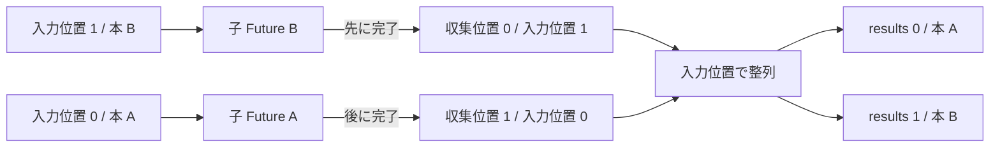

# 完了順と入力順を分ける

## 問い

二冊目の読了記録が一冊目より先に完了しても、応答の `results` を入力順にできるのはなぜでしょうか。実行順を固定せず、入力との対応だけを固定する所有値を追います。

## 前提

[独立した読了記録を並行に進める](concurrent-completions.md)まで読み、`FuturesUnordered` が完了可能になった Future から結果を返すことを確認しているものとします。

## 読む場所と順序

1. `src/service.rs` の `ReadingService::record_reading_completions` にある `enumerate` と子 Future。
2. 同じメソッドの結果収集と `sort_unstable_by_key`。
3. `src/service.rs` の `ReadingCompletionResult`。
4. `src/handler.rs` の `ReadingCompletionResultResponse` と変換処理。
5. `src/service/tests.rs` の `advances_completions_concurrently_and_returns_results_in_input_order`。
6. `tests/api.rs` の `records_reading_completions_and_returns_the_persisted_results`。



## 解説

### 固定するのは実行順ではなく対応関係

```rust,ignore
{{#include ../../../src/service.rs:reading_completions_concurrency}}
```

`enumerate()` は入力順の `position` を各項目へ付けます。子 Future は `position`、`book_id`、検証済みの `NoteBody` を所有し、完了時に `(position, ReadingCompletionResult)` を返します。

`FuturesUnordered::next()` から返る順序は入力順ではありません。repository の待機、SQLite の接続やロック、実行器の poll によって、後の入力が先に完了できます。service はその順序を固定しようとせず、完了した組を `results` へ集めます。

全件の完了後、`sort_unstable_by_key` で `position` を基準に並べます。入力位置は `enumerate()` が作る重複しない値なので、同じ位置同士の順序を保つ安定ソートは不要です。最後に位置を取り除き、`Vec<ReadingCompletionResult>` を handler へ返します。

### book_id と position は役割が違う

`ReadingCompletionResult` の成功値に含まれる本と、失敗値に含まれる `book_id` は、「どの本の結果か」を応答自身から分かるようにします。一方、`position` は「要求の何番目に対応するか」を親 Future の内部で保つための値です。

要求内の `book_id` は重複しません。そのため `book_id` をキーに再整列する実装も考えられますが、数値の小さい ID 順と入力順は同じではありません。入力位置を直接所有すれば、利用者の順序を ID の性質へ依存させずに済みます。

### 完了順を制御して契約を確かめる

service のテストは、二冊の処理が開始したあと、入力の二冊目だけを先に解放します。フェイクが記録した完了順は二冊目、一冊目です。それでも service が返す `ReadingCompletionResult` の順序は一冊目、二冊目になります。

このテストは scheduler がたまたま二冊目を先に選ぶことを期待しません。待機点を持つフェイクが解放順を決めるため、「完了順と入力順が異なる」という条件を毎回作れます。Router と実 SQLite のテストは、利用者向けの JSON が入力順であることと保存結果を確認しますが、SQLite だけで特定の完了順を再現したとは扱いません。

### FuturesUnordered を選ぶ理由

`futures-util` 0.3.34 の `FuturesUnordered` は、多数の Future を管理し、起床した Future を進めるための公開型です。この実装では最大 8 件なので大規模な task 管理が目的ではありません。完了順で値を受け取り、入力位置によって利用者向けの順序へ戻す二つの順序をコードから読める点が、教材の目的に合います。

[`join_all`](https://docs.rs/futures-util/0.3.34/futures_util/future/fn.join_all.html) も全 Future を並行に進め、入力順の結果を返せる成立する別案です。ただし、今回の完成形では完了順の収集と入力順への復元を明示し、どの値が対応関係を保持するかを追える形を採用します。

## 比較した別案

### 完了順のまま返す

集めた結果を並べ替えずに返せば実装は短くなります。しかし同じ要求でも待機状態によって `results` の順序が変わり、利用者が入力位置との対応を保てません。各要素に `book_id` があっても、「応答は入力順」という Interface を破ります。

### book_id で並べる

結果を安定した順序にはできますが、入力順ではなく ID 順になります。利用者が指定した順序を保持する契約とは別物です。

### 逐次処理で入力順を保つ

一件ずつ完了を待てば、位置を持たなくても結果は入力順になります。しかし独立した I/O を並行に進める Interface を失うため、順序を保つために進行まで逐次化する必要はありません。

## 確認

1. `FuturesUnordered` から返る順序と HTTP 応答の順序は、それぞれ何で決まりますか。
2. 子 Future が `position` を所有するのはなぜですか。
3. `book_id` で整列しても入力順の契約を満たせない場合があるのはなぜですか。
4. `sort_unstable_by_key` で安定性が不要なのはなぜですか。
5. テストは完了順と入力順の違いをどう決定的に作りますか。
6. `join_all` は成立しない案ですか。

## 解答

1. `FuturesUnordered` は進行可能になって完了した順に返します。HTTP 応答は子 Future が保持した入力位置で整列した順です。
2. 完了時刻にかかわらず、結果を要求内の元の位置へ戻すためです。
3. ID の大小と利用者が項目を並べた順序は独立しているためです。
4. `enumerate()` が作る入力位置は重複せず、同じキーを持つ要素がないためです。
5. 二冊とも開始したあとで二冊目の待機だけを先に解放し、フェイクの完了記録と service の返却順を別々に確認します。
6. いいえ。全 Future を進めながら入力順で結果を得る成立する別案です。完成形は完了順と入力順の違い、および対応を保つ所有値をコードに表すため `FuturesUnordered` と入力位置を選びます。

次は[失敗と親 Future の終了](failure-and-parent-future.md)で、一件の失敗後もほかの処理を続ける契約と、親 Future が破棄されたときの未完了処理を読みます。
