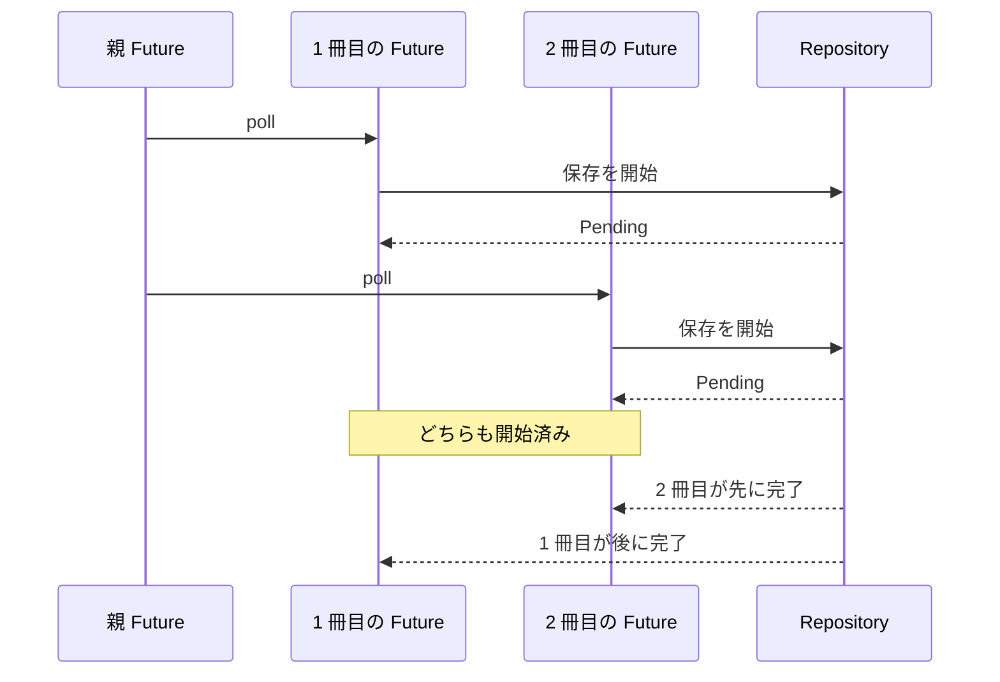

# 独立した読了記録を並行に進める

## 問い

一括読了記録は、なぜ一冊目の保存が終わるまで二冊目を待たずに進めるのでしょうか。複数の Future を同じ親 Future の中で進める実装と、同時に進める仕事量の上限を読みます。

## 前提

[Future が値を保持する範囲](future-values.md)まで読み、`async fn` の呼び出しが Future を返すこと、子 Future が再開に必要な所有値と借用を保持することを確認しているものとします。

## 読む場所と順序

1. `src/service.rs` の `ReadingService::record_reading_completions` にある要求全体の検証。
2. 同じメソッドの `FuturesUnordered` を作る部分。
3. 一冊を処理する `record_reading_completion`。
4. `src/repository.rs` の `BookRepository::record_reading_completion`。
5. `src/service/tests.rs` の `advances_completions_concurrently_and_returns_results_in_input_order`。
6. `src/test_support.rs` の `ReadingCompletionControl` と `FakeBookRepository::record_reading_completion`。



## 解説

### 冊子間には待つべき順序がない

一冊の読了記録では、本の取得、読書状態の検査、`Book<Reading>` から `Book<Finished>` への遷移、状態とメモの原子的な保存を順番に行います。この順序を入れ替えることはできません。

一方、要求内で重複する `book_id` は保存前に拒否されています。異なる本の読了記録は、一冊目の取得結果を二冊目が使うような依存関係を持ちません。そこで service は、一冊目の I/O が `Pending` の間に二冊目を進められる形にします。

```rust,ignore
{{#include ../../../src/service.rs:reading_completions_concurrency}}
```

`validated.into_iter()` は検証済みの各入力を値で取り出します。`async move` で作る子 Future は、入力位置の `position`、`book_id`、`NoteBody` を所有します。repository は `&self` から共有借用し、`record_reading_completion` の呼び出し中だけ `&NoteBody` を借ります。入力一覧やメモ本文を clone する必要はありません。

`FuturesUnordered` は、保持している Future のうち進行可能になったものを poll し、完了した結果から `next()` で返します。一つの子 Future が `Pending` になっても、親 Future はほかの子 Future を poll できます。これは複数の処理を並行に進める仕組みであり、別スレッドで同時に実行されることまで保証するものではありません。

### Future を作るだけでは進行しない

`map` と `collect` は子 Future を作って `FuturesUnordered` へ所有させます。この時点では repository 操作がすべて完了したわけではありません。親 Future が `pending.next().await` を poll すると、集合内の子 Future も poll されます。

全件を作ったあとで最初の `next()` を待つため、一件目を `.await` してから二件目を作る逐次処理にはなりません。親 Future は子 Future の集合を所有し、その場で全件の完了を待ちます。`tokio::spawn` で切り離した task は作らないため、処理を進めるためだけに入力や repository を `'static` にする必要もありません。

### 上限は要求の不変条件に置く

一つの要求は 1 件以上 8 件以下です。要求全体の検証を終えてから子 Future を作るので、親 Future が一度に所有する子 Future も最大 8 個です。9 件の要求は `400 Bad Request` になり、`rejects_completion_requests_above_the_concurrency_limit` が利用者向けの HTTP Interface から上限を確認します。

別の semaphore や worker queue は置いていません。最大 8 件という既存の要求上限だけで、一要求から無制限に仕事が作られることを防げるためです。より大きな要求、要求間の公平性、DB 接続数に合わせた厳密な制御が必要になれば、この判断は変わります。

### 並行進行を実時間で推測しない

service のテストでは、フェイクが二冊の保存処理を待機させます。テストは二冊とも開始した通知を受け取るまで、どちらも解放しません。逐次実装なら一冊目の待機中に二冊目へ到達できないため、この条件を満たせません。

この検証は「逐次実装より何ミリ秒短かったか」を測りません。実行環境の速度や scheduler の偶然ではなく、解放前に複数の処理が開始済みという状態を観測します。有限のテストから任意の実行順は保証できませんが、service が不要な逐次待機を加えていないことは確認できます。

## 比較した別案

### 一件ずつ await する

実装は単純で、最終的な保存結果も同じにできます。しかし一冊の I/O 待機中に独立した本を進められず、「複数の独立した読了記録を進行可能にする」という Interface を満たしません。

### tokio::spawn で task を分ける

各処理を独立した task として実行する要件があれば成立します。今回は HTTP の親 Future が全結果を待ち、終了時には子 Future も終了する契約です。`spawn` を使うと `Send + 'static`、task の所有者、終了後の結果の扱いという追加の問題が生じるため採用しません。

### 無制限に Future を作る

入力件数に上限がなければ、要求サイズに応じて Future と DB 操作を無制限に増やします。現在は 8 件という要求の不変条件が上限として働くため、追加の仕組みは不要です。

## 確認

1. 一冊の処理内では順序が必要でも、冊子間では順序が不要なのはなぜですか。
2. `async move` の子 Future は何を所有し、何を借りますか。
3. `FuturesUnordered` を作った時点で repository 操作は完了していますか。
4. この実装が `tokio::spawn` を必要としないのはなぜですか。
5. 同時に進める仕事量が 8 件を超えないことは、どの Interface から確認できますか。
6. テストは並行進行を実行時間ではなく何から判断しますか。

## 解答

1. 一冊では取得した状態を検査して遷移させ、その結果を保存するためです。冊子間は重複 ID を拒否した独立した処理で、一冊の結果を別の一冊が使いません。
2. 入力位置、`book_id`、`NoteBody` を所有し、service と repository を親 Future が有効な範囲で共有借用します。
3. していません。Future を集合へ入れただけで、`next()` を待つ親 Future が poll して初めて処理が進みます。
4. 親 Future が子 Future の集合を所有し、その場で完了を待てるためです。呼び出し元から独立した `'static` な task は必要ありません。
5. `POST /reading-completions` が 9 件を `400 Bad Request` で拒否することと、検証後の各入力から一つずつ子 Future を作る実装から確認できます。
6. フェイクが待機中の二冊について、どちらも解放する前に開始済みになったことから判断します。

次は[完了順と入力順を分ける](completion-order.md)で、先に終わった結果をそのまま返さず、利用者の入力へ対応付け直す仕組みを読みます。
