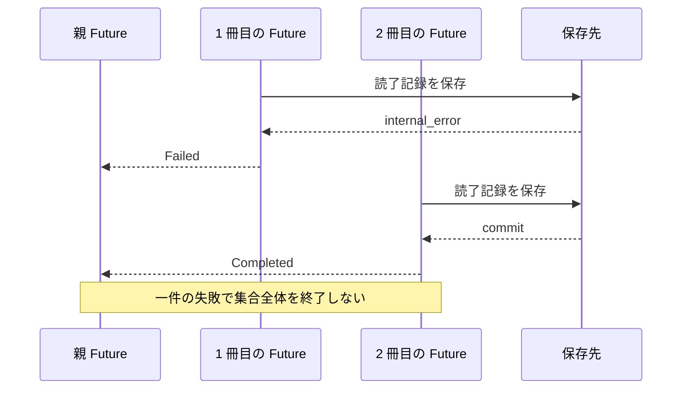
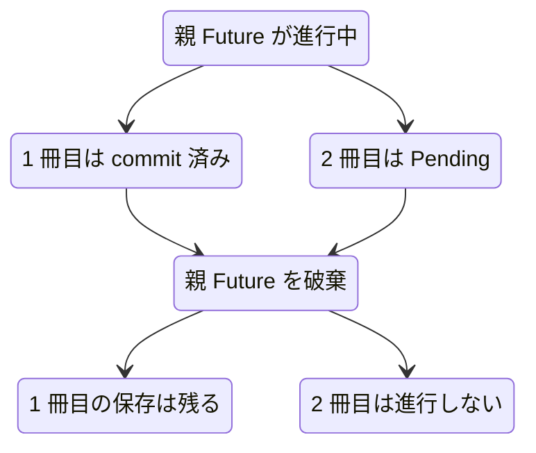

# 失敗と親 Future の終了

## 問い

一冊の読了記録が失敗したあとも、なぜ別の本は処理を続けられるのでしょうか。また、HTTP を処理する親 Future が完了前に破棄されたとき、待機中の読了記録と、すでに保存された読了記録はそれぞれどうなるのでしょうか。

## 前提

[完了順と入力順を分ける](completion-order.md)まで読み、親 Future が `FuturesUnordered` と子 Future を所有し、各結果を入力位置へ戻す仕組みを確認しているものとします。

## 読む場所と順序

1. `src/service.rs` の `ReadingService::record_reading_completions` にある子 Future のエラー変換。
2. 同じメソッドの `FuturesUnordered` と結果収集。
3. `src/test_support.rs` の `ReadingCompletionControl` と `FakeBookRepository::record_reading_completion`。
4. `src/service/tests.rs` の `continues_other_completions_after_one_fails`。
5. 同じファイルの `dropping_parent_future_stops_pending_completions_and_keeps_saved_results`。



## 解説

### 一件の失敗を一件の結果へ変える

```rust,ignore
{{#include ../../../src/service.rs:reading_completions_concurrency}}
```

一冊分の子 Future は、`record_reading_completion` の `Result` を待ちます。成功なら `ReadingCompletionResult::Completed`、失敗なら同じ `book_id` を持つ `ReadingCompletionResult::Failed` へ変換します。ここでは `?` で親 Future から早期 return しません。

失敗も一件分の値になって `(position, result)` として `FuturesUnordered` へ戻るため、親 Future は残りの子 Future を保持したまま `pending.next().await` を続けます。全件が成功することではなく、入力した全件について成功または失敗を返すことが一括読了記録の契約です。

`continues_other_completions_after_one_fails` は、制御可能なフェイクで二冊の保存開始を確認してから、一冊目だけに DB エラーを返します。その失敗が `internal_error` になったあとで二冊目を解放し、二冊目が読了してメモも残ることを確認します。一冊目は読書中のままで、メモも残りません。待ち時間や scheduler の偶然には依存しません。

### 親 Future が子 Future を所有する

`record_reading_completions` は `tokio::spawn` を使わず、子 Future を `FuturesUnordered` の中に置きます。`FuturesUnordered` は親 Future のローカル変数です。したがって呼び出し元が親 Future を破棄すると、集合と、その中の未完了の子 Future も破棄されます。

Future の破棄は、それ以降その処理を poll しないという意味です。未完了の子 Future を完了させる background task は残りません。これは、すでに保存先へ確定した変更を取り消すこととは別です。



`dropping_parent_future_stops_pending_completions_and_keeps_saved_results` は、二冊とも保存処理へ入ったあと、一冊目だけを解放して保存を完了させます。二冊目が待機している状態で親 Future を破棄し、フェイクの drop guard から未完了の保存処理も破棄されたことを確認します。最終的な保存状態は、一冊目が読了してメモあり、二冊目が読書中でメモなしです。

### 処理の終了と rollback は範囲が違う

一冊の中では、読書状態の変更とメモ追加を同じ repository 操作で確定します。SQLite Adapter は transaction を使うため、commit 前にその Future が破棄された場合は未確定の変更が rollback され、片方だけは残りません。

一方、冊子間を一つの transaction にはしていません。一冊の commit 後に親 Future が破棄されても、その commit は別の一冊の未完了処理と一緒には取り消されません。処理の終了時点によって確定済みの冊数は変わり得ます。親 Future が完了していないので HTTP 応答は返らず、利用者は本の詳細取得から保存状態を確認する必要があります。

型と所有関係から分かるのは、親 Future の破棄に未完了の子 Future が従うことです。破棄の瞬間までにどの transaction が commit したかは実行時の状態であり、型だけでは決まりません。

## 比較した別案

### 最初の失敗で全件を終了する

子 Future の失敗を `?` で親 Future まで伝播すれば実装は短くできます。しかし、冊子間の部分成功を許し、各入力へ読了結果を返す契約を満たしません。すでに commit した別の本を取り消せないため、応答から保存状態との対応も追いにくくなります。

### 各処理を `tokio::spawn` で切り離す

親 Future の終了後も全件を完了させる要件があるなら成立する案です。その場合は task の所有者、処理状態の保存と再取得、shutdown、再試行、HTTP 応答との対応を設計する必要があります。今回はそれらの契約を持たないため、親 Future と寿命をそろえます。

### 親 Future の破棄時に確定済みの保存も戻す

全冊を一つの transaction に入れれば全体を戻せる場合があります。しかし一冊ごとの独立した結果と並行進行を失い、長い transaction が複数の処理を抱えます。一括読了記録は一冊の中だけを原子的にし、冊子間では確定済みの成功を残す契約です。

## 確認

1. 一冊の失敗後も `FuturesUnordered` がほかの子 Future を保持し続けるのはなぜですか。
2. 親 Future を破棄すると、待機中の子 Future はどうなりますか。
3. 親 Future の破棄前に commit 済みの読了記録が残るのはなぜですか。
4. Future の破棄と transaction の rollback は、どの範囲が違いますか。
5. 二つの service テストは、失敗後の継続と親 Future の終了をどう決定的に再現しますか。
6. 親の終了後も処理を続けたい場合、`tokio::spawn` の追加だけでは足りないのはなぜですか。

## 解答

1. 各子 Future が失敗を親全体の `Err` ではなく一件分の `ReadingCompletionResult::Failed` へ変換し、親 Future が `pending.next().await` を続けるためです。
2. 親 Future が所有する `FuturesUnordered` とともに破棄され、それ以降は poll されません。切り離した task は残りません。
3. 冊子間は一つの transaction ではなく、一冊ごとに独立して commit するためです。Future の破棄には、保存先へ確定した変更を巻き戻す効果はありません。
4. Future の破棄は未完了処理を今後進めないことです。rollback は一冊の transaction 内で未確定の状態変更とメモ追加を両方とも保存しないことです。
5. 一冊ごとの待機点を持つフェイクで、開始、失敗、成功、親 Future の破棄をテスト側から順番に起こします。実時間の短さや偶然の完了順は使いません。
6. task の所有者、終了後の処理状態を取得する Interface、shutdown、再試行、HTTP 応答との関係も必要になるためです。

次は[第 5 部](../05-flow/status-update.md)で、HTTP、service、repository、SQLite の境界を端から端へ読み直します。
