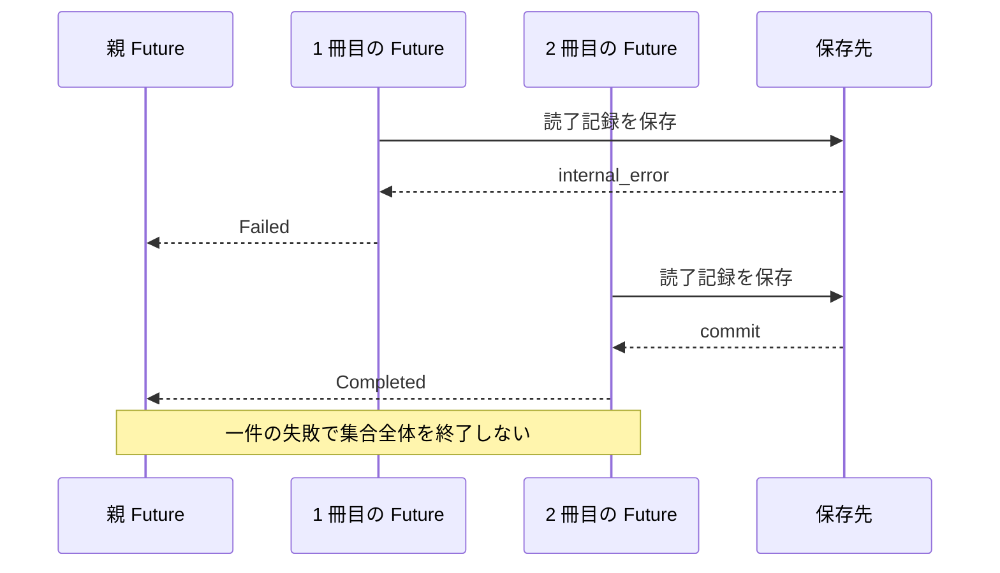
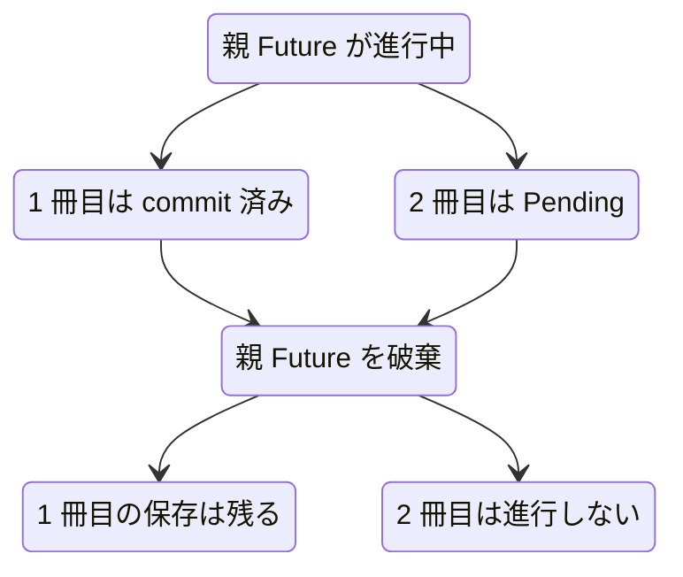

# 失敗と親 Future の終了

## 問い

一冊の読了記録が失敗したあとも、なぜ別の本は処理を続けられるのでしょうか。また、HTTP を処理する親 Future が完了前に破棄されたとき、待機中の読了記録と、すでに保存された読了記録はそれぞれどうなるのでしょうか。

## 前提

[完了順と入力順を分ける](completion-order.md)まで読み、親 Future が `FuturesUnordered` と子 Future を所有し、各結果を入力位置へ戻す仕組みを確認しているものとします。

## 読む場所と順序

1. [一件の失敗を一件の結果へ変える](#一件の失敗を一件の結果へ変える) で子 Future の `match` と `From` 変換。
2. [親 Future が子 Future を所有する](#親-future-が子-future-を所有する) で破棄の連鎖と二つのテスト。
3. [処理の終了と rollback は範囲が違う](#処理の終了と-rollback-は範囲が違う) で確定済みの commit と未確定の transaction。

## 解説


```mermaid
sequenceDiagram
    participant Parent as 親 Future
    participant First as 1 冊目の Future
    participant Second as 2 冊目の Future
    participant Store as 保存先
    First->>Store: 読了記録を保存
    Store-->>First: internal_error
    First-->>Parent: Failed
    Second->>Store: 読了記録を保存
    Store-->>Second: commit
    Second-->>Parent: Completed
    Note over Parent,Second: 一件の失敗で集合全体を終了しない
```

### 一件の失敗を一件の結果へ変える

対象: `src/service.rs` / `ReadingService::record_reading_completions`

```rust,ignore
{{#include ../../../src/service.rs:reading_completions_child}}
```

1. `match self.record_reading_completion(book_id, &body).await { ... }` は、repository まで含めた一冊の結果を待ち、`Result` の二つの枝へ分けます。
2. `Ok(completion)` の枝は `ReadingCompletionResult::Completed(completion)` を作ります。
3. `Err(error)` の枝は、同じ `book_id` を持つ `ReadingCompletionResult::Failed` を作ります。`book_id` は値で持っているので、ここでもそのまま移せます。
4. `error: error.into()` は `From` 変換を呼びます。ここでは `?` を使わないため、失敗しても親 Future から早期 return しません。
5. どちらの枝でも `(position, result)` を返すので、結果は一件分の値として `FuturesUnordered` へ戻ります。

対象: `src/service.rs` / `ReadingCompletionFailure`

```rust,ignore
{{#include ../../../src/service.rs:reading_completion_failures}}
```

1. `ReadingCompletionResult::Failed` は、どの本か (`book_id`) と、失敗の種類 (`ReadingCompletionFailure`) を持ちます。
2. `impl From<AppError> for ReadingCompletionFailure` は、`NotFound` と `Conflict` を同じ名前の variant へ、`Database`、`InvalidStoredValue`、`Validation` をログ付きで `Internal` へ畳みます。
3. `error.into()` の `into` はこの `From` 実装を選びます。呼び出し側は `AppError` ごとの分岐を書かずに済みます。

失敗も一件分の値として `(position, result)` の形で集合へ戻ります。そのため、親 Future は残りの子 Future を保持したまま `pending.next().await` を続けます。

一括読了記録の契約は全件の成功ではありません。入力した全件について、成功または失敗を返すことです。

対象: `src/service/tests.rs` / `continues_other_completions_after_one_fails`

```rust,ignore
{{#include ../../../src/service/tests.rs:failure_continues_drive}}
```

1. `control.wait_for_started(2).await` で二冊の開始を待ちます。
2. `control.release(first.id())` で一冊目だけを進め、`wait_for_finished(1)` でその完了を待ちます。
3. `assert_eq!(control.finished(), vec![first.id()])` は、一冊目だけが完了したことを確かめます。
4. `control.release(second.id())` で二冊目を解放し、失敗が続行を止めないことを観測できるようにします。

対象: `src/service/tests.rs` / `continues_other_completions_after_one_fails`

```rust,ignore
{{#include ../../../src/service/tests.rs:failure_result_assert}}
```

1. `results[0]` は先頭の本の結果です。`matches!` は variant とガードをまとめて確かめるマクロで、`ReadingCompletionResult::Failed` かつ `error` が `Internal` かつ `book_id` が一冊目であることを確認します。
2. `results[1]` は二冊目の結果で、`Completed` であることを確認します。
3. 失敗が一件分の値になっているので、入力順の並べ替えはそのまま働きます。

このテストでは、制御可能なフェイクで二冊の保存開始を確認し、一冊目だけに DB エラーを返します。一冊目の失敗が `ReadingCompletionFailure::Internal` になったあとで二冊目を解放し、処理の継続を確認します。

一冊目は読書中のままで、メモも残りません。二冊目は読了し、メモも残ります。待ち時間や scheduler の偶然には依存しません。

### 親 Future が子 Future を所有する

`record_reading_completions` は `tokio::spawn` を使わず、子 Future を `FuturesUnordered` の中に置きます。`FuturesUnordered` は親 Future のローカル変数です。したがって呼び出し元が親 Future を破棄すると、集合と、その中の未完了の子 Future も破棄されます。

Future の破棄は、それ以降その処理を poll しないという意味です。未完了の子 Future を完了させる background task は残りません。これは、すでに保存先へ確定した変更を取り消すこととは別です。


```mermaid
stateDiagram-v2
    state "親 Future が進行中" as Running
    state "1 冊目は commit 済み" as Committed
    state "2 冊目は Pending" as Pending
    state "親 Future を破棄" as Dropped
    state "1 冊目の保存は残る" as Kept
    state "2 冊目は進行しない" as Stopped
    Running --> Committed
    Running --> Pending
    Committed --> Dropped
    Pending --> Dropped
    Dropped --> Kept
    Dropped --> Stopped
```

対象: `src/service/tests.rs` / `dropping_parent_future_stops_pending_completions_and_keeps_saved_results`

```rust,ignore
{{#include ../../../src/service/tests.rs:parent_drop_select}}
```

1. `tokio::pin!(run)` は Future をスタック上で固定し、`&mut run` で poll できるようにします。
2. `tokio::select!` は複数の Future を同時に待ち、先に完了した枝を選びます。
3. `_ = &mut run => panic!(...)` の枝は、親 Future がこの時点で完了したら失敗させます。二冊目が待機中なので完了しないはずです。
4. もう一方の枝は、二冊の開始を待って一冊目を解放し、その完了を待ちます。この枝が先に完了すると、`select!` はまだ完了していない `run` を poll 対象から外して抜けます。
5. `select!` を抜けた時点で `run` はスコープを離れ、親 Future と、その内側の未完了の子 Future が破棄されます。

対象: `src/service/tests.rs` / `dropping_parent_future_stops_pending_completions_and_keeps_saved_results`

```rust,ignore
{{#include ../../../src/service/tests.rs:parent_drop_assert}}
```

1. `control.finished()` が一冊目だけなのは、一冊目が親の破棄前に保存を完了したためです。
2. `control.dropped()` が二冊目なのは、二冊目の子 Future が完了せずに破棄されたためです。

対象: `src/test_support.rs` / `ReadingCompletionAttempt`

```rust,ignore
{{#include ../../../src/test_support.rs:attempt_drop_guard}}
```

1. `finish` は、フェイクの読了記録が成功または失敗の `Result` を返すところまで到達したときに `finished` フラグを立てます。保存成功を表すフラグではありません。
2. `impl Drop for ReadingCompletionAttempt` は、結果を返す前に処理が破棄され、フラグが立っていないときだけ `mark_dropped` を呼びます。
3. したがって `finished` は結果を返した処理、`dropped` は途中で破棄された処理を記録します。保存の成否は `ReadingCompletionResult` と再取得した保存状態で別に確認します。

最終的な保存状態は、一冊目が読了してメモあり、二冊目が読書中でメモなしです。

### 処理の終了と rollback は範囲が違う

一冊の中では、読書状態の変更とメモ追加を同じ repository 操作で確定します。SQLite Adapter は transaction を使うため、commit 前にその Future が破棄された場合は未確定の変更が rollback され、片方だけは残りません。

一方、複数の本を一つの transaction にはしていません。一冊の commit 後に親 Future が破棄されても、その commit は別の一冊の未完了処理と一緒には取り消されません。終了時点によって、確定済みの冊数は変わり得ます。

親 Future が完了していないため、HTTP 応答は返りません。利用者は本の詳細取得から保存状態を確認します。

型と所有関係から分かるのは、親 Future の破棄に未完了の子 Future が従うことです。破棄の瞬間までにどの transaction が commit したかは実行時の状態であり、型だけでは決まりません。

## 比較した別案

### 最初の失敗で全件を終了する

子 Future の失敗を `?` で親 Future まで伝播すれば、実装は短くなります。しかし、複数の本の間での部分成功を許し、各入力へ読了結果を返す契約を満たしません。

別の本ですでに commit した結果は取り消せません。最初の失敗で終了すると、応答から保存状態との対応も追いにくくなります。

### 各処理を `tokio::spawn` で切り離す

親 Future の終了後も全件を完了させる要件があるなら成立する案です。その場合は task の所有者、処理状態の保存と再取得、shutdown、再試行、HTTP 応答との対応を設計する必要があります。

今回はそれらの契約を持たないため、子 Future の寿命を親 Future にそろえます。

### 親 Future の破棄時に確定済みの保存も戻す

全冊を一つの transaction に入れれば、確定済みの保存まで戻せる場合があります。しかし、一冊ごとの独立した結果と並行進行を失い、長い transaction が複数の処理を抱えます。

一括読了記録は一冊の中だけを原子的にし、複数の本の間では確定済みの成功を残す契約です。

## 確認

1. 一冊の失敗後も `FuturesUnordered` がほかの子 Future を保持し続けるのはなぜですか。
2. `error.into()` は、どの型からどの型への変換を呼びますか。
3. 親 Future を破棄すると、待機中の子 Future はどうなりますか。
4. 親 Future の破棄前に commit 済みの読了記録が残るのはなぜですか。
5. Future の破棄と transaction の rollback は、どの範囲が違いますか。
6. 二つの service テストは、失敗後の継続と親 Future の終了をどう決定的に再現しますか。
7. 親の終了後も処理を続けたい場合、`tokio::spawn` の追加だけでは足りないのはなぜですか。

## 解答

1. 各子 Future が失敗を親全体の `Err` ではなく一件分の `ReadingCompletionResult::Failed` へ変換し、親 Future が `pending.next().await` を続けるためです。
2. `AppError` から `ReadingCompletionFailure` への変換です。`impl From<AppError> for ReadingCompletionFailure` が選ばれ、依存先の失敗は `Internal` へ畳まれます。
3. 親 Future が所有する `FuturesUnordered` とともに破棄され、それ以降は poll されません。切り離した task は残りません。
4. 複数の本は一つの transaction ではなく、一冊ごとに独立して commit するためです。Future の破棄には、保存先へ確定した変更を巻き戻す効果はありません。
5. Future の破棄は未完了処理を今後進めないことです。rollback は一冊の transaction 内で未確定の状態変更とメモ追加を両方とも保存しないことです。
6. 一冊ごとの待機点を持つフェイクで、開始、失敗、成功、親 Future の破棄をテスト側から順番に起こします。実時間の短さや偶然の完了順は使いません。
7. task の所有者、終了後の処理状態を取得する Interface、shutdown、再試行、HTTP 応答との関係も必要になるためです。

次は[HTTP から SQLite まで](../05-flow/http-to-sqlite.md)で、利用者の要求から保存結果までを端から端へ読み直します。
