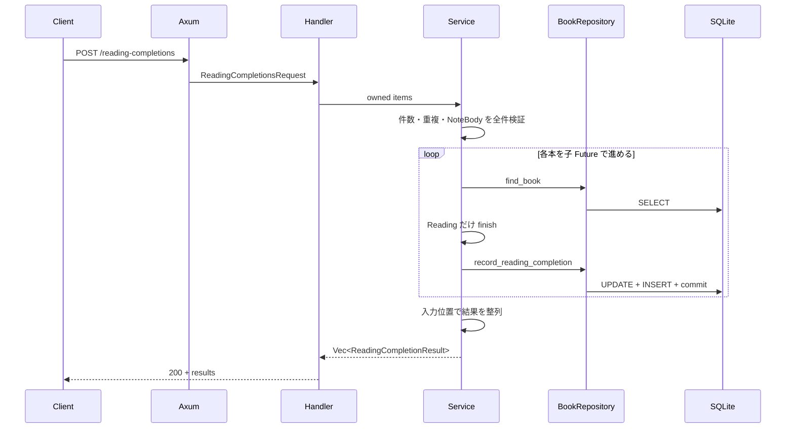

# HTTP から SQLite まで

## 問い

`POST /reading-completions` の JSON は、どの境界で所有権と型を変え、成功または失敗の読了結果として利用者へ戻るのでしょうか。

## 前提

第 1〜4 部を読み、検証済み入力、一冊の原子的保存、Adapter、子 Future の並行進行と寿命を確認しているものとします。

## 読む場所と順序

1. `src/app.rs` の `/reading-completions` route。
2. `src/handler.rs` の要求 DTO、handler、応答 DTO。
3. `src/service.rs` の要求全体の検証、子 Future、一冊の処理。
4. `src/repository.rs` の保存契約。
5. `src/repository/sqlite.rs` の transaction と行変換。
6. `tests/api.rs` の正常系、部分成功、rollback の統合テスト。



次の handler は、HTTP が所有する各入力を service の入力へ移し、完了後の読了結果を応答 DTO へ移す境界です。図の入口と復路を、完成形のコードで確認します。

```rust,ignore
{{#include ../../../src/handler.rs:reading_completions_handler}}
```

## 解説

Axum の `Json` extractor が JSON の構造を読み、handler は `Vec` と各 `String` を所有します。構造が不正なら handler より前に Axum 標準の rejection が返り、アプリケーション共通のエラー JSON にはなりません。

handler は項目を service の入力へ移します。service は件数、重複、本文を全件検証し、失敗なら repository を呼ばず `400 Bad Request` を返します。

入力全体が正しければ、各子 Future が本を取得します。未検出は一件の `not_found`、読書中でなければ `conflict` です。読書中なら `Book<Reading>` を `finish()` で消費し、repository が状態変更とメモを transaction で保存します。

一件の失敗は `ReadingCompletionResult::Failed` へ変換し、ほかの子 Future を止めません。全件を完了後、入力位置で整列して handler へ返します。handler は各結果を `completed` または `failed` の JSON に変換します。入力が正しい要求では、全件失敗でも HTTP は `200 OK` であり、利用者は各 `outcome` を読みます。

成功値は要求の文字列をそのまま返したものではありません。SQLite が返した行を値型へ復元し、commit 後の本とメモを応答 DTO へ移しています。

| 失敗 | 境界 | 利用者から見える結果 | 保存状態 |
| --- | --- | --- | --- |
| JSON の構造不正 | Axum extractor | 標準 rejection | 処理開始前 |
| 件数・重複・空本文 | service の全件検証 | `400 validation_error` | 全冊変更なし |
| 未検出 | 一冊の取得 | 項目 `not_found` | その本は変更なし |
| 状態不一致・保存競合 | service / 条件付き更新 | 項目 `conflict` | その本は変更なし |
| DB・保存値の失敗 | Adapter / 行変換 | 項目 `internal_error` | 未 commit の一冊は変更なし |

## 別案との比較

### handler が SQL を直接実行する

HTTP、入力規則、状態遷移、transaction が一か所に混ざり、フェイクとの既存 Seam を使えません。各境界の責任を保ちます。

### 一冊の失敗を HTTP エラーにする

独立した別の成功との対応を返せず、すでに commit した状態も表しにくくなります。一件の失敗を結果値にします。

### 完了順のまま応答する

実行の都合で利用者向けの順序が変わります。子 Future が持つ入力位置で戻します。

## 確認

1. JSON extractor の失敗と service の入力検証はどう違いますか。
2. `Book<Finished>` はどこで作られ、どこで現在の DB 状態を再検査しますか。
3. 一冊が失敗しても要求が `200 OK` になるのはなぜですか。
4. 応答の成功値が commit 済みだと判断できる根拠は何ですか。
5. 親 Future が応答前に破棄された場合、利用者は保存状態をどう確認しますか。

## 解答

1. extractor は JSON の構造を handler 前に検査し、service は受理済みの値に対する件数、重複、本文の規則を保存前に検査します。
2. service が `Book<Reading>::finish()` で作り、SQLite Adapter の `UPDATE ... WHERE status = 'reading'` が保存時に再検査します。
3. 入力が正しい要求では各冊が独立した読了結果であり、失敗も `results` の一要素として返す契約だからです。
4. repository が transaction を commit した後に、保存した本とメモを成功値として返すためです。
5. HTTP 応答はないため、既存の `GET /books/{id}` から本とメモを再取得します。

次は[検証の保証と限界](verification-limits.md)で、同じ契約をどの検証からどこまで判断できるか整理します。
