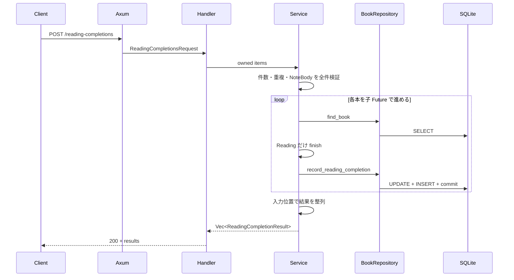

# HTTP から SQLite まで

## 問い

`POST /reading-completions` の JSON は、どの境界で所有権と型を変え、成功または失敗の読了結果として利用者へ戻るのでしょうか。

## 前提

第 1〜4 部を読み、検証済み入力、一冊の原子的保存、Adapter、子 Future の並行進行と寿命を確認しているものとします。

## 読む場所と順序

1. [経路と入力の取り出し](#経路と入力の取り出し)で Router と handler の引数を対応させる。
2. [service へ渡し、結果を待つ](#service-へ渡し結果を待つ)で入力の所有権と失敗の戻り先を追う。
3. [読了結果を応答へ変換する](#読了結果を応答へ変換する)で成功値と失敗値が JSON になるまでを読む。
4. [利用者から見える失敗と保存状態](#利用者から見える失敗と保存状態)で全経路を振り返り、[次章の統合テスト](verification-limits.md#応答と保存状態を分けて確認する)で再取得の意味を確かめる。


```mermaid
sequenceDiagram
    participant Client
    participant Axum
    participant Handler
    participant Service
    participant Repository as BookRepository
    participant SQLite
    Client->>Axum: POST /reading-completions
    Axum->>Handler: ReadingCompletionsRequest
    Handler->>Service: owned items
    Service->>Service: 件数・重複・NoteBody を全件検証
    loop 各本を子 Future で進める
        Service->>Repository: find_book
        Repository->>SQLite: SELECT
        Service->>Service: Reading だけ finish
        Service->>Repository: record_reading_completion
        Repository->>SQLite: UPDATE + INSERT + commit
    end
    Service->>Service: 入力位置で結果を整列
    Service-->>Handler: Vec<ReadingCompletionResult>
    Handler-->>Client: 200 + results
```

## 経路と入力の取り出し

対象: `src/app.rs` / `build_app_with_repository` の Router を組み立てるメソッドチェーンの一部。

```rust,ignore
{{#include ../../../src/app.rs:completion_route}}
```

1. `.route(...)` の第 1 引数が URL のパスです。第 2 引数に、このパスで受け付ける HTTP メソッドと処理を渡します。
2. `post(...)` に渡すのは handler 関数そのものです。ここで handler を呼んで保存するのではなく、要求が来たときに呼ぶ関数を登録します。
3. `::<R>` は handler の型パラメータを指定しています。Router と handler が同じ repository 型を使うことは、[Adapter の組み立て](../03-abstraction/adapters.md)で確認した通りです。

対象: `src/handler.rs` / `record_reading_completions` の関数シグネチャ。続く本文は次節に分けて掲載します。

```rust,ignore
{{#include ../../../src/handler.rs:completion_handler_signature}}
```

1. `<R: BookRepository>` は、この handler で使う `R` が保存操作の契約を満たすという条件です。
2. `State(state): State<AppState<R>>` は引数の型指定とパターンによる分解を組み合わせています。Axum が共有状態を取り出し、`State` の中身を `state` という名前で受け取ります。
3. `Json(request): Json<ReadingCompletionsRequest>` も同じ形です。Axum がリクエスト本文を JSON として読み、[要求 DTO](../01-values/reading-completion-input.md)へ変換した中身を `request` に束縛します。本文を消費する extractor なので最後の引数に置いています。
4. `Result<Json<ReadingCompletionsResponse>, AppError>` は、成功時は JSON 応答用の値、失敗時はアプリケーションのエラーを返すことを表します。`async fn` なので、呼び出し直後にこの結果が出るのではなく、Future を待つことで結果が得られます。

JSON の構造不正は、この関数の本文が呼ばれる前に Axum 標準の rejection になります。戻り型に `AppError` と書いてあっても、extractor 自身の失敗がアプリケーション共通のエラー JSON に変わるわけではありません。

## service へ渡し、結果を待つ

対象: `src/handler.rs` / `record_reading_completions` の service 呼び出し。

```rust,ignore
{{#include ../../../src/handler.rs:completion_handler_input}}
```

1. `state.service` は共有している `ReadingService<R>` です。`RecordReadingCompletions { ... }` を作り、service の同名メソッドへ渡します。
2. `request.items.into_iter().map(...).collect()` は、HTTP 用の各項目を service 用に詰め替えます。本文の所有権を移す仕組みは[入力の変換](../01-values/reading-completion-input.md)で読んだ通りです。ここでは検証や SQL の実行を直接行いません。
3. `.await?` は二段階です。`.await` で service の結果を待ち、`?` で `Ok` なら一覧を取り出し、`Err` なら handler からも早期に返します。成功時だけ `completions` に一覧が入ります。

この待機中に service は次の順に処理します。すでに詳しく読んだ部分なので、ここでは戻り値がどうつながるかを押さえます。

| 段階 | 次へ渡すもの・失敗時の戻り先 | 実コードの解説 |
| --- | --- | --- |
| 全件の入力検証 | 検証済み本文の一覧。不正なら外側の `Err` となり、上の `?` から HTTP エラーへ進む | [要求から検証済みの入力へ](../01-values/reading-completion-input.md) |
| 一冊の取得と状態検査 | 読書中の本だけを読了へ進める。未検出や状態不一致はその一冊の失敗 | [保存状態を型状態へ接続する](../02-types/stored-state-to-typestate.md) |
| 状態変更とメモの保存 | commit が成功した本とメモ。失敗時には一冊の未確定の変更を戻す | [原子的な保存](../02-types/atomic-completion.md) |
| 子 Future の結果収集 | 失敗も一件の値として集めるため、別の本の成功を取り消さない | [失敗と親 Future の終了](../04-async/failure-and-parent-future.md) |
| 入力順への整列 | `Vec<ReadingCompletionResult>` を外側の `Ok` として handler へ戻す | [完了順と入力順を分ける](../04-async/completion-order.md) |

一冊の失敗は一覧内の値なので、上の `.await?` では早期 return しません。全件失敗でも、入力全体が正しければ一覧を受け取って応答を組み立てます。

## 読了結果を応答へ変換する

対象: `src/handler.rs` / `record_reading_completions` の成功時の戻り値。

```rust,ignore
{{#include ../../../src/handler.rs:completion_handler_response}}
```

1. `completions.into_iter()` で service の結果一覧を消費します。すでに入力順なので、ここでは並べ替えません。
2. `.map(ReadingCompletionResultResponse::from)` は、各要素を応答用の型へ変換する関数を渡しています。クロージャで一件ずつ同じ関数を呼ぶ代わりの書き方です。
3. `.collect()` で変換結果を `results` フィールドの一覧にします。内側の構造体を `Json(...)` で包み、さらに handler の成功を表す `Ok(...)` で包んで返します。

対象: `src/handler.rs` / `From<CompletedReading> for ReadingCompletionResultResponse`。

```rust,ignore
{{#include ../../../src/handler.rs:completion_success_response}}
```

1. `impl From<CompletedReading> for ...` は、保存成功のドメイン値から HTTP 応答用の値を作る変換です。`Self` は変換先の `ReadingCompletionResultResponse` を指します。
2. `completion.book.id()` は、保存した本から ID を読み取ります。そのあと `completion.book.into()` と `completion.note.into()` で、本とメモをそれぞれ応答用の型へ移します。`.into()` の変換先はフィールドの型から決まります。
3. `Self::Completed { ... }` は enum の成功バリアントを作ります。この変換は保存を実行しません。引数の本とメモは repository が commit 後に返した値です。

対象: `src/handler.rs` / `From<StoredBook> for BookResponse`。上の `completion.book.into()` が呼ぶ変換です。

```rust,ignore
{{#include ../../../src/handler.rs:book_response_conversion}}
```

1. `book.into_parts()` は本を消費し、ID・書名・著者・読書状態のタプルを返します。`let (id, title, author, status)` が各値を名前へ分解します。
2. `title.into_inner()` と `author.into_inner()` は検証済みの値型から文字列を取り出します。書名や著者を再入力したり再検証したりする処理ではありません。
3. `Self { id, ..., status }` で HTTP 用の構造体を作ります。`id` と `status` はフィールド名と変数名が同じなので省略記法になっています。メモも同様に ID と本文を応答へ移します。

失敗バリアントの変換と Serde の `outcome` タグは、[失敗後に何が残るか](../02-types/completion-failures.md)の応答コードと対応させて読めます。成功・失敗の両方を同じ一覧に載せるため、入力が正しい要求の HTTP status は `200 OK` です。利用者は各項目の `outcome` を確認します。

## 利用者から見える失敗と保存状態

成功値は要求の文字列をそのまま返したものではありません。SQLite が返した行を値型へ復元し、commit 後の本とメモを応答 DTO へ移しています。

| 失敗 | 境界 | 利用者から見える結果 | 保存状態 |
| --- | --- | --- | --- |
| JSON の構造不正 | Axum extractor | 標準 rejection | 処理開始前 |
| 件数・重複・空本文 | service の全件検証 | `400 validation_error` | 全冊変更なし |
| 未検出 | 一冊の取得 | 項目 `not_found` | その本は変更なし |
| 状態不一致・保存競合 | service / 条件付き更新 | 項目 `conflict` | その本は変更なし |
| DB・保存値の失敗 | Adapter / 行変換 | 項目 `internal_error` | 未 commit の一冊は変更なし |

## 別案との比較

### handler が SQL を直接実行する

HTTP、入力規則、状態遷移、transaction が一か所に混ざり、フェイクとの既存 Seam を使えません。各境界の責任を保ちます。

### 一冊の失敗を HTTP エラーにする

独立した別の成功との対応を返せず、すでに commit した状態も表しにくくなります。一件の失敗を結果値にします。

### 完了順のまま応答する

実行の都合で利用者向けの順序が変わります。子 Future が持つ入力位置で戻します。

## 確認

1. JSON extractor の失敗と service の入力検証はどう違いますか。
2. `Book<Finished>` はどこで作られ、どこで現在の DB 状態を再検査しますか。
3. 一冊が失敗しても要求が `200 OK` になるのはなぜですか。
4. 応答の成功値が commit 済みだと判断できる根拠は何ですか。
5. 親 Future が応答前に破棄された場合、利用者は保存状態をどう確認しますか。

## 解答

1. extractor は JSON の構造を handler 前に検査し、service は受理済みの値に対する件数、重複、本文の規則を保存前に検査します。
2. service が `Book<Reading>::finish()` で作り、SQLite Adapter の `UPDATE ... WHERE status = 'reading'` が保存時に再検査します。
3. 入力が正しい要求では各冊が独立した読了結果であり、失敗も `results` の一要素として返す契約だからです。
4. repository が transaction を commit した後に、保存した本とメモを成功値として返すためです。
5. HTTP 応答はないため、既存の `GET /books/{id}` から本とメモを再取得します。

次は[検証の保証と限界](verification-limits.md)で、同じ契約をどの検証からどこまで判断できるか整理します。
