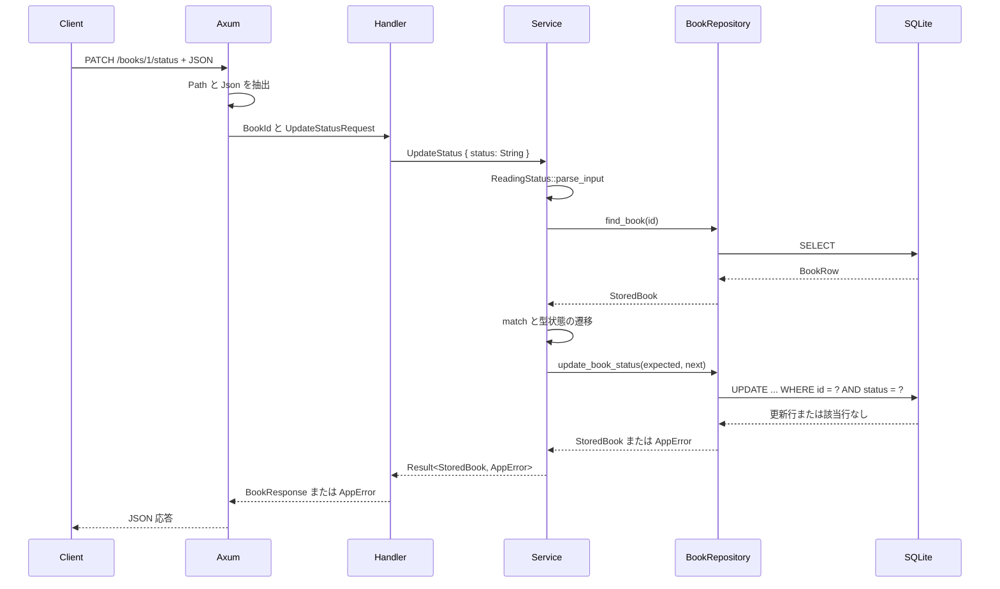

# 状態変更を HTTP から SQLite まで追う

## 問い

`PATCH /books/{id}/status` に `{"status":"reading"}` を送ったとき、入力の文字列はどこで検証され、どの型へ変わり、何を条件に SQLite へ保存されるのでしょうか。これまでに読んだ所有権、型状態、trait、Future の知識を使い、応答までを一つの処理として追います。

## 読む場所と順序

1. `src/app.rs` の `build_app` と `src/handler.rs` の `UpdateStatusRequest`、`update_status`。
2. `src/service.rs` の `UpdateStatus`、`ReadingService::update_status`。
3. `src/repository.rs` の `BookRepository::find_book`、`update_book_status`。
4. `src/repository/sqlite.rs` の `find_book`、`update_book_status`、`TryFrom<BookRow>`。
5. `src/error.rs` の `AppError::into_response` と `src/handler.rs` の `BookResponse`。
6. `tests/api.rs`、`src/repository/sqlite.rs`、`src/service/tests.rs`、`src/domain/book.rs` の対応する検証。



## 正常系を一つの値の流れとして読む

Router は `PATCH /books/{id}/status` を `handler::update_status` へ接続します。Axum は handler を呼ぶ前に Path を `BookId`、JSON 本文を `UpdateStatusRequest` へ変換します。抽出に成功すると、handler はリクエストが所有する `String` を `UpdateStatus` へ移し、service の Future を `.await` します。

```rust,ignore
{{#include ../../../src/handler.rs:update_status_handler}}
```

service は入力文字列を `ReadingStatus` へ変換してから、repository を通して現在の本を取得します。ここで未検出なら、後続の遷移や保存には進みません。取得した `StoredBook` から `expected` を控えた後、現在状態と要求状態の組を `match` します。

```rust,ignore
{{#include ../../../src/service.rs:update_status_service}}
```

成功する枝は、未読から読書中と、読書中から読了だけです。各枝で `StoredBook` の variant から具体的な `Book<WantToRead>` または `Book<Reading>` が得られるため、その型に存在する `start_reading` または `finish` を呼べます。遷移メソッドは `self` を消費し、次の状態を型に持つ別の値を返します。

ここまでで得た `next` は、メモリ上では合法な遷移です。しかし、取得後に別の要求が同じ本を更新または削除した可能性は残ります。service は取得時の状態 `expected` と遷移済みの `next` を repository へ渡します。

```rust,ignore
{{#include ../../../src/repository/sqlite.rs:conditional_update}}
```

SQLite Adapter は状態の比較と更新を一つの `UPDATE` に含めます。ID と現在状態の両方が一致した行だけを書き換え、`RETURNING` で更新後の行を受け取ります。該当行がなければ、状態が変わった場合も削除された場合も `Conflict` です。取得時に存在しなかった `NotFound` とは、失敗した段階が異なります。

返された `BookRow` は値型と状態を再検証して `StoredBook` へ戻ります。handler はその所有権を `BookResponse` へ移し、Axum が `200 OK` の JSON 応答へ変換します。要求の `String` をそのまま応答へ返しているのではなく、保存して再構築した値が復路を通ります。

## 型の保証と保存の保証を分ける

| 場所 | 保証すること | 保証しないこと |
| --- | --- | --- |
| `Book<WantToRead>` と `Book<Reading>` | その型に許された遷移メソッドだけを書ける | HTTP の文字列が既知か、DB が現在も同じ状態か |
| service の `parse_input` と `match` | 既知の状態名だけを扱い、現在状態との許可された組だけを選ぶ | 取得後に保存状態が変わらないこと |
| SQLite の条件付き `UPDATE` | 取得時の状態が現在も一致する行だけを更新する | あらゆるフィールドや履歴の競合検査 |
| `TryFrom<BookRow>` | DB の行を検証済みの値と既知の状態へ復元する | DB に不正値が書かれないことそのもの |
| handler と `IntoResponse` | 成功値とアプリケーションエラーを HTTP 応答へ変換する | handler 到達前に Axum が返す rejection の JSON 形式 |

`self` を消費しても、遷移前に clone した値や、同じ DB 行を別に取得した値は残せます。型状態は一つの所有値に対する操作を制限します。条件付き更新は、取得したスナップショットを前提に現在の DB へ保存できるかを検査します。二つは置き換え関係ではありません。

## 失敗が HTTP 応答へ変わる場所

```rust,ignore
{{#include ../../../src/error.rs:http_error_mapping}}
```

| 失敗 | 判定する場所 | HTTP で観測する結果 |
| --- | --- | --- |
| 数値でない Path、不正な JSON、対応しない `Content-Type` | Axum の extractor。handler 本文より前 | Axum の rejection。アプリケーションの共通 JSON 契約の対象外 |
| 未知の状態名 | `ReadingStatus::parse_input` | `400 Bad Request` と `validation_error` |
| 最初の取得で本がない | `find_book` | `404 Not Found` と `not_found` |
| 飛び越し、逆戻り、同じ状態への変更 | service の `match` | `409 Conflict` と `conflict` |
| 取得後に状態が変わった、または削除された | SQLite の条件付き `UPDATE` | `409 Conflict` と `conflict` |
| DB 行を検証済みの値へ復元できない | `TryFrom<BookRow>` | 詳細を隠した `500 Internal Server Error` と `internal_error` |
| SQLx の接続・実行エラー | SQLite Adapter からの `?` | 詳細を隠した `500 Internal Server Error` と `internal_error` |

`AppError::Database` と `AppError::InvalidStoredValue` は内部ログに原因を残しますが、応答には DB の詳細を含めません。一方、extractor の rejection は `AppError::into_response` を通りません。どちらも 400 系や 500 系になり得るというだけで、同じエラー契約ではありません。

## 検証ごとの保証と限界

| 検証 | 実際に通る範囲 | 分かること | 分からないこと |
| --- | --- | --- | --- |
| `Book` の doctest | 公開されたドメインの型とメソッドをコンパイラから利用 | 合法な遷移が成立し、未読から直接 `finish` を書けない | 実行時の入力、SQLite への保存、HTTP 応答 |
| service のフェイク | `ReadingService` と既存の `BookRepository` Seam | 遷移判断、保存競合・保存失敗の伝播、失敗時に保存値を変えないこと | SQL の条件、行変換、Router、Axum の rejection |
| SQLite Adapter | 実 SQLite、SQL、行変換、repository の契約 | 古い取得結果と取得後の削除を条件付き更新が拒否すること | HTTP の status・JSON、service が選ぶ遷移 |
| Router と実 SQLite | routing、extractor、handler、service、SQLite、応答変換 | HTTP の status・JSON と、取得できる保存結果 | TCP 設定と、取得・保存間の競合を任意のタイミングで発生させること |

アプリケーションの通常の振る舞いは、最も高い既存の境界である Router と実 SQLite から確認します。保存前の競合や、その保存だけに起こる DB エラーは、HTTP 要求だけでは発生位置を決定的に制御できません。その二つだけを既存の repository と service の Seam で確認します。待ち時間やタスクの実行順へ依存するテストは増やしません。

## 確認

1. 入力の `status` は、どこまで `String` で、どこから `ReadingStatus` になりますか。
2. `Book<Reading>` を作れた後でも、条件付き `UPDATE` が必要なのはなぜですか。
3. 最初から本がない場合と、取得後に削除された場合は、それぞれ何になりますか。
4. 保存値の不正と DB エラーは、内部では別の失敗なのに、なぜ同じ HTTP 応答になりますか。
5. 保存競合と保存失敗だけを Router より低い Seam で確認する理由は何ですか。

## 解答

1. Axum が `UpdateStatusRequest` を作り、handler が `UpdateStatus` へ移す間は `String` です。service の `ReadingStatus::parse_input` が既知の variant へ変換します。
2. 型状態が制限するのは手元の所有値に対する操作です。同じ ID の別の取得結果や別要求によって、DB の現在状態が取得時から変わる可能性は残るためです。
3. `find_book` の時点でなければ `404 Not Found` です。取得後の条件付き保存で行が見つからなければ、保存の前提が崩れた `409 Conflict` です。
4. 原因の分類とログは保ちつつ、保存内容や接続情報などの内部詳細を HTTP の利用者へ公開しない契約だからです。
5. 通常の結果は Router から広い範囲を確認できますが、取得と保存の間への更新・削除や、保存箇所だけの失敗は HTTP から発生位置を決定的に制御できないためです。既存の Seam なら古い取得結果や次の保存エラーを待ち時間なしで作れます。

次は[フェイクで service の判断を確かめる](service-fake.md)で、合法な遷移を作った後の保存だけを失敗させる方法を詳しく読みます。
