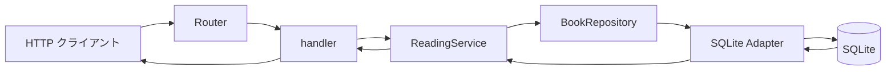

# 完成形と一括読了記録

## 問い

一括読了記録は誰の何を解決し、HTTP の要求から SQLite の保存結果まで、どの値と保証をつなぐのでしょうか。

## 対象読者と到達点

この教材は Rust Book を一通り読んだ直後の学習者を対象にします。Axum、SQLx、SQLite の開発経験は前提にしません。読むだけで完結し、コード編集や実行環境の準備を修了条件にしません。

読了時には、完成した一括読了記録を根拠に次を説明できることを目指します。

- HTTP の所有値が検証済みの値へ変わり、Future 間で移動または借用される場所。
- `Book<Reading>` が保証することと、保存時に実行時検査が必要なこと。
- 一冊の状態変更とメモ追加をまとめる保存単位と、冊子間の部分成功の違い。
- `BookRepository` の Interface が SQLite とフェイクの二つの Adapter へ届く仕組み。
- 独立した Future を並行に進めても、入力と結果の対応を失わない仕組み。
- 一件の失敗と親 Future の終了後に、未完了処理と保存済み結果がどうなるか。
- 型検査、実行テスト、実アプリの確認、読解レビューが保証する範囲の違い。

## 完成したアプリケーション

題材は、本、読書状態、メモを SQLite に保存する読書記録 API です。中心となる `POST /reading-completions` は、読書中の複数冊を読了へ進め、各本の読了時のメモを一緒に残します。



要求は重複しない 1〜8 件の `book_id` と空でない `body` を入力順で持ちます。要求全体を検証してから各本を独立した子 Future で進め、結果は完了順ではなく入力順で返します。

```json
{
  "items": [
    {"book_id": 12, "body": "所有権と保存の関係を確認した"},
    {"book_id": 7, "body": "Future が保持する値を確認した"}
  ]
}
```

一冊では、読書中から読了への状態変更とメモ追加を同じ transaction で確定します。冊子間では一つの transaction にまとめません。一冊が未検出や競合でも、別の本は処理を続け、各項目に `completed` または `failed` を返します。

## 5 部の読み方

| 部 | 範囲 | 読了時に説明すること |
| --- | --- | --- |
| 第 1 部：一件の値を整える | HTTP の `String`、検証、所有権、借用 | 保存前に要求全体を検証し、子 Future へ所有値を渡す理由 |
| 第 2 部：一冊の読了を成立させる | 型状態、実行時状態、transaction、失敗 | 型の保証と保存の保証、一冊の原子性と冊子間の部分成功 |
| 第 3 部：Interface の向こうを読む | trait、ジェネリクス、Adapter | 呼び出し側が頼る契約と、具体型が決まる場所 |
| 第 4 部：複数の処理を進める | Future、並行性、順序、寿命 | 所有値と共有借用、結果の対応、失敗と終了後の保存状態 |
| 第 5 部：利用者の経路を読み直す | HTTP から SQLite、検証の種類 | 端から端の値と失敗、および各検証から分からないこと |

各章は「問い」「前提」「読む場所と順序」「解説」「別案」「確認」「解答」の順です。中断後は、その章の問いと読む順序を読み直せば再開できます。

## 前提

Rust Book の所有権と借用、`enum` と `match`、`Result` と `?`、ジェネリクスと trait の基礎を使います。最初は [要求から検証済みの入力へ](01-values/reading-completion-input.md) 進みます。

## 教材をブラウザで開く

初回だけリポジトリのルートで次を実行します。

```bash
mise trust mise.toml
mise install
```

2 回目以降は次のコマンドで起動します。

```bash
mise exec -- mdbook serve --hostname 127.0.0.1 --port 3001
```

`http://127.0.0.1:3001/introduction.html` を開きます。Mermaid とソース抜粋は生成した mdBook で確認できます。検索は日本語の分かち書きに制約があるため、見つからないときは `NoteBody`、`BookRepository`、`FuturesUnordered`、`record_reading_completion` など本文中の識別子を使います。

## 任意で API を動かす

教材は読むだけで完結します。実行する場合は別の端末で `cargo run` を実行すると、`http://127.0.0.1:3000` で待ち受け、`reading-notes.db` に既存の migration を適用します。今回の完成形は既存の `books` と `notes` の表を変更せず利用するため、新しい migration や利用者データの削除はありません。
