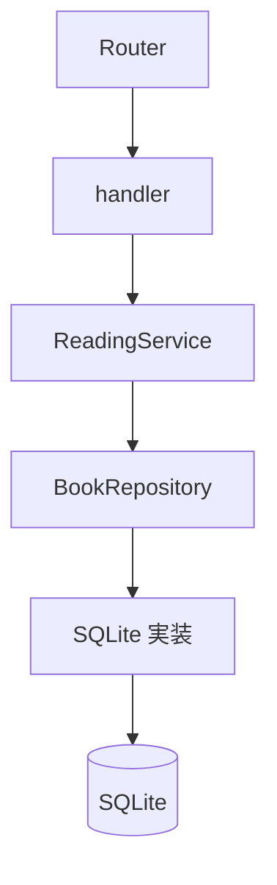

# 教材の使い方

## この教材で目指すこと

Rust Book の知識を使い、HTTP から DB まで値が移動する流れと、型が操作を制限する理由を読み解きます。完成した読書記録 API の実装とテストを手元で開き、型シグネチャ、値の移動、呼び出し先を根拠に説明することが目標です。

## 前提知識と準備

Rust Book を一通り読み、`struct`、`enum`、`match`、ジェネリクス、`Result` と `?` の基本を知っている方を想定しています。Axum や SQLx を使った開発経験は前提にしません。

読んでいて迷ったら、[日本語版 Rust Book](https://doc.rust-jp.rs/book-ja/) の次の章へ戻って確認してください。

- 第4章「所有権を理解する」：所有権の移動、参照と借用。
- 第9章「エラー処理」：`Result` と `?` による失敗の伝播。
- 第10章「ジェネリック型、トレイト、ライフタイム」：型引数、trait 境界、参照の有効期間。

API の実行には Rust toolchain（Edition 2024 に対応する Rust 1.85 以降）、本のビルドには mise、本の登録例には curl を使います。依存クレートが要求するバージョンも満たすため、Rust は現在の stable を推奨します。プロジェクトの `mise.toml` は mdBook と mdbook-mermaid だけを固定し、既存の Rust 管理方式を上書きしません。

以降のコマンドは、`Cargo.toml` と `book.toml` があるリポジトリのルートで実行します。初回のツール導入と依存クレート取得にはネットワーク接続が必要です。

## 起動する

```bash
cargo run
```

API は `http://127.0.0.1:3000` で待ち受け、ルートに `reading-notes.db` を作成します。起動時に migration を適用します。SQLite は SQLx が組み込みで利用するため、別の DB サーバーを起動する必要はありません。

別の端末で本を登録します。

```bash
curl -i http://127.0.0.1:3000/books \
  -H 'content-type: application/json' \
  -d '{"title":"Rust Book","author":"The Rust Project"}'
```

成功すると `201 Created` と登録した本の JSON が返り、状態は未読の `want_to_read` になります。登録を繰り返すと別の本が作られるので、応答の `id` を確認してください。一覧は次のコマンドで取得できます。

```bash
curl -i http://127.0.0.1:3000/books
```

読書状態は `WantToRead → Reading → Finished`（HTTP では `want_to_read → reading → finished`）の順にだけ変更できます。飛び越し、逆戻り、同じ状態への更新は `409 Conflict`、認識できない状態名は `400 Bad Request` です。対象取得時の未検出は `404 Not Found`、取得後の条件付き更新の不成立は途中での削除も含めて `409 Conflict` として扱います。この規則を、型と DB がどのように分担して守るかを読みます。

### 教材を開く

```bash
mise install
mise exec -- mdbook --version
mise exec -- mdbook-mermaid --version
mise exec -- mdbook build
mise exec -- mdbook serve --hostname 127.0.0.1 --port 3001
```

ブラウザで `http://127.0.0.1:3001/introduction.html` を開きます。API のポートは 3000、本のポートは 3001 です。それぞれの端末で `Ctrl+C` を押すと停止します。ビルド結果は `book/` に出力され、Git の管理対象には含めません。Mermaid の JavaScript は本に同梱されるので、閲覧時に CDN へ接続する必要はありません。

固定版の mdBook 0.5.4 と、mdbook-mermaid 0.17.1 の preprocessor がビルド時に使った mdBook 0.5.0 は、バージョン文字列の完全一致比較で既知の警告が出ます。この組み合わせでビルドと図の描画（外部通信遮断時を含む）を確認済みです。

検索には日本語「非同期」が未ヒットになる実測上の制限があります。`Future` などの識別子や画面の目次から章を探してください。

## 全体図



図は処理を追う順序です。`BookRepository` は操作の契約を表す trait で、起動時に SQLite 実装を `ReadingService<R>` へ渡します。trait 自体が別の処理プロセスとして動くわけではありません。HTTP の入出力は handler、検証と処理の組み立ては service、SQL と保存値の変換は SQLite 実装が担当します。ドメインの型は、その間を移動する値と許される操作を表します。

## 4部の読み方

まず第1部で全体を一周し、第2部以降で同じ完成形のコードを別の観点から読み直します。第1部では型状態やジェネリクスの細部を覚え切らず、値の行き先を押さえてから定義へ戻って構いません。

| 部 | 読む観点 | 読了時に説明したいこと |
| --- | --- | --- |
| 第1部：処理を端から端まで追う | 依存関係の組み立て、本の登録、詳細取得とエラー | HTTP から DB、応答まで値と呼び出しがどうつながるか |
| 第2部：型でルールを表現する | 検証済み newtype、`Book<S>`、動的な状態との境界 | 型が保証することと、実行時に判定することの違い |
| 第3部：抽象化と非同期を読む | repository trait、`ReadingService<R>`、借用、`Future`、`Send` | 具体的な型が決まる場所と、非同期処理に必要な制約 |
| 第4部：テストから保証を読む | フェイク、SQLite、更新競合、Router | それぞれのテストが実際に通る範囲と保証 |

所要時間は第1部を60〜90分、全体を3〜5時間程度と仮置きしています。Rust Book の再確認や実験にかかる時間に合わせて調整してください。

各章では、最初の問いを読んでから指定されたファイル・型・関数を順に開きます。引数と返り値、所有・借用、失敗の型を書き出し、理解の確認にコードを根拠として答え、最後に解答・解説と照らし合わせます。

## DB とテストの読み方

起動時の `connect_database` と API テストの `test_app_and_pool` は、教材の接続管理を単純にするため pool を最大1接続に設定します。API テストでは、各テストが `sqlite::memory:` から別の pool を作り、独立したインメモリ DB を使います。SQLx 0.8.6 はこの URL の解析時に一意な DB 名と `shared_cache = true` を設定し、同じ pool 内では接続オプションを共有するため、複数接続でも同じ DB を共有できます。テスト間の独立性と、pool 内の接続数は別の話です。

repository の `#[sqlx::test]` では、SQLx が独立したファイル DB と pool を準備します。`connect_database` の1接続設定を引き継ぐものではありません。repository テストと API テストは、どちらもアプリと同じ migration を適用し、手元の `reading-notes.db` を共有しません。

service の単体テストでは [repository のフェイク](04-tests/service-fake.md)を使い、[SQLite の契約テスト](04-tests/sqlite-contract.md)では SQL と保存の契約、[Router の統合テスト](04-tests/http-integration.md)では HTTP の入出力まで確認します。

```bash
cargo test
```

型状態がメモリ上の操作を制限していても、別の要求による DB 更新まで防ぐわけではありません。変更前の状態を条件に含む更新と競合テストを読み、型の保証と永続化の保証を区別してください。
