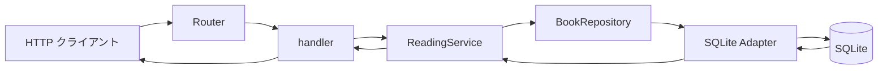

# 教材の使い方

## この教材で目指すこと

この教材は、Rust Book を一通り読んだ直後の学習者が、完成した Web API を題材に Rust の制約を理由から読めるようになるためのものです。Axum や SQLx を使った開発経験は前提にしません。

読了時には、実装を根拠に次の問いへ答えられることを目指します。

- 値を所有するのは誰で、どこで移動し、どこで借用しているか。
- 型が保証することと、HTTP 入力や DB の値に対して実行時に検査することは何か。
- ジェネリックな型の具体形を誰が決め、trait の契約がどの実装へ届くか。
- Future が何を保持し、`Send`、`Sync`、`'static`、`Arc` がなぜ必要になるか。
- HTTP から SQLite までの各境界とテストが、何を保証し、何を保証しないか。

読むだけで完結するように、各章にコード抜粋、読む順序、解説、確認問題、根拠付きの解答を置いています。コードの編集や API の実行は修了条件ではありません。分量は一度に読み切ることを前提にせず、複数日に分けて構いません。再開するときは各章の「問い」と「読む場所と順序」を読み直すと、その章で追う値と型へ戻れます。

## 完成したアプリケーションの全体像

題材は、本、読書状態、メモを SQLite に保存する読書記録 API です。本の登録、一覧と絞り込み、詳細取得、状態変更、メモ追加、削除を扱います。



図の往路では、HTTP の JSON が入力用の型へ変わり、検証済みの値を経て SQLite へ保存されます。復路では、DB の行を検証してドメインの型へ戻し、HTTP の出力用の型へ所有権を移して JSON にします。`BookRepository` は別プロセスではなく、service と SQLite Adapter の間にある Interface です。

最初から図のすべてを理解する必要はありません。第 1 部では `String`、小さな変換関数、`Result` から始め、本の登録経路だけを広げて読みます。

## 5 部の読み方

| 部 | 読む観点 | 読了時に説明したいこと |
| --- | --- | --- |
| 第 1 部：値と関数 | 所有権の移動、部分的な移動、借用、`Clone`、`Result` と `?` | 本の登録で値がどこへ移り、どの呼び出しだけが借りるのか |
| 第 2 部：型と状態 | 検証済み newtype、可視性、`enum`、型状態、外部データの検証 | 型が防ぐ不正と、実行時の検査が必要な不正の違い |
| 第 3 部：型を抽象化する | ジェネリクス、trait 境界、`impl Trait`、具体型 | 呼び出し側と Adapter が Interface を介してどうつながるか |
| 第 4 部：非同期と共有 | Future、`.await`、`Send`、`Sync`、`'static`、`Arc` | 停止をまたいで保持する値と、共有に必要な制約 |
| 第 5 部：全体を読み直す | HTTP、service、SQLite、エラー変換、テスト | 一つの処理を端から端まで追い、各保証の限界を区別できること |

前の部で得た見方を次の部で使います。分からない用語が先に見えても、その章の問いに必要な範囲だけ押さえ、詳細を扱う部へ進んでから戻って構いません。

各章は次の順で読みます。

1. 「問い」で、その章で説明したいことを確認する。
2. 「読む場所と順序」に従い、型シグネチャ、引数、返り値を追う。
3. ソースと連動する抜粋を見ながら、所有、借用、失敗の経路を読む。
4. 「確認」へ本文と参照コードだけで答える。
5. 「解答」で根拠と推論を照らし合わせる。

## 第 1 部を始める前の前提

Rust Book の次の内容を知っていれば読み始められます。忘れている箇所は、[日本語版 Rust Book](https://doc.rust-jp.rs/book-ja/)へ戻って確認できます。

- 第 4 章「所有権を理解する」：所有権の移動、参照と借用。
- 第 6 章「Enum とパターンマッチング」：`Option`、`match`。
- 第 9 章「エラー処理」：`Result` と `?`。
- 第 10 章「ジェネリック型、トレイト、ライフタイム」：型引数、trait、参照の有効期間。

まず[値を受け取る関数を読む](01-values/values-and-functions.md)へ進んでください。完成した API の全体像から範囲を絞り、`BookTitle::try_from` と `normalize` という小さな関数から始めます。

## 教材をブラウザで開く

Markdown 原文でも読めますが、ソース取り込みと Mermaid の図は生成した mdBook で確認できます。初回だけリポジトリのルートで次を実行します。

```bash
mise trust mise.toml
mise install
```

2 回目以降は次のコマンドで起動します。

```bash
mise exec -- mdbook serve --hostname 127.0.0.1 --port 3001
```

ブラウザで `http://127.0.0.1:3001/introduction.html` を開きます。`mdbook serve` は変更時にも再ビルドします。終了するときは `Ctrl+C` を押します。Mermaid の JavaScript は本に同梱されるため、閲覧時に CDN への接続は必要ありません。

検索では日本語の語句が見つからない場合があります。その場合は `BookTitle`、`create_book`、`BookRepository`、`Future` など、本文に現れるコード識別子で検索してください。

## 任意で API を動かす

教材は読むだけで完結しますが、完成したアプリケーションを確認したい場合は、別の端末で次を実行します。

```bash
cargo run
```

API は `http://127.0.0.1:3000` で待ち受け、リポジトリのルートに `reading-notes.db` を作成して migration を適用します。本を登録する例は次のとおりです。

```bash
curl -i http://127.0.0.1:3000/books \
  -H 'content-type: application/json' \
  -d '{"title":"Rust Book","author":"The Rust Project"}'
```

成功すると `201 Created` と登録した本の JSON が返り、状態は `want_to_read` になります。実行しなくても、第 1 部ではこの要求と応答をソースと確認済みの実行結果から追えます。
