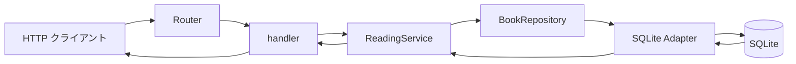

# 完成形と一括読了記録

## 問い

一括読了記録は誰の何を解決し、HTTP の要求から SQLite の保存結果まで、どの値と保証をつなぐのでしょうか。

## 前提

Rust Book の所有権と借用、`enum` と `match`、`Result` と `?`、ジェネリクスと trait の基礎を使います。Axum、SQLx、SQLite の開発経験は前提にしません。

## 読む場所と順序

1. [完成したアプリケーション](#完成したアプリケーション)で、HTTP から保存までの全体像をつかむ。
2. 同節の `src/handler.rs` / `ReadingCompletionsRequest` の抜粋で、入力 JSON と Rust の型を対応させる。
3. [5 部の読み方](#5-部の読み方)で全体の読む順序を確認し、[要求から検証済みの入力へ](01-values/reading-completion-input.md)から具体的な式を追う。

## 解説

### 対象読者と到達点

この教材は Rust Book を一通り読んだ直後の学習者を対象にします。Axum、SQLx、SQLite の開発経験は前提にしません。読むだけで完結し、コード編集や実行環境の準備を修了条件にしません。

読了時には、完成した一括読了記録を根拠に次を説明できることを目指します。

- HTTP の所有値が検証済みの値へ変わり、Future 間で移動または借用される場所。
- `Book<Reading>` が保証することと、保存時に実行時検査が必要なこと。
- 一冊の状態変更とメモ追加をまとめる保存単位と、冊子間の部分成功の違い。
- `BookRepository` の Interface が SQLite とフェイクの二つの Adapter へ届く仕組み。
- 独立した Future を並行に進めても、入力と結果の対応を失わない仕組み。
- 一件の失敗と親 Future の終了後に、未完了処理と保存済み結果がどうなるか。
- 型検査、実行テスト、実アプリの確認、読解レビューが保証する範囲の違い。

### 完成したアプリケーション

題材は、本、読書状態、メモを SQLite に保存する読書記録 API です。中心となる `POST /reading-completions` は、読書中の複数冊を読了へ進め、各本の読了時のメモを一緒に残します。


```mermaid
flowchart LR
    Client[HTTP クライアント] --> Router
    Router --> Handler[handler]
    Handler --> Service[ReadingService]
    Service --> Contract[BookRepository]
    Contract --> Adapter[SQLite Adapter]
    Adapter --> DB[(SQLite)]
    DB --> Adapter --> Service --> Handler --> Client
```

要求は重複しない 1〜8 件の `book_id` と空でない `body` を入力順で持ちます。要求全体を検証してから各本を独立した子 Future で進め、結果は完了順ではなく入力順で返します。

```json
{
  "items": [
    {"book_id": 12, "body": "所有権と保存の関係を確認した"},
    {"book_id": 7, "body": "Future が保持する値を確認した"}
  ]
}
```

完成形の HTTP 入力は、一覧と各メモ本文を所有する次の型です。

対象: `src/handler.rs` / `ReadingCompletionsRequest` と `ReadingCompletionItemRequest`。

```rust,ignore
{{#include ../../src/handler.rs:reading_completions_request}}
```

1. `#[derive(Deserialize)]` は、JSON からこの構造体へ変換するための実装を Serde に生成させます。一覧の型だけでなく、その要素の型にも必要です。
2. `pub(crate)` は、同じクレート内からこの型を使えるという公開範囲です。API 利用者に公開する JSON のフィールドとは別の話です。
3. `items: Vec<ReadingCompletionItemRequest>` は、入力 JSON の `items` 配列を受け取ります。`Vec<T>` は、ここでは各本の入力を順序付きで所有する一覧です。
4. 要素の `book_id` は対象の本を識別し、`body: String` はその本に残すメモ本文を所有します。この型に変換できただけでは、本文が空でないことや、本が読書中であることまでは保証しません。

このあと handler が一覧を消費し、service が本文を検証済みの値へ変換します。具体的な `into_iter()` と `NoteBody::try_from` のコードは[次章の解説](01-values/reading-completion-input.md)で一緒に読みます。導入では、入力の一覧があり、各要素に本の ID と本文があることを押さえれば十分です。

一冊では、読書中から読了への状態変更とメモ追加を同じ transaction で確定します。冊子間では一つの transaction にまとめません。一冊が未検出や競合でも、別の本は処理を続け、各項目に `completed` または `failed` を返します。

### 5 部の読み方

| 部 | 範囲 | 読了時に説明すること |
| --- | --- | --- |
| 第 1 部：一件の値を整える | HTTP の `String`、検証、所有権、借用 | 保存前に要求全体を検証し、子 Future へ所有値を渡す理由 |
| 第 2 部：一冊の読了を成立させる | 型状態、実行時状態、transaction、失敗 | 型の保証と保存の保証、一冊の原子性と冊子間の部分成功 |
| 第 3 部：Interface の向こうを読む | trait、ジェネリクス、Adapter | 呼び出し側が頼る契約と、具体型が決まる場所 |
| 第 4 部：複数の処理を進める | Future、並行性、順序、寿命 | 所有値と共有借用、結果の対応、失敗と終了後の保存状態 |
| 第 5 部：利用者の経路を読み直す | HTTP から SQLite、検証の種類 | 端から端の値と失敗、および各検証から分からないこと |

各章は「問い」「前提」「読む場所と順序」「解説」「別案」「確認」「解答」の順です。中断後は、その章の問いと読む順序を読み直せば再開できます。

### コードと解説の読み合わせ方

各節は「対象ファイル・型や関数名 → 短い実コード → 直下の解説」の順で読みます。本文のインラインコードは、原則としてすぐ上の抜粋の式を指します。別の場所の説明が必要な場合は、対応する節や章へリンクします。

解説は構文を日本語に置き換えるだけでなく、「何を受け取り、どう処理し、何を次へ渡すか」「失敗したらどこへ戻るか」を追います。構文や API は初出で詳しく説明し、後の章ではその章で変わる役割を中心に読み直します。

抜粋はソースの名前付き範囲から取り込むため、説明に必要なところだけを載せても別実装にはなりません。メソッドチェーンや関数の途中から始まる抜粋では、その旨と対象関数を添えます。まずはその場のコードと解説で読み進め、関数全体を見たいときだけ対象ファイルを開いてください。

「なぜこの設計か」「別案では何が変わるか」は、具体的な処理を押さえたあとに読みます。所有権などの学習テーマに直接関係しない式でも、掲載コードの流れを追うのに必要なものは説明します。

## 別案との比較

### 既存の状態変更とメモ追加を利用者が順に呼ぶ

新しい API を増やさずに済みますが、状態変更だけが成功してメモ追加が失敗する可能性があります。また、複数冊の入力と結果の対応、並行進行、親 Future の終了という一つのユースケースを実装から追えません。一冊の状態とメモを一緒に確定する一括読了記録を採用します。

### 全冊を一つの transaction に入れる

全体成功・全体失敗が必要なら成立します。しかし一冊の競合で独立した別の本まで失敗させるため、冊子間の部分成功という契約には合いません。一冊の中だけを原子的にします。

### 外部サービスを題材にする

独立した通信は並行処理の動機になりますが、認証、再試行、外部サービスの可用性という別の前提が増えます。既存の読書状態と保存契約だけで学習目標を満たせるため導入しません。

## 確認

1. 一括読了記録は、既存の状態変更とメモ追加を利用者が順に呼ぶ場合と比べて、一冊について何を保証しますか。
2. 要求全体の入力不正と、正しい要求に含まれる一冊の失敗は、結果と保存範囲がどう違いますか。
3. 複数冊を一つの transaction に入れず、子 Future で独立して進めるのはなぜですか。
4. 完了順が変わっても、利用者へ入力順で結果を返せるのは何を保持するためですか。
5. 親 Future が破棄されたとき、未完了処理と commit 済みの保存はそれぞれどうなりますか。

## 解答

1. 読書中から読了への状態変更とメモ追加を同じ transaction で確定し、片方だけを残しません。
2. 件数、重複、空本文の違反は保存前に要求全体を `400` で拒否します。入力全体が正しければ、未検出や競合は一冊の `failed` となり、別の本の処理と確定済みの保存を取り消しません。
3. 各 `book_id` は重複せず、一冊の結果を別の一冊が使わないためです。独立した I/O の待機中にほかの本を進め、部分成功を保ちます。
4. 各子 Future が `book_id` と入力位置を所有し、親 Future が全結果を入力位置で整列するためです。
5. 親が所有する未完了の子 Future は破棄され、それ以上 poll されません。一冊ごとにすでに commit した本とメモは保存先に残ります。

最初は[要求から検証済みの入力へ](01-values/reading-completion-input.md)進みます。

## 教材をブラウザで開く

初回だけリポジトリのルートで次を実行します。

```bash
mise trust mise.toml
mise install
```

2 回目以降は次のコマンドで起動します。

```bash
mise exec -- mdbook serve --hostname 127.0.0.1 --port 3001
```

`http://127.0.0.1:3001/introduction.html` を開きます。Mermaid とソース抜粋は生成した mdBook で確認できます。検索は日本語の分かち書きに制約があるため、見つからないときは `NoteBody`、`BookRepository`、`FuturesUnordered`、`record_reading_completion` など本文中の識別子を使います。

## 任意で API を動かす

教材は読むだけで完結します。実行する場合は別の端末で `cargo run` を実行すると、`http://127.0.0.1:3000` で待ち受け、`reading-notes.db` に既存の migration を適用します。今回の完成形は既存の `books` と `notes` の表を変更せず利用するため、新しい migration や利用者データの削除はありません。
