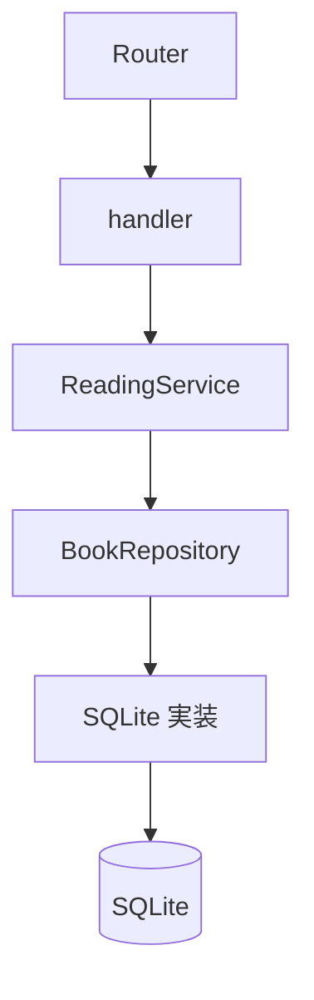

# 中級 Rust コードリーディング教材の実装計画

> **実行するエージェントへ:** `executing-plans`、またはユーザーが委任方式を選んだ場合は `subagent-driven-development` を使用し、チェックボックスを更新しながらタスク単位で実行する。設計書と本計画を両方読む。

**目的:** Rust Book 読了者が、型状態・ジェネリクス・非同期処理の組み合わさった一つの完成形 API を、実装・テスト・mdBook から読み解ける教材を作る。

**アーキテクチャ:** `Book<S>` と検証済み newtype がドメインの規則を表し、`StoredBook` が動的な境界を担う。`ReadingService<R>` は `BookRepository` に依存し、SQLite 実装とフェイクを静的ディスパッチで利用する。HTTP の状態変更は条件付き更新で保存し、型の保証と DB の保証を接続する。

**技術:** Rust edition 2024、Axum 0.8、SQLx 0.8 / SQLite、Tokio 1、serde、thiserror 2、mdBook、mdbook-mermaid、mise。

**設計書:** `docs/superpowers/specs/2026-09-11-intermediate-rust-reading-design.md`

## 全体の制約

- 完成形の実装、テスト、ドキュメントだけで学習が完結する構成にする。
- Before/After 比較を教材の軸にしない。
- 実務寄りの機能追加は対象外とする。
- 独自 Future の実装、`Poll`、`Pin`、独自 Tower middleware には踏み込まない。
- 第1部を60〜90分、全体を3〜5時間程度と仮置きし、実際の読解量に応じて調整する。
- 新しい本は未読で登録し、`WantToRead → Reading → Finished` のみ許可する。
- 状態の飛び越し、逆戻り、同じ状態への更新は `409 Conflict`、認識できない状態名は `400 Bad Request` とする。
- 対象取得時の未検出は `404`、取得後の条件付き更新の不成立は削除も含めて `409` とする。
- 人が読む本文、コメント、rustdoc は日本語にする。既存の英語の HTTP エラーメッセージは維持する。
- ツールの導入・更新は mise で管理する。生成 HTML は Git 管理対象外とする。
- コミット・push は明示的に依頼された場合だけ行う。タスク末尾の検証をコミットで代用しない。

## 実行前の確認

- [ ] `using-git-worktrees` に従って作業場所を確認する。設計書と本計画が未コミットの場合、新しい worktree には自動で現れないため、両文書を参照できる状態にしてから開始する。既存のユーザー変更を上書きしない。
- [ ] `git status --short` と `git log --oneline -5` を確認する。
- [ ] `gh issue list --repo okw0204/life --state open --search 'rust-reading-notes-api'` で実行管理先を確認し、該当 Issue がなければ本作業の Issue を作成する。学習本文はリポジトリ、作業状況は Issue で管理する。
- [ ] `cargo test` で既存の基準状態を確認する。失敗した場合は `systematic-debugging` に従って原因を確認し、変更による失敗と分ける。
- [ ] 機能変更は `test-driven-development` に従う。各タスクの失敗確認は、import の誤りや無関係なビルド失敗ではなく、狙った不足によることを確認する。

## ファイル構成と責務

| ファイル | 作業 | 完成形での責務 |
| --- | --- | --- |
| `src/domain.rs` | 編集 | ID、動的な状態、メモ、詳細、子モジュールの再公開 |
| `src/domain/text.rs` | 作成 | `BookTitle`、`Author`、`NoteBody`、`InvalidText` |
| `src/domain/book.rs` | 作成 | `Book<S>`、状態マーカー、`StoredBook`、型状態の doctest |
| `src/error.rs` | 編集 | 検証エラー変換、`Conflict`、HTTP 応答 |
| `src/repository.rs` | 編集 | `BookRepository` の契約と SQLite 実装の再公開 |
| `src/repository/sqlite.rs` | 作成 | 既存 SQL の移動、DB 行の変換、条件付き更新、実 DB テスト |
| `src/service.rs` | 編集 | `ReadingService<R>`、入力構造体、ユースケース |
| `src/service/tests.rs` | 作成 | フェイクを用いる service テスト |
| `src/service/tests/fake.rs` | 作成 | テスト専用の repository 実装と失敗の制御 |
| `src/handler.rs` | 編集 | service の呼び出し、所有権を移す DTO 変換 |
| `src/app.rs` | 編集 | SQLite repository と service の組み立て、`Arc` による共有 |
| `src/lib.rs` | 編集 | doctest に必要なドメイン API の公開 |
| `tests/api.rs` | 編集 | 現行 API の回帰確認、遷移規則、HTTP のエラー境界 |
| `mise.toml`、`book.toml` | 作成 | 教材ツールの固定、mdBook と Mermaid の設定 |
| `mermaid.min.js`、`mermaid-init.js` | 導入 | preprocessor 同梱の閲覧用資産 |
| `docs/book/SUMMARY.md` | 作成 | 全章の順序 |
| `docs/book/introduction.md` | 作成 | 目的、起動、読み方、全体図 |
| `docs/book/01-flow/*.md` | 作成 | 依存関係の組み立て、登録、詳細とエラー |
| `docs/book/02-types/*.md` | 作成 | 検証済みの値、型状態、動的な境界 |
| `docs/book/03-abstraction/*.md` | 作成 | trait、service、非同期の制約 |
| `docs/book/04-tests/*.md` | 作成 | フェイク、DB、HTTP のテスト |
| `README.md`、`.gitignore` | 編集 | 教材への入口と生成物の除外 |

既存の migration、`main.rs` の起動インターフェース、`build_app(SqlitePool) -> Router` はそのまま利用する。Rust の依存追加は予定しない。各タスクは前のタスクの完了状態を入力とし、毎回コンパイル可能な状態で終える。途中の構造は完成教材の説明対象にしない。

---

## タスク1：検証済み newtype を入力と永続化の境界につなぐ

**ファイル:** `src/domain/text.rs` を作成。`src/domain.rs`、`src/error.rs`、`src/service.rs`、`src/repository.rs`、`src/handler.rs`、`src/lib.rs` を編集。

**入力:** 現行の `CreateBook`、`AddNote`、`BookRow`、`NoteRow`。

**出力インターフェース:**

```rust
// text.rs。3つの型に同じ公開操作を定義する。マクロでまとめず明示する。
pub struct BookTitle(String);
pub struct Author(String);
pub struct NoteBody(String);
pub struct InvalidText(&'static str);

// BookTitle、Author、NoteBody のそれぞれに実装する。
impl TryFrom<String> for BookTitle {
    type Error = InvalidText;
    fn try_from(value: String) -> Result<Self, Self::Error> {
        let value = value.trim();
        if value.is_empty() {
            return Err(InvalidText("title must not be empty"));
        }
        Ok(Self(value.to_owned()))
    }
}
impl BookTitle {
    pub fn as_str(&self) -> &str { &self.0 }
    pub fn into_inner(self) -> String { self.0 }
}
```

`Author` の失敗メッセージは `author must not be empty`、`NoteBody` は `note body must not be empty`。3つの値型は `Debug, Clone, PartialEq, Eq` を導出する。`InvalidText` は `Debug, thiserror::Error` を導出し、`#[error("{0}")]` を付ける。

- [ ] **1. 値の保証を確認する単体テストを書く。** `domain.rs` に `mod text;` を宣言し、`src/domain/text.rs` に `#[cfg(test)] mod tests` と `use super::*;` を用意して次を置く。著者と本文にも成功・空白拒否のケースを具体的に追加する。

```rust
#[test]
fn title_is_trimmed_and_cannot_be_blank() {
    let title = BookTitle::try_from("  Rust Book\n".to_owned()).unwrap();
    assert_eq!(title.as_str(), "Rust Book");
    assert_eq!(title.into_inner(), "Rust Book");
    assert_eq!(
        BookTitle::try_from(" \t".to_owned()).unwrap_err().to_string(),
        "title must not be empty"
    );
}
```

- [ ] **2. 失敗を確認する。** `cargo test domain::text` を実行し、未実装の値型による失敗を確認する。
- [ ] **3. 値型を実装して公開境界を設ける。** `domain.rs` で `mod text; pub use text::{Author, BookTitle, InvalidText, NoteBody};`、`lib.rs` で `pub mod domain;` とする。`AppError` は crate 内のまま維持し、次の変換を追加する。

```rust
impl From<crate::domain::InvalidText> for AppError {
    fn from(error: crate::domain::InvalidText) -> Self {
        Self::Validation(error.to_string())
    }
}
```

- [ ] **4. service の検証を値の構築へ置き換える。** 入力 DTO の文字列を消費し、repository へ値型を借用して渡す。

```rust
let title = BookTitle::try_from(input.title)?;
let author = Author::try_from(input.author)?;
repository::insert_book(pool, &title, &author).await
```

`add_note` は `NoteBody::try_from(input.body)?` を作り、`insert_note(pool, book_id, &body)` に渡す。repository の引数は `&BookTitle`、`&Author`、`&NoteBody` に変え、SQL bind で `as_str()` を使う。

- [ ] **5. DB と HTTP の変換を更新する。** この段階の `Book` の title/author を値型に、`Note.body` を `NoteBody` にする。`BookRow` と `NoteRow` は `String` のまま保持し、どちらも `TryFrom` で検証する。

```rust
let title = BookTitle::try_from(row.title)
    .map_err(|error| AppError::InvalidStoredValue(error.to_string()))?;
```

著者・本文も同じエラー分類にする。`list_notes` は `rows.into_iter().map(Note::try_from).collect()`、追加結果は `row.try_into()` とする。handler の DTO では `into_inner()` によって `String` を取り出す。

- [ ] **6. 検証する。** `cargo test domain::text`、`cargo test --test api`、`cargo clippy --all-targets --all-features -- -D warnings` を実行する。公開 API から private 型を露出しないこと、既存のエラーメッセージと JSON が一致することを確認する。

## タスク2：型状態と条件付き更新を API 全体に組み込む

**ファイル:** `src/domain/book.rs` を作成。`src/domain.rs`、`src/error.rs`、`src/repository.rs`、`src/service.rs`、`src/handler.rs`、`tests/api.rs` を編集。

**入力:** タスク1の値型と、具体関数を呼ぶ service。

**出力インターフェース:**

```rust
pub struct WantToRead;
pub struct Reading;
pub struct Finished;
pub struct Book<S> {
    id: BookId,
    title: BookTitle,
    author: Author,
    state: S,
}
// Book<S> とマーカーは Debug, Clone を導出する。
impl Book<WantToRead> {
    pub fn new(id: BookId, title: BookTitle, author: Author) -> Self {
        Self { id, title, author, state: WantToRead }
    }
    pub fn start_reading(self) -> Book<Reading> {
        Book { id: self.id, title: self.title, author: self.author, state: Reading }
    }
}
impl Book<Reading> {
    pub fn finish(self) -> Book<Finished> {
        Book { id: self.id, title: self.title, author: self.author, state: Finished }
    }
}
impl<S> Book<S> {
    pub fn id(&self) -> BookId { self.id }
    pub fn title(&self) -> &BookTitle { &self.title }
    pub fn author(&self) -> &Author { &self.author }
    pub(crate) fn into_parts(self) -> (BookId, BookTitle, Author, S) {
        (self.id, self.title, self.author, self.state)
    }
}
```

`BookId` を `pub struct BookId(pub i64)` として公開する。ID の正数検証は追加しない。`Book<S>`、マーカーを `domain.rs` から公開し、`StoredBook` は `pub(crate)` の再公開にする。

`StoredBook` は設計書の3 variant を持ち、次の crate 内操作を提供する。

| 操作 | シグネチャ |
| --- | --- |
| 検証済み保存値の復元 | `restore(id: BookId, title: BookTitle, author: Author, status: ReadingStatus) -> Self` |
| ID の取得 | `id(&self) -> BookId` |
| 動的な状態の取得 | `status(&self) -> ReadingStatus` |
| HTTP への分解 | `into_parts(self) -> (BookId, BookTitle, Author, ReadingStatus)` |

`restore` だけが、既存 DB の任意の有効状態から本を復元する。`ReadingStatus` は crate 内に残し、`StoredBook` は `Debug, Clone` を導出する。`BookDetail.book` は `StoredBook` とする。

- [ ] **1. ドメインの正しい遷移をテストする。** `domain.rs` に `mod book;` を宣言し、`src/domain/book.rs` の単体テストとして記述する。`cargo test domain::book` で必要な型・操作の不足を確認する。続く HTTP テストの失敗を確認する段階では、単体テスト用のビルドではなく `--test api` を使う。

```rust
#[test]
fn transitions_preserve_book_data() {
    let book = Book::new(
        BookId(7),
        BookTitle::try_from("Rust Book".to_owned()).unwrap(),
        Author::try_from("Author".to_owned()).unwrap(),
    );
    let reading: Book<Reading> = book.start_reading();
    let finished: Book<Finished> = reading.finish();
    assert_eq!(finished.id(), BookId(7));
    assert_eq!(finished.title().as_str(), "Rust Book");
    assert_eq!(finished.author().as_str(), "Author");
}
```

- [ ] **2. HTTP の飛び越し拒否テストを書く。** `tests/api.rs` の既存 helper と次の request helper を使う。

```rust
fn json_request(method: &str, path: &str, body: Value) -> Request<Body> {
    Request::builder().method(method).uri(path)
        .header("content-type", "application/json")
        .body(Body::from(body.to_string())).unwrap()
}

#[tokio::test]
async fn rejects_skipping_the_reading_state() {
    let app = test_app().await;
    let created = app.clone().oneshot(json_request(
        "POST", "/books", json!({"title":"Rust Book","author":"Author"})
    )).await.unwrap();
    assert_eq!(created.status(), StatusCode::CREATED);
    let response = app.clone().oneshot(json_request(
        "PATCH", "/books/1/status", json!({"status":"finished"})
    )).await.unwrap();
    assert_eq!(response.status(), StatusCode::CONFLICT);
    assert_eq!(json_body(response).await["error"]["code"], "conflict");
    let response = app.oneshot(Request::get("/books/1").body(Body::empty()).unwrap())
        .await.unwrap();
    assert_eq!(json_body(response).await["status"], "want_to_read");
}
```

- [ ] **3. 失敗を確認する。** `cargo test --test api rejects_skipping_the_reading_state` が `200` と `409` の不一致で失敗することを確認する。型状態テストは型の導入前にはコンパイル失敗する。
- [ ] **4. 型状態、復元、DTO 分解を実装する。** 旧 `Book` 定義を置き換え、repository の作成・取得・一覧・更新結果を `StoredBook` にする。`BookRow::try_from` 相当の既存変換は `impl TryFrom<BookRow> for StoredBook` に変更し、値検証後に `StoredBook::restore` を呼ぶ。handler は `impl From<StoredBook> for BookResponse` で `into_parts()` を使用する。
- [ ] **5. エラーと service の状態照合を実装する。** `AppError::Conflict` を単位 variant として追加し、表示文は `reading state conflict`、HTTP は `409`、コードは `conflict` にする。

```rust
let requested = ReadingStatus::parse_input(&input.status)?;
let current = repository::find_book(pool, book_id).await?;
let expected = current.status();
let next = match (current, requested) {
    (StoredBook::WantToRead(book), ReadingStatus::Reading) =>
        StoredBook::Reading(book.start_reading()),
    (StoredBook::Reading(book), ReadingStatus::Finished) =>
        StoredBook::Finished(book.finish()),
    _ => return Err(AppError::Conflict),
};
repository::update_book_status(pool, expected, next).await
```

- [ ] **6. 保存を条件付き更新にする。** 具体関数は `async fn update_book_status(pool: &SqlitePool, expected: ReadingStatus, next: StoredBook) -> Result<StoredBook, AppError>` とする。次の SQL を使い、`next.status().as_str()`、`next.id().0`、`expected.as_str()` の順で bind する。

```sql
UPDATE books
SET status = ?
WHERE id = ? AND status = ?
RETURNING id, title, author, status
```

`fetch_optional` が `None` なら `Conflict`、行があれば検証して返す。既存のメモ追加の単一 SQL と削除の CASCADE を維持する。
- [ ] **7. 成功・不正遷移を網羅する。** API から初期状態ごとに新しい本を作り、初期状態には有効な遷移だけで到達する。状態3種×要求3種の9通りのうち2通りが成功、7通りが `409` になる表形式テストを追加する。拒否後は GET で保存状態が変わらないことも確認する。既存の不明な状態 `400`、不明な ID `404` のテストも実行する。

```rust
#[tokio::test]
async fn accepts_only_forward_adjacent_transitions() {
    let states = ["want_to_read", "reading", "finished"];
    for (from, &current) in states.iter().enumerate() {
        for (to, &requested) in states.iter().enumerate() {
            let app = test_app().await;
            let created = app.clone().oneshot(json_request(
                "POST", "/books", json!({"title":"Title","author":"Author"})
            )).await.unwrap();
            assert_eq!(created.status(), StatusCode::CREATED);
            for &step in states.iter().take(from + 1).skip(1) {
                let response = app.clone().oneshot(json_request(
                    "PATCH", "/books/1/status", json!({"status":step})
                )).await.unwrap();
                assert_eq!(response.status(), StatusCode::OK);
            }
            let response = app.clone().oneshot(json_request(
                "PATCH", "/books/1/status", json!({"status":requested})
            )).await.unwrap();
            let allowed = to == from + 1;
            assert_eq!(response.status(), if allowed {
                StatusCode::OK
            } else {
                StatusCode::CONFLICT
            }, "{current} -> {requested}");
            if !allowed {
                assert_eq!(json_body(response).await["error"]["code"], "conflict");
            }
            let stored = app.oneshot(Request::get("/books/1").body(Body::empty()).unwrap())
                .await.unwrap();
            assert_eq!(json_body(stored).await["status"], if allowed { requested } else { current });
        }
    }
}
```

- [ ] **8. 型の保証を rustdoc に記述する。** 公開された `Book` の説明に、次の同じ初期化を使う正例と不正例を置く。

````markdown
```rust
use rust_reading_notes_api::domain::{Author, Book, BookId, BookTitle};
let book = Book::new(
    BookId(1),
    BookTitle::try_from("Rust Book".to_owned()).unwrap(),
    Author::try_from("Author".to_owned()).unwrap(),
);
let finished = book.start_reading().finish();
assert_eq!(finished.id(), BookId(1));
```

```compile_fail,E0599
use rust_reading_notes_api::domain::{Author, Book, BookId, BookTitle};
let book = Book::new(
    BookId(1),
    BookTitle::try_from("Rust Book".to_owned()).unwrap(),
    Author::try_from("Author".to_owned()).unwrap(),
);
book.finish();
```
````

標準の `compile_fail` 成功だけではエラーコードが保証されないため、失敗理由を一度明示的に確認する。専用の確認用ファイルを `/tmp/opencode` に `apply_patch` で作り、正例・不正例を Cargo の依存プロジェクトからコンパイルして、前者が成功し、後者が `finish` 不在の `E0599` になることを確認する。実行場所のパスを依存に指定し、確認用ファイルは教材へ追加しない。
- [ ] **9. 検証する。** `cargo test domain`、`cargo test --doc`、`cargo test --test api`、`cargo clippy --all-targets --all-features -- -D warnings` を実行する。

## タスク3：repository trait とジェネリックな service を接続する

**ファイル:** `src/repository/sqlite.rs`、`src/service/tests.rs`、`src/service/tests/fake.rs` を作成。`src/repository.rs`、`src/service.rs`、`src/app.rs`、`src/handler.rs` を編集。

**入力:** タスク2で成立した型状態と条件付き更新。

**出力インターフェース:** `src/repository.rs` で次を定義する。

```rust
use std::future::Future;
use crate::{domain::{Author, BookId, BookTitle, Note, NoteBody, ReadingStatus, StoredBook}, error::AppError};

mod sqlite;
pub(crate) use sqlite::SqliteBookRepository;

pub(crate) trait BookRepository: Send + Sync {
    fn insert_book(&self, title: &BookTitle, author: &Author)
        -> impl Future<Output = Result<StoredBook, AppError>> + Send;
    fn list_books(&self, status: Option<ReadingStatus>)
        -> impl Future<Output = Result<Vec<StoredBook>, AppError>> + Send;
    fn find_book(&self, id: BookId)
        -> impl Future<Output = Result<StoredBook, AppError>> + Send;
    fn list_notes(&self, book_id: BookId)
        -> impl Future<Output = Result<Vec<Note>, AppError>> + Send;
    fn insert_note(&self, book_id: BookId, body: &NoteBody)
        -> impl Future<Output = Result<Note, AppError>> + Send;
    fn update_book_status(&self, expected: ReadingStatus, next: StoredBook)
        -> impl Future<Output = Result<StoredBook, AppError>> + Send;
    fn delete_book(&self, id: BookId)
        -> impl Future<Output = Result<(), AppError>> + Send;
}
```

SQLite 実装は `SqliteBookRepository { pool: SqlitePool }` とし、`new(pool: SqlitePool) -> Self` を crate 内へ提供する。`ReadingService<R>` は private な `repository: R` を持ち、`new(repository: R) -> Self` と以下のメソッドを提供する。

| メソッド | 引数（`&self` を除く） | 成功型 |
| --- | --- | --- |
| `create_book` | `input: CreateBook` | `StoredBook` |
| `list_books` | `status: Option<String>` | `Vec<StoredBook>` |
| `get_book` | `id: BookId` | `BookDetail` |
| `add_note` | `book_id: BookId, input: AddNote` | `Note` |
| `update_status` | `book_id: BookId, input: UpdateStatus` | `StoredBook` |
| `delete_book` | `book_id: BookId` | `()` |

全メソッドは `async fn`、返り値は `Result<成功型, AppError>`。入力構造体とフィールドは現行の crate 内定義を保持する。

- [ ] **1. 差し替えで検証できる振る舞いのテストを書く。** 先に既存の service 単体テストを `src/service/tests.rs` へ移し、`service.rs` で `#[cfg(test)] mod tests;` を宣言する。テストモジュールは `use super::*;` と、フェイクへの `mod fake; use fake::FakeBookRepository;` を持つ。タスク3内で作るフェイクの `fail_next_update` を使う。

```rust
#[tokio::test]
async fn reports_a_save_conflict_without_changing_the_book() {
    let fake = FakeBookRepository::default();
    let service = ReadingService::new(fake.clone());
    let book = service.create_book(CreateBook {
        title: "Rust Book".to_owned(), author: "Author".to_owned(),
    }).await.unwrap();
    fake.fail_next_update(AppError::Conflict);
    let error = service.update_status(book.id(), UpdateStatus {
        status: "reading".to_owned(),
    }).await.unwrap_err();
    assert!(matches!(error, AppError::Conflict));
    let stored = fake.find_book(book.id()).await.unwrap();
    assert_eq!(stored.status(), ReadingStatus::WantToRead);
}
```

- [ ] **2. 失敗を確認する。** `cargo test service::tests::reports_a_save_conflict` を実行し、新しい service とフェイクが未定義であることを確認する。
- [ ] **3. trait と SQLite 実装を作る。** 既存 `repository.rs` の SQL・行型・テストを `repository/sqlite.rs` に移動し、具体関数を `impl BookRepository for SqliteBookRepository` の `async fn` にする。`pool` 引数を `&self.pool` へ置き換える。trait の各メソッドに未検出、検証済み引数、条件付き更新、削除の契約を日本語で記述する。
- [ ] **4. service を型にまとめる。** ユースケース本体を `impl<R: BookRepository> ReadingService<R>` へ移し、具体関数呼び出しを置き換える。

```rust
pub(crate) async fn create_book(&self, input: CreateBook) -> Result<StoredBook, AppError> {
    let title = BookTitle::try_from(input.title)?;
    let author = Author::try_from(input.author)?;
    self.repository.insert_book(&title, &author).await
}
```

状態変更の最後は `self.repository.update_book_status(expected, next).await`、一覧は `as_deref().map(ReadingStatus::parse_input).transpose()?` を残す。`SqlitePool` を service から取り除く。
- [ ] **5. フェイクを実装する。** `service.rs` のテストを `#[cfg(test)] mod tests;` へ切り出し、`tests.rs` から `mod fake;` を読む。フェイクの共有状態は次で固定する。

```rust
#[derive(Clone, Default)]
pub(super) struct FakeBookRepository {
    state: std::sync::Arc<std::sync::Mutex<FakeState>>,
}
#[derive(Default)]
struct FakeState {
    books: std::collections::BTreeMap<i64, StoredBook>,
    notes: std::collections::BTreeMap<i64, Vec<Note>>,
    next_book_id: i64,
    next_note_id: i64,
    next_update_error: Option<AppError>,
    calls: usize,
}
```

`fail_next_update(&self, error: AppError)` で一度だけ返す保存エラーを設定し、`calls(&self) -> usize` で全操作の呼び出し数を読む。各 trait メソッドは開始時に `calls` を増やす。

```rust
impl FakeBookRepository {
    pub(super) fn fail_next_update(&self, error: AppError) {
        self.state.lock().unwrap().next_update_error = Some(error);
    }
    pub(super) fn calls(&self) -> usize {
        self.state.lock().unwrap().calls
    }
}
```

| 操作 | フェイクの処理 |
| --- | --- |
| 登録 | ID を増やし、`Book::new` を `StoredBook::WantToRead` で包んで保存する |
| 一覧 | BTreeMap の ID 順に clone し、指定状態で絞る |
| 取得 | clone して返す。キーなしは `NotFound` |
| メモ一覧 | 対象 ID の Vec を clone する。なければ空 Vec |
| メモ追加 | 本の存在を確認し、ID を増やして追加する。存在しなければ `NotFound` |
| 状態保存 | 設定済みの保存エラーを先に take する。次に現在状態と expected を照合し、成功時だけ next を保存する |
| 削除 | 本がなければ `NotFound`。本と対応するメモを削除する |

状態保存の核は次のとおりとする。

```rust
let mut state = self.state.lock().unwrap();
state.calls += 1;
if let Some(error) = state.next_update_error.take() {
    return Err(error);
}
let id = next.id().0;
if state.books.get(&id).map(StoredBook::status) != Some(expected) {
    return Err(AppError::Conflict);
}
state.books.insert(id, next.clone());
Ok(next)
```

ロック保持中に `.await` を置かない。フェイクは即時に返す小さなメモリ操作だけを行う。
- [ ] **6. AppState と handler を接続する。**

```rust
#[derive(Clone)]
pub(crate) struct AppState {
    pub(crate) service: std::sync::Arc<ReadingService<SqliteBookRepository>>,
}

// build_app(pool) の Router 構築前に置く。
let repository = SqliteBookRepository::new(pool);
let state = AppState {
    service: std::sync::Arc::new(ReadingService::new(repository)),
};
```

Router の `.with_state(state)` と、handler の `state.service.create_book(input).await?` などへ変更する。handler 自体をジェネリックにせず、起動境界で型を具体化する。repository に `Clone` を要求しない。`Arc` は service の共有所有、pool は DB 接続の共有を担うことをコメントにする。
- [ ] **7. 入力拒否と DB 失敗のテストを追加する。** 空のタイトル・著者・本文、不明な一覧状態・更新状態では `calls() == 0` を確認する。`fail_next_update(AppError::Database(sqlx::Error::PoolClosed))` で保存失敗が `Database` のまま返り、保存状態が変わらないことを確認する。遷移不正は取得のみ行い保存しないため、更新前後の calls の差が1になることを確認する。

```rust
#[tokio::test]
async fn rejects_invalid_inputs_without_repository_access() {
    let fake = FakeBookRepository::default();
    let service = ReadingService::new(fake.clone());
    for (title, author) in [(" ", "Author"), ("Title", "\t")] {
        assert!(matches!(service.create_book(CreateBook {
            title: title.to_owned(), author: author.to_owned(),
        }).await, Err(AppError::Validation(_))));
    }
    assert!(matches!(service.add_note(BookId(1), AddNote {
        body: "\n".to_owned(),
    }).await, Err(AppError::Validation(_))));
    assert!(matches!(service.list_books(Some("paused".to_owned())).await,
        Err(AppError::Validation(_))));
    assert!(matches!(service.update_status(BookId(1), UpdateStatus {
        status: "paused".to_owned(),
    }).await, Err(AppError::Validation(_))));
    assert_eq!(fake.calls(), 0);
}
```

既存の lazy pool を使う2つの service テストは、この入力拒否テストへ統合し、service テストから SQLx の pool 作成を取り除く。
- [ ] **8. 検証する。** `cargo test service::tests`、`cargo test --test api`、`cargo clippy --all-targets --all-features -- -D warnings` を実行する。`Future` の `Send` は実際の Axum handler のコンパイルでも検証される。

## タスク4：保存境界と HTTP の保証をテストで固定する

**ファイル:** `src/repository/sqlite.rs`、`src/service/tests.rs`、`tests/api.rs` を編集。

**入力:** タスク3の `BookRepository`、`SqliteBookRepository::new`、フェイク。

**出力:** 競合・削除割り込み・保存値不正・内部エラーの非公開を説明できるテスト。新しい公開インターフェースは増やさない。

- [ ] **1. 実 DB の古い状態による保存拒否をテストする。** `repository/sqlite.rs` 内のテストで次を追加する。

```rust
#[sqlx::test(migrations = "./migrations")]
async fn rejects_a_stale_state_update(pool: SqlitePool) {
    let repo = SqliteBookRepository::new(pool);
    let title = BookTitle::try_from("Rust Book".to_owned()).unwrap();
    let author = Author::try_from("Author".to_owned()).unwrap();
    let book = repo.insert_book(&title, &author).await.unwrap();
    let first = repo.find_book(book.id()).await.unwrap();
    let second = repo.find_book(book.id()).await.unwrap();
    let StoredBook::WantToRead(first) = first else { panic!("未読であること") };
    let StoredBook::WantToRead(second) = second else { panic!("未読であること") };
    repo.update_book_status(
        ReadingStatus::WantToRead, StoredBook::Reading(first.start_reading())
    ).await.unwrap();
    let error = repo.update_book_status(
        ReadingStatus::WantToRead, StoredBook::Reading(second.start_reading())
    ).await.unwrap_err();
    assert!(matches!(error, AppError::Conflict));
    assert_eq!(repo.find_book(book.id()).await.unwrap().status(), ReadingStatus::Reading);
}
```

- [ ] **2. 競合の契約を追加確認する。** 同様に取得した未読の本を保持し、`delete_book` の後に `update_book_status` を呼ぶと `Conflict` になるケースを追加する。フェイクにも同じ「二つのスナップショット」「取得後削除」のシナリオを記述し、同じ結果を確認する。sleep や並列タスクの実行順には依存しない。
- [ ] **3. 保存値の不正を確認する。** SQL から空白だけのタイトル・著者・メモ本文を入れ、`find_book` / `list_notes` が `InvalidStoredValue` を返すことを確認する。未知の状態名は SQLite の CHECK が通常拒否するため、直接 `BookRow { id: 1, title: "Title".into(), author: "Author".into(), status: "paused".into() }` を作る変換単体テストで拒否を確認する。実 DB の制約を恒久的に無効化しない。
- [ ] **4. HTTP の内部エラー非公開をテストする。** 既存の `test_app_and_pool` を使う。

```rust
#[tokio::test]
async fn hides_database_error_details() {
    let (app, pool) = test_app_and_pool().await;
    pool.close().await;
    let response = app.oneshot(Request::get("/books").body(Body::empty()).unwrap())
        .await.unwrap();
    assert_eq!(response.status(), StatusCode::INTERNAL_SERVER_ERROR);
    assert_eq!(json_body(response).await, json!({
        "error": {"code":"internal_error", "message":"internal server error"}
    }));
}
```

空白タイトルを SQL で入れて GET した場合も同じ公開エラーになることを追加確認する。非数値 Path の場合は `400` を確認し、アプリケーションの JSON エラー形式を要求しない。
- [ ] **5. 全体を検証する。** `cargo fmt -- --check`、`cargo test`、`cargo clippy --all-targets --all-features -- -D warnings` を実行する。このタスクで新しいテストが最初から通る場合、既に成立した契約の回帰テストとして扱い、失敗を作るためだけの実装修正はしない。失敗する場合は原因を調べ、タスク1〜3の契約の範囲で修正する。

## タスク5：mdBook と Mermaid の実行環境、導入章を作る

**ファイル:** `mise.toml`、`book.toml`、`docs/book/SUMMARY.md`、`docs/book/introduction.md`、`mermaid.min.js`、`mermaid-init.js` を作成。`.gitignore` を編集。

**入力:** 検証済みの API。2026-09-11 の調査では mdBook 0.5.4、mdbook-mermaid 0.17.1 が公開されており、後者は `mdbook-preprocessor = "0.5.0"` を使用する。

**出力:** `mise exec -- mdbook build` と `mise exec -- mdbook serve` で利用でき、導入章の Mermaid が描画される book。

- [ ] **1. mise 設定を作る。**

```toml
[tools]
mdbook = "0.5.4"
"cargo:mdbook-mermaid" = "0.17.1"
```

Rust の既存管理方式を確認し、プロジェクト設定で不要に上書きしない。`mise install` で導入し、`mise exec -- mdbook --version` と `mise exec -- mdbook-mermaid --version` を確認する。
- [ ] **2. book 設定と入口を作る。**

```toml
[book]
title = "Rust Reading Notes API を読む"
language = "ja"
src = "docs/book"

[build]
build-dir = "book"

[preprocessor.mermaid]
command = "mdbook-mermaid"

[output.html]
additional-js = ["mermaid.min.js", "mermaid-init.js"]
```

最初の `SUMMARY.md` には `# 目次` と `- [教材の使い方](introduction.md)` を置く。後続章は本文ができたタスクで追加し、空の章を量産しない。
- [ ] **3. Mermaid の資産を導入する。** リポジトリルートが正しいことを確認して `mise exec -- mdbook-mermaid install .` を実行する。この installer は book.toml と同じディレクトリに JS を配置する。両 JS は生成 HTML ではなく閲覧用の入力資産として管理する。ライセンス表示を保持し、minify された資産を手編集しない。`.gitignore` に `/book/` を追加する。
- [ ] **4. 導入章を書く。** 次の構成で、コマンドをコピーして起動できる本文にする。

````markdown
# 教材の使い方

## この教材で目指すこと

Rust Book の知識を使い、HTTP から DB まで値が移動する流れと、型が操作を制限する理由を読み解きます。

## 起動する

```bash
cargo run
```

別の端末で本を登録します。

```bash
curl -i http://127.0.0.1:3000/books \
  -H 'content-type: application/json' \
  -d '{"title":"Rust Book","author":"The Rust Project"}'
```

## 全体図


````

この本文に前提知識、Rust Book の所有権・trait・エラー処理を再確認する案内、4部の読み方と所要時間の目安を加える。SQLite の組み込み利用と1接続 pool、独立したインメモリ DB のテストも説明する。
- [ ] **5. ビルド・描画を確認する。** `mise exec -- mdbook build` を実行する。preprocessor のバージョン警告が出た場合は実際の依存と実行版を記録し、描画の成否を確認する。`mise exec -- mdbook serve --hostname 127.0.0.1 --port 3001` で図と日本語の目次を確認する。ブラウザ操作手段がない環境では、表示確認を未実施としてユーザーへ依頼し、ビルド成功で代替しない。

## タスク6：第1部・第2部を完成形のコードへ接続する

**ファイル:** 次の6章を作成し、`docs/book/SUMMARY.md` と参照箇所の Rust コメントを編集する。

- `docs/book/01-flow/composition.md`
- `docs/book/01-flow/create-book.md`
- `docs/book/01-flow/detail-and-errors.md`
- `docs/book/02-types/validated-values.md`
- `docs/book/02-types/typestate.md`
- `docs/book/02-types/runtime-boundaries.md`

**入力:** タスク1〜4の完成形の関数と型。**出力:** 処理の流れと型の保証を、実装参照から説明する6章。

- [ ] **1. 読む箇所へアンカーを付ける。** `// ANCHOR: create_book_service` と `// ANCHOR_END: create_book_service` で `ReadingService::create_book` 全体を囲む。同様に以下を囲む。アンカーは一意にし、コードの意味を変えない。

| アンカー | ファイル・範囲 |
| --- | --- |
| `composition` | `src/app.rs` の AppState と build_app |
| `create_book_handler` | `src/handler.rs` の create_book |
| `insert_book_sqlite` | `src/repository/sqlite.rs` の insert_book |
| `book_row_conversion` | `src/repository/sqlite.rs` の TryFrom<BookRow> |
| `get_book_service` | `src/service.rs` の get_book |
| `http_error_mapping` | `src/error.rs` の IntoResponse |
| `validated_title` | `src/domain/text.rs` の BookTitle とその impl |
| `book_typestate` | `src/domain/book.rs` の Book と遷移メソッド |
| `stored_book` | `src/domain/book.rs` の StoredBook と復元・分解 |
| `update_status_service` | `src/service.rs` の update_status |

- [ ] **2. 3つの処理読解章を書く。** 各章に「問い／読む場所と順序／解説／確認／解答」を設け、以下の内容を入れる。

| 章 | 説明する処理 | 確認問題と解答の要点 |
| --- | --- | --- |
| composition | main → lib → app、pool → repository → service → Arc → Router | `R` は build_app で SQLite 実装に決まる。AppState の Clone は service 全体の複製ではない |
| create-book | extractor → 入力 DTO → 値型 → SQL → DB 行 → StoredBook → 出力 DTO | String は入力から値型へ移り、repository は借用する。DB の行と HTTP DTO は別の表現 |
| detail-and-errors | 本とメモの取得、Option から NotFound、`?`、IntoResponse | 未検出、入力不正、保存値不正を分ける。別々の SELECT は一つのスナップショットを保証しない |

抜粋は例えば次の形式にする。

````markdown
```rust
{{#include ../../../src/service.rs:create_book_service}}
```
````

各章から `main.rs`、`lib.rs`、ID・DTO 定義など補助的に読む場所も名前で示す。Axum の rejection と AppError の境界を明記する。
- [ ] **3. 型設計の3章を書く。**

| 章 | 説明する処理 | 確認問題と解答の要点 |
| --- | --- | --- |
| validated-values | 非公開フィールド、TryFrom<String>、関連型 Error、as_str/into_inner | 成功した値は正規化済みかつ非空。HTTP と DB の失敗は呼び出し境界で分類する |
| typestate | `Book<S>`、マーカー値、特殊化した impl、self の消費 | 未読の Book に finish は存在しない。消費はその値の移動であり、DB の排他や全スナップショットの一意性ではない |
| runtime-boundaries | DB 文字列 → ReadingStatus → StoredBook → match → 遷移 | 実行時の判定は残る。restore は永続化境界のための crate 内操作。条件付き保存は別の保証 |

型状態章には `stateDiagram-v2` で `WantToRead --> Reading` と `Reading --> Finished` を描く。境界章には DB 行から StoredBook の3 variant への分岐を描く。正例と compile_fail の所在、`cargo test --doc` の確認方法を説明する。
- [ ] **4. SUMMARY に6章を追加する。** 第1部・第2部の見出し下に、上記の順で相対リンクを置く。
- [ ] **5. 検証する。** `mise exec -- mdbook build` と `cargo fmt -- --check` を実行する。章の問いに解答があること、抜粋に必要な型シグネチャが含まれること、手動複製された長い実装がないことを読む。ブラウザで依存関係・状態遷移・境界の図を確認する。

## タスク7：第3部・第4部と README を仕上げる

**ファイル:** 次の6章を作成し、`docs/book/SUMMARY.md`、`README.md`、参照先の Rust コメントを編集する。

- `docs/book/03-abstraction/repository-trait.md`
- `docs/book/03-abstraction/generic-service.md`
- `docs/book/03-abstraction/async-bounds.md`
- `docs/book/04-tests/service-fake.md`
- `docs/book/04-tests/sqlite-contract.md`
- `docs/book/04-tests/http-integration.md`

**入力:** `BookRepository`、`ReadingService<R>`、`AppState`、フェイク・DB・API テスト。**出力:** 抽象化と非同期、検証の保証を読む6章と、教材の入口となる README。

- [ ] **1. 参照アンカーを追加する。**

| アンカー | 対象 |
| --- | --- |
| `repository_contract` | `src/repository.rs` の trait 全体 |
| `generic_service` | `src/service.rs` の struct と new |
| `conditional_update` | `src/repository/sqlite.rs` の update_book_status |
| `fake_update` | `src/service/tests/fake.rs` の update_book_status |
| `service_conflict_test` | `src/service/tests.rs` の保存競合テスト |
| `stale_update_test` | `src/repository/sqlite.rs` の古い状態による更新拒否テスト |
| `api_test_setup` | `tests/api.rs` の test_app_and_pool と json_body |
| `api_delete_test` | `tests/api.rs` の本とメモの削除テスト |

- [ ] **2. 抽象化と非同期の3章を書く。**

| 章 | 説明する内容 | 確認問題と解答の要点 |
| --- | --- | --- |
| repository-trait | 操作・引数・結果・失敗の契約、impl Future、SQLite 実装 | trait は SQL の書き方ではなく service が使う契約。静的ディスパッチで実装が決まる |
| generic-service | `R: BookRepository`、所有する repository、型の具体化 | service に Clone は不要。フェイクも同じ service を使い、handler は SQLite に具体化されている |
| async-bounds | async fn の Future、`.await` 中の借用、Send/Sync/Arc | Future の Send と repository の Sync の関係。Arc 自体が内部を自動でスレッド安全にするわけではない |

`Send` は Future をスレッド間で移動できる条件であり、毎回スレッドが移動する保証ではないと説明する。`'static` は「実行時間が永遠」ではなく非 static な参照への依存がない制約であることを、実際の Router・共有状態の要求に関連づける。trait の Future に無条件の `'static` を付けず、service 内のローカル値を借用して await できる理由を示す。
- [ ] **3. テストの3章を書く。**

| 章 | 説明する内容 | 確認問題と解答の要点 |
| --- | --- | --- |
| service-fake | Arc<Mutex<_>>、即時の操作、保存失敗の注入 | SQLite を再現するためではなく service の判断を制御して確かめる。ロックを await 越しに保持しない |
| sqlite-contract | 実 DB、migration、行変換、条件付き更新、メモの原子的追加 | 二つの取得結果を順に保存して競合を再現できる。1接続でも複数 await をまたぐ処理全体が原子的にはならない |
| http-integration | Router::oneshot、Body、JSON、DB 検査、rejection | TCP を開かず全レイヤーを通す。削除は応答だけでなく DB のメモも確かめる |

保存エラーのフェイク例と pool.close による API テストを区別する。未知の保存状態は DB の CHECK が通常防ぐこと、行変換単体テストは境界の拒否を確認することを説明する。
- [ ] **4. README を入口へ整理する。** 詳細ウォークスルーと未実装の発展課題を、完成した各章への案内に置き換える。概要・学べること・起動・API・ファイル構成・検証方法を完成形に合わせる。次の短い節を加える。

````markdown
## コードリーディング教材

[教材の使い方](docs/book/introduction.md)と[目次](docs/book/SUMMARY.md)から読み始められます。
ローカルで目次・検索・図付きの教材を開くには、mise でツールを導入します。

```bash
mise install
mise exec -- mdbook serve --hostname 127.0.0.1 --port 3001
```

mise の環境がシェルで有効なら、`mdbook serve --port 3001` でも起動できます。
````

状態遷移の表と `409` を API 説明に加える。curl 例は未読→読書中→読了の順にする。Markdown 原文ではソース取り込みや Mermaid が HTML と同じ表示にはならないことを短く説明する。
- [ ] **5. 検証する。** `mise exec -- mdbook build` と `git diff --check` を実行する。README から導入、目次、各部へ進めること、全章に確認問題と解答があること、過去の実装との比較を前提とする本文がないことを確認する。

## タスク8：完成形の受け入れ確認とレビュー

**ファイル:** 完成形のコード、テスト、README、`docs/book/`、ツール設定。必要な修正だけを行う。

**入力:** タスク1〜7の成果物。**出力:** コードと教材の検証結果、残る制約の記録、Issue の更新。

- [ ] **1. 最終の自動検証を実行する。**

```bash
cargo fmt -- --check
cargo test
cargo clippy --all-targets --all-features -- -D warnings
mise exec -- mdbook build
git diff --check
```

未追跡の文書は通常の `git diff --check` に含まれないため、対象ごとに `git diff --no-index --check /dev/null <対象ファイル>` でも確認する。Rust の doctest が実行されたことを出力で確認する。
- [ ] **2. 教材をローカルで通読・表示確認する。** 導入の curl、目次、章移動、検索、ソース抜粋、Mermaid の4種類の図を確認する。初回読み込み後、外部ネットワークへの依存なしにローカル配信された Mermaid が描画されることを確認する。ブラウザの Network パネル等を使い、ローカルの接続は維持する。
- [ ] **3. 設計書との対応を確認する。** 型状態で許されない操作、復元の可視性、入力と保存値のエラー分類、取得後削除の `409`、非同期の Send、フェイクの契約、1接続 pool の説明がコード・テスト・本文で矛盾しないことを確認する。
- [ ] **4. 完成コードをレビューする。** `requesting-code-review` の手順を適用する。レビュー指摘を受けたら `receiving-code-review` に従い、妥当性を確認して修正する。修正箇所に関係する検証を再実行する。
- [ ] **5. 結果をまとめる。** Issue に実施内容、検証コマンドと結果、教材の入口を記録する。ブラウザ確認を実施できていない場合は未完了項目として明記する。`verification-before-completion` に従い、確認できた結果だけを報告する。

## 設計書との対応表

| 設計項目 | 実装タスク |
| --- | --- |
| 検証済みの値、TryFrom、所有権、HTTP/DB の境界 | 1、6 |
| 型状態、一方向遷移、動的な enum、非公開フィールド | 2、6 |
| compile_fail と正例、適切な公開境界 | 2、6、8 |
| repository trait、ジェネリックな service、静的ディスパッチ | 3、7 |
| 非同期 Future の Send、借用、共有状態 | 3、7 |
| 条件付き更新、競合、取得後削除 | 2、4、7 |
| フェイク、SQL、Router のテストの役割 | 3、4、7 |
| mdBook、Mermaid、mise、HTML 除外 | 5、8 |
| 第1〜4部、問いと解答、実装からの抜粋 | 6、7 |
| README の入口、完成形で完結、時間枠 | 5、6、7、8 |

## 調査に使用した情報

- 現行コードと既存テスト、`Cargo.toml`、`migrations/0001_create_books_and_notes.sql`。
- `mise registry mdbook`：`aqua:rust-lang/mdBook` 等が利用可能。
- `mise ls-remote mdbook`：0.5.4 を確認。
- `mise ls-remote cargo:mdbook-mermaid`：0.17.1 を確認。短縮名は registry にないため cargo backend を明示する。
- [mdbook-mermaid の導入説明](https://github.com/badboy/mdbook-mermaid/blob/v0.17.1/README.md)。
- [0.17.1 の installer](https://github.com/badboy/mdbook-mermaid/blob/v0.17.1/src/bin/mdbook-mermaid.rs)：JS は book のルートへ配置し、既存資産は自動で上書きしない。将来の更新時は資産も確認する。

ツールの公開版と依存関係は確認済みだが、上記バージョンのインストール・book ビルド・ブラウザ描画はタスク5で実施する。
